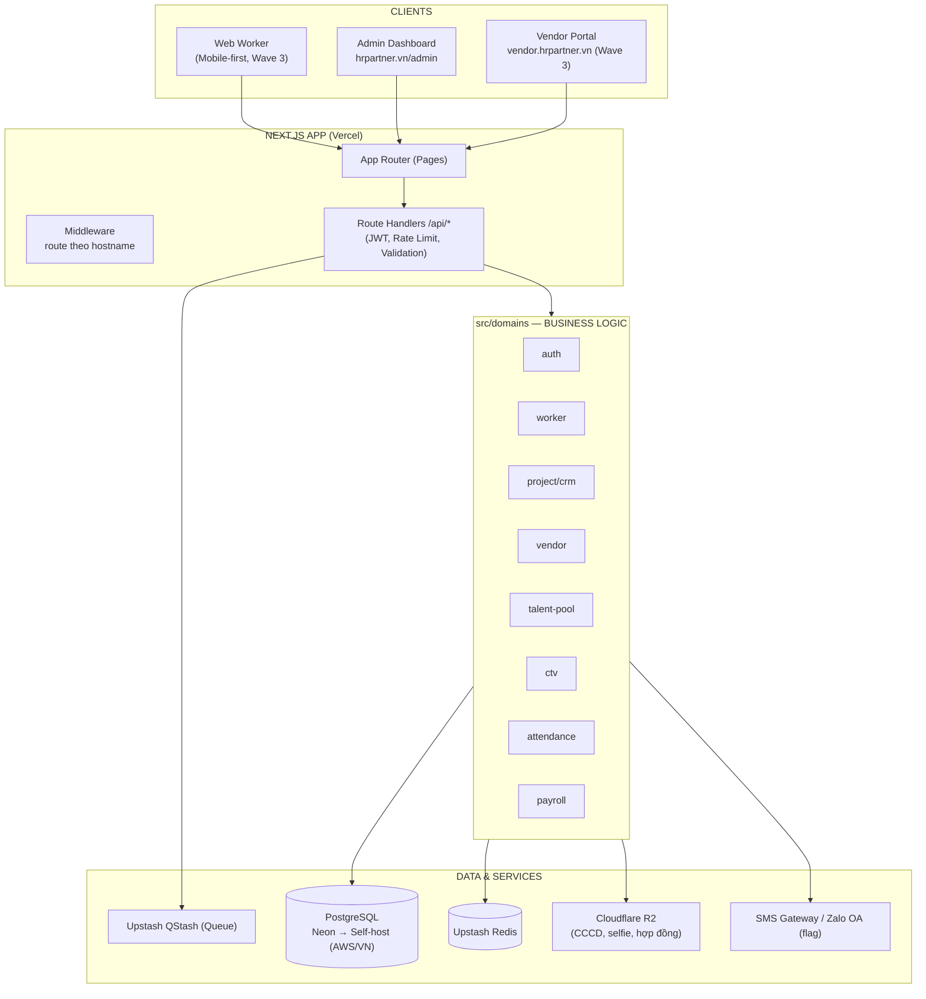
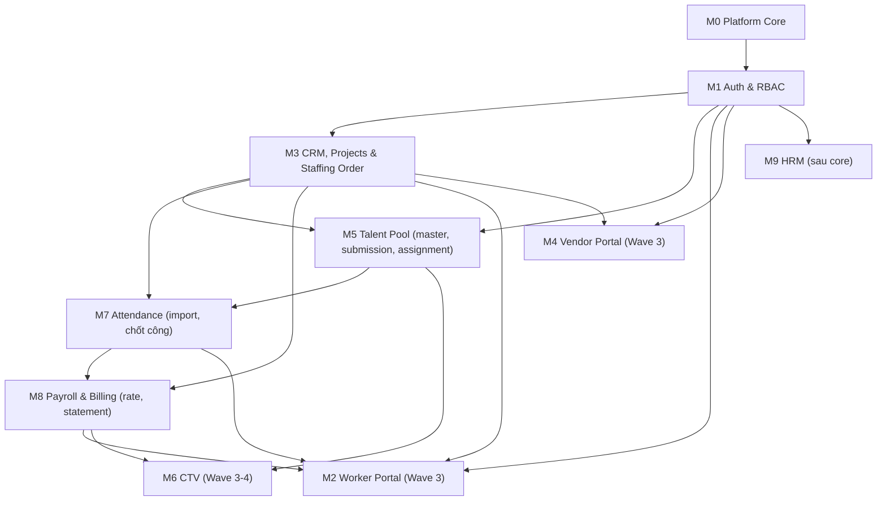
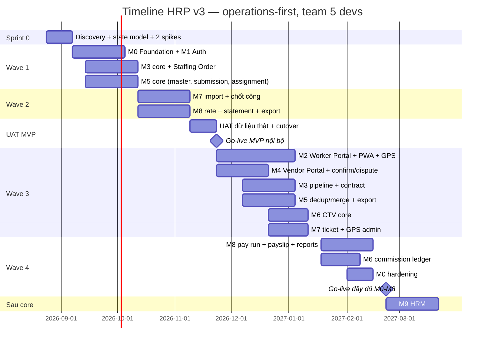
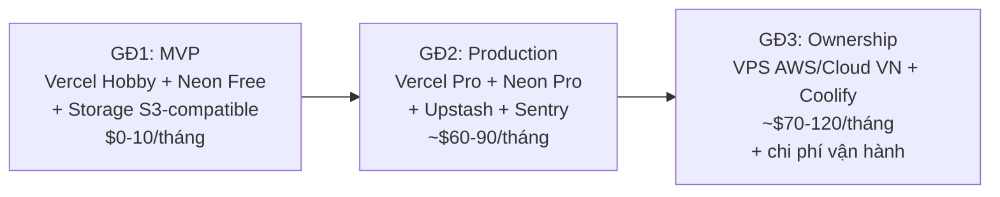

# HRP SYSTEM — UNIFIED PROJECT PLAN (v3.0)
## Hệ thống Quản trị Nguồn Nhân lực & Cung ứng Nhân lực

> **Phiên bản:** 3.3 (tiếp thu Báo cáo Đánh giá Khả thi + bài học Odoo HR + bài học Viet-ERP VN compliance + bài học HRM_SYSTEM ticket workflow + bài học shadcn-admin UI library + bài học Frappe/ERPNext DocType & Workflow & Standalone)
> **Ngày:** 14/08/2026
> **Trạng thái:** Draft - Chờ phê duyệt

> **Domain chính thức:**
> - https://hrpartner.vn (chính)
> - https://hrpvietnam.vn (backup/parity)

---

## 0. CHANGELOG & HƯỚNG DẪN CHỈNH SỬA

### 0.1. Thay đổi so với v2.1 (tiếp thu từ Báo cáo Đánh giá Khả thi)

| # | Thay đổi | Nguồn (mục báo cáo) |
|---|----------|----------------------|
| 1 | **Chuyển sang operations-first**: MVP nội bộ = chuỗi `Khách hàng/Dự án → Staffing Order → Worker → Assignment → Nhập & chốt công → Đối soát`; portal (Worker/Vendor/CTV) chuyển sang Wave 3 | Kết luận, 3.4 |
| 2 | **Bỏ `WorkStatus` đơn lẻ** → 5 vòng đời tách biệt: `profile_status`, `submission_status`, `employment_status`, `assignment_status`, `risk_status`; trạng thái rảnh/làm được SUY RA từ assignment | 2, 3.1 |
| 3 | **Tách nguồn tuyển khỏi Worker**: Worker chỉ giữ master data; nguồn nằm ở `source_claims` (lịch sử đầy đủ, 1 accepted) + `candidate_submissions` (vendor/CTV nộp → HR duyệt/merge) | 2, 3 |
| 4 | `employmentType` + `workSetting` chuyển từ Worker xuống **assignment** (hiệu lực theo thời gian) | 2 |
| 5 | **Chấm công 3 tầng**: `attendance_events` (raw bất biến) → `timesheet_lines` (chuẩn hóa) → `timesheet_periods` (duyệt/khóa); sau khóa chỉ tạo adjustment, không sửa | 2, 3.2 |
| 6 | **Payroll `pay_run`**: 1 kết quả/người/kỳ (`worker_pay_results`), `earning_lines` phân bổ theo assignment, khoản cấp người tính 1 lần; khóa theo legal entity/payroll group/kỳ | 2, 3.3 |
| 7 | **Tách vendor payable khỏi client billing**: 2 loại rate card (mua/bán) + 2 statement với workflow riêng `DRAFT→SENT→DISPUTED→CONFIRMED→LOCKED→PAID` | 2, 3, 3.3 |
| 8 | Bổ sung **Staffing Order / Job Position** (M3): nhu cầu theo vị trí, ca, số lượng, thời gian | 3 |
| 9 | Bổ sung **Talent Pool dedup/merge** (M5): chuẩn hóa SĐT/CCCD, merge queue, lịch sử nguồn | 3 |
| 10 | **Bỏ khỏi MVP**: import PDF, webhook máy chấm công (giữ adapter interface), multi-tenant, M10 Assets (ngoài horizon), Capacitor (hoãn) | 3 |
| 11 | Commission CTV: **PER_HEAD theo milestone** (default), policy có version/cap, **commission ledger** với dòng đảo (reversal), bỏ unique ctv+worker+tháng | 3, 6 |
| 12 | Bỏ KPI "1 giờ = 1 điểm": giờ công → **incentive theo policy** (ledger); KPI vận hành (fill-rate, show-up, retention) → dashboard post-go-live | 3 |
| 13 | Contract: bỏ `party_id` đa hình → **`contract_parties` junction** | 2 |
| 14 | Tiền tệ: **BIGINT đồng nguyên** xuyên suốt, cấm `.toNumber()`/float; tham số lương/BH/hoa hồng **effective-dated config**, không hard-code | 1.1, 2, 6 |
| 15 | Sửa 10 lỗi code mẫu (middleware, KPI 2 khóa OR, quota ngoài transaction, half-open interval, offline timestamp có cờ độ tin cậy...) | 2.1 |
| 16 | **Timeline mới**: Sprint 0 (dữ liệu thật + 2 spike) → Wave 1–2 → UAT → **MVP nội bộ ~12 tuần (~3 tháng)**; đầy đủ M0–M9 ~6–7 tháng (5 devs). "Production-ready 2–3 tháng" chỉ gắn với MVP | 1, 8 |
| 17 | DoD mới: state transition test, migration trên DB sạch + DB cũ, idempotency, audit, không sửa record đã khóa, UI theo loại công việc | 7 |
| 18 | Observability/audit/feature-flags **từ Sprint 1** (không chờ Phase 2); idempotency key theo `(actorId, route, key)`; bỏ cache profile | 2 |
| 19 | Auth: OTP là baseline bắt buộc; **Zalo là feature flag** (không block MVP); upsert mù theo SĐT → **`auth_identities` + account linking** | 1.1, 2 |
| 20 | Cập nhật toàn bộ [CẦN CHỐT] theo khuyến nghị chuyên gia + thêm 5 mục mới | 6, 6.1 |
| 21 | Thêm mục **Tính năng mở rộng post-go-live** (3 giai đoạn, kèm điều kiện kích hoạt) | 4 |
| 22 | Self-host GĐ3 **không bắt buộc đặt tại VN** — AWS (Lightsail/EC2, region Singapore) là lựa chọn chính thức, VNG/Viettel IDC là phương án thay thế | Quyết định của founder |

### 0.1.1. Thay đổi v3.1 (bổ sung từ bài học Odoo HR — `payroll_attendance`)

| # | Bổ sung | Nguồn |
|---|---------|-------|
| 23 | **`worker_pay_results` thêm 9 field hours breakdown** (snapshot từ timesheet_lines — audit & giải trình với nhân viên) | Odoo `payroll.payslip` 9 fields |
| 24 | **`payroll_rules` bảng config**: thay enum cứng `earning_type`/`deduction_type` → rule definition (`type` + `computation_method` + `sequence` + version/effective-dated) | Odoo `payroll.bonus.deduction` |
| 25 | **`pay_run_rule_overrides`**: template rule theo pay_run (vd: thưởng Tết cho tất cả NV) | Odoo `payroll.payroll.line` |
| 26 | **`payroll_config` bảng key-value + effective-dated**: OVERTIME_TOLERANCE_MIN, OT_15_RATE, BH_LUONG_MIN_REGION_1, TNCN_GIAM_TRU_BAN_THAN, BHXH_RATE_EMPLOYEE, ... | Odoo `res.config.settings` |
| 27 | **Calc input snapshot** (`calc_input_snapshot` JSONB): chụp `config_version` + rates tại thời điểm tính — replay được | ADR-013 (bất biến khi LOCK) |
| 28 | **Luồng pay_run cập nhật**: snapshot config → hours breakdown → hourly_wage → apply rules theo sequence → pay_run_rule_overrides → LOCK | Tổng hợp Odoo |

### 0.1.2. Thay đổi v3.2 (bổ sung từ bài học Viet-ERP — Vietnamese HR compliance)

| # | Bổ sung | Nguồn |
|---|---------|-------|
| 29 | **`Dependent` model** (người phụ thuộc giảm trừ TNCN 4.4M/người): `fullName`, `dateOfBirth`, `relationship`, `nationalId`, `taxDependentCode` (MST NPT), `validFrom/To` | Viet-ERP HRM `Dependent` |
| 30 | **Worker bổ sung VN compliance fields**: `gender`, `maritalStatus`, `permanentAddress`/`currentAddress`/`hometown`, `ethnicGroup`, `religion`, `nationality` | Viet-ERP HRM `Employee` 34 fields |
| 31 | **CCCD đầy đủ**: `cccdIssuedDate`, `cccdIssuedPlace`, `cccdExpiryDate`, `cccdChipData` (eKYC) | Bắt buộc theo NĐ 13/2023 + Luật CCCD 2023 |
| 32 | **Worker thuế & BH**: `taxCode` (MST cá nhân, unique), `insuranceCode` (số sổ BHXH, unique), `bankAccount`/`bankName`/`bankBranch` | HRM `tax_code`/`insurance_code` |
| 33 | **`tax_brackets` bảng riêng** (PIT progressive 7 bậc), tách khỏi `payroll_config` JSON — query/audit/versioning tốt hơn | Tổng hợp Odoo + Viet-ERP |
| 34 | **`calculateVietnameseTaxes()` service** (BigInt VND nguyên, pure, không truy cập DB) + golden tests (vitest) | Refactor Viet-ERP `packages/vietnam` |
| 35 | **`payrollConfigRepo.loadTaxConfig(asOfDate)`** — load snapshot effective-dated từ `payroll_config` + `tax_brackets` | Odoo `res.config_settings` |
| 36 | **File `src/shared/utils/money.ts`**: BigInt helpers (`mulRateVnd`, `roundHalfDownVnd`, `formatVnd`) | Internal |
| 37 | **`prisma/schema-v3.1-patches.prisma`** patch file — copy từng block vào schema chính | Internal |

### 0.1.3. Thay đổi v3.3 (bổ sung từ bài học `W-Codyz/HRM_SYSTEM` — Ticket workflow)

| # | Bổ sung cho V3 (Module M7 — Tickets: Phản ánh, Tạm ứng) | Nguồn HRM_SYSTEM |
|---|-----------------------------------------------------------|-------------------|
| 38 | **`prisma/schema-m7-tickets.prisma`**: `Ticket` (7 status × 8 action), `TicketHistory` (audit log mỗi transition), `TicketComment`, `TicketNotification` (DB queue), `AuditLog` (chung, ADR-014) | HRM `leave_requests` + `notifications` |
| 39 | **`src/domains/attendance/ticket.service.ts`** — Domain service với state machine typed (`TRANSITIONS: Record<TicketStatus, Partial<Record<TicketAction, ...>>>`) | HRM `leave_requests.php` (state machine) |
| 40 | **Optimistic locking** qua `version` field + `updateMany({ where: { id, version } })` chống race condition | Cải tiến từ HRM `WHERE status = 'pending'` |
| 41 | **2-step approval cho Advance Salary**: HR confirm (`HR_APPROVED`) → Accountant chi (`APPROVED` → `PAID`) | Cải tiến từ HRM 1-step |
| 42 | **6 role queue**: WORKER, HR_STAFF (PENDING), HR_MANAGER (PENDING/HR_APPROVED), ACCOUNTANT (HR_APPROVED), PM, ADMIN (all) | Cải tiến từ HRM admin/manager/employee |
| 43 | **Idempotency** qua `x-idempotency-key` header + lưu `metadata.idempotencyKey` | Bổ sung (HRM không có) |
| 44 | **Auto SLA** qua `slaDueAt` (LOW 72h, NORMAL 48h, HIGH 24h, URGENT 4h) | Bổ sung |
| 45 | **6 API endpoints**: POST /api/tickets, GET list, GET [id], POST [id]/{approve,reject,cancel} | Bổ sung route theo Next.js App Router |
| 46 | **`src/domains/attendance/ticket.service.test.ts`** — 16 unit tests (vitest, in-memory mock) covering: create happy/idempotency/validation, approve 2-step & fast-track, reject, cancel (own/other/terminal), pay (right role/wrong type), concurrent update | Bổ sung (HRM không có test) |
| 47 | **BigInt** cho `amountVnd`, `deductionVnd` (thay `decimal(12,2)` của HRM) | Cải tiến theo ADR-010 |
| 48 | **Reject bắt buộc có lý do** (lưu `note` vào `ticket_history`) | Cải tiến (HRM `review_notes` optional) |

**Phiên bản 3.3.0** — Bổ sung 11 entries (38–48) từ bài học `W-Codyz/HRM_SYSTEM`. Schema M7 + domain service + route handlers + unit tests đã có.

### 0.1.4. Thay đổi v3.3 (bổ sung từ bài học `satnaing/shadcn-admin` — UI/UX & Data Table)

| # | Bổ sung cho V3 (UI Component Library) | Nguồn shadcn-admin |
|---|----------------------------------------|--------------------|
| 49 | **`src/shared/styles/tokens.ts`** — HRP Orange palette (orange-50 → orange-950) + semantic + component tokens | shadcn-admin dùng neutral; HRP cần brand |
| 50 | **`src/shared/ui/entity-card/entity-card.tsx`** — Reusable card (avatar, badges, meta, actions, selection, footer, hover/focus) | shadcn-admin chỉ có Table. HRP thêm Card cho directory |
| 51 | **`src/shared/ui/data-table/data-table.tsx`** — TanStack Table wrapper (Toolbar + FacetedFilter + ColumnToggle + Pagination + BulkActions) | shadcn-admin `users-table.tsx` (URL-synced state pattern) |
| 52 | **`src/shared/ui/data-table/use-table-url-state.ts`** — Hook đồng bộ pagination/filter với URL search params | shadcn-admin `use-table-url-state.ts` (deep-link, back/forward nav) |
| 53 | **`src/shared/ui/view-toggle/view-toggle.tsx`** — Card ↔ Table toggle (URL sync + localStorage fallback) | Bổ sung (shadcn-admin chỉ Table) |
| 54 | **`src/shared/ui/sheet/slide-out-drawer.tsx`** — Right-side animated drawer (ESC + backdrop + scroll lock + focus trap) | shadcn-admin dùng Dialog (modal center). Drawer tốt hơn cho reconciliation |
| 55 | **`src/shared/ui/role-guard/role-guard-layout.tsx`** — 3 portal variants (admin sidebar / worker bottom tab / vendor mini-sidebar) + role-based nav filtering | shadcn-admin chỉ 1 admin layout |
| 56 | **`src/shared/utils/cn.ts`** — tailwind-merge stub (production sẽ dùng clsx + tailwind-merge) | shadcn-admin `lib/utils.ts` |
| 57 | **Demo page `src/app/(portal)/admin/tickets/page.tsx`** — M7 showcase: Card view (EntityCard grid) + Table view (DataTable + BulkActions) + Drawer detail (SlideOutDrawer) + RoleGuardLayout sidebar | Bổ sung |
| 58 | **Demo page `src/app/(portal)/vendor/projects/page.tsx`** — Vendor Portal showcase: Card grid cho staffing orders + KPI strip + CTA "Nộp ứng viên" | Bổ sung |
| 59 | **HRP Orange WCAG fix**: orange-500 chỉ cho background/button ≥ 18px BOLD; body text dùng orange-700 (4.7:1); badge dùng orange-50 bg + orange-800 text | Bổ sung theo HRP v3 §4.5 WCAG requirement |
| 60 | **URL state**: `?view=card|table&page=1&pageSize=20&type=ADVANCE_SALARY&status=PENDING` — share link work, back/forward nav chuẩn | shadcn-admin pattern |

**Phiên bản 3.3.1** — Bổ sung 12 entries (49–60) từ bài học `satnaing/shadcn-admin`. UI Component Library hoàn chỉnh: 5 reusable components + 2 demo pages + tokens + WCAG compliance.

### 0.1.5. Thay đổi v3.3 (bổ sung từ bài học ERPNext + Frappe — DocType, Workflow Engine, Batch Import, Standalone)

| # | Bổ sung cho V3 | Nguồn Frappe/ERPNext |
|---|----------------|----------------------|
| 61 | **`workflow_definitions` + `workflow_states` + `workflow_transitions`** (config-driven workflow, thay hardcode TRANSITIONS) | Frappe `workflow/doctype/workflow` (states + transitions tables) |
| 62 | **`attendance_import_batches` + `attendance_import_rows`** (parse CSV/XLSX → preview → match worker → INSERT raw rows) | Frappe `core/doctype/data_import` + HRMS `Employee Attendance Tool` |
| 63 | **`amendedFrom` field** cho TimesheetPeriod, PayRun, Statement | HRMS `Attendance.amended_from` |
| 64 | **`docStatus` column** (0/1/2) cho TimesheetPeriod, PayRun, Statement | Frappe DocStatus pattern (query `WHERE docstatus=1`) |
| 65 | **3-tier approval flow**: Location Manager → HR Manager → Accounting → LOCKED | Frappe Workflow `transitions` table + multi-role |
| 66 | **`on_submit` / `on_cancel` lifecycle hooks** cho service layer | Frappe `def on_submit(self)` / `def on_cancel(self)` hooks |
| 67 | **Savepoint pattern** cho long-running batch imports (Postgres SAVEPOINT) | Frappe `frappe.db.savepoint(name)` + `rollback_to_savepoint` |
| 68 | **`bulk-mark` UI** cho HR (query Active workers chưa có công → bulk insert) | HRMS `Employee Attendance Tool.get_employees()` |
| 69 | **Standalone .exe** đóng gói cho admin portal — đề xuất **Tauri + Next.js static + SQLite** (~25MB bundle) | Đáp ứng yêu cầu "phân phối cho client dạng 1 file" |
| 70 | **Half-day status + overtime section** tách riêng trên TimesheetLine | HRMS `Attendance.half_day_status` + `overtime_section` |
| 71 | **Caveats cho Standalone**: Cloud sync (CRDT/last-write-wins), auto-backup, Tauri Updater, native print/PDF | Bổ sung |

**Phiên bản 3.3.2** — B� sung 11 entries (61–71) từ bài học Frappe/ERPNext/HRMS. Đề xuất:
- Schema `workflow_definitions` (config-driven, không hardcode trong code)
- Schema `attendance_import_batches` cho CSV/XLSX import từ máy chấm công vật lý
- Standalone .exe qua Tauri (Wave 5 — sau khi cloud ổn định)

**LƯU Ý quan trọng:** Repo `frappe/erpnext` hiện đại đã **DEPRECATED HR/Payroll**, chuyển sang `frappe/hrms`. Reference Frappe HR/Payroll phải dùng `frappe/hrms` (đã update trong §12.5.4).

### 0.2. Các điểm review KHÔNG tiếp thu / tiếp thu có điều chỉnh

| Điểm | Quyết định V3 | Lý do |
|------|---------------|-------|
| "Card/List bắt buộc mọi màn" là nợ scope (P2) | **Dung hòa**: Card cho màn directory (Talent Pool, Dự án, Client, Vendor, CTV) theo yêu cầu founder; **table mặc định** cho BCC, payroll, đối soát, audit | Review đúng về bản chất tabular của màn tài chính; founder đúng về nhu cầu "nhìn lướt là thấy" của màn directory |
| Storage: v2.1 đổi sang Cloudflare R2 | **Giữ Cloudflare R2 xuyên suốt** (quyết định của founder); vẫn giữ abstraction S3-compatible để đổi provider được nếu cần | Founder chọn R2 vì chi phí thấp + không tính egress |
| Nội dung compliance/BHXH/TNCN | **Giữ nguyên** từ v2 | Review tuyên bố ngoài phạm vi; đây là yêu cầu pháp lý của dự án |
| "1 giờ = 1 điểm" KPI bị bỏ | **Tiếp thu có điều chỉnh**: giờ công giữ lại dưới dạng incentive theo policy (đây là cơ chế trả thưởng quản lý/CTV đang tồn tại trong nghiệp vụ công ty); khái niệm "KPI" dành cho chỉ số vận hành | Tránh vứt bỏ nghiệp vụ đang chạy; chỉ sửa tên gọi và cách lưu |

### 0.3. Hướng dẫn cho AI / người chỉnh sửa

- Giữ nguyên cấu trúc mục lục; khi sửa nội dung mục nào, ghi chú vào changelog.
- Các phần đánh dấu **[CẦN CHỐT]** là quyết định nghiệp vụ chờ stakeholder — AI có thể đề xuất phương án mặc định nhưng phải giữ đánh dấu.
- Không thêm công nghệ mới khi chưa có mục tương ứng trong ADR (mục 3).
- **Nguyên tắc bất biến:** dữ liệu đã LOCKED (bảng công, pay run, statement) không bao giờ sửa — chỉ adjustment/version mới.
- Mọi con số effort/timeline phải khớp với bảng capacity (mục 7.1).

---

## MỤC LỤC

1. [Tổng quan Dự án](#1-tổng-quan-dự-án)
2. [Personas & Luồng người dùng](#2-personas--luồng-người-dùng)
3. [Quyết định Kiến trúc (ADR)](#3-quyết-định-kiến-trúc-adr)
4. [Cấu trúc Hệ thống](#4-cấu-trúc-hệ-thống)
5. [Danh sách Tính năng (Nhóm A–H)](#5-danh-sách-tính-năng-nhóm-ah)
6. [Phân chia Module Thực thi (M0–M9)](#6-phân-chia-module-thực-thi-m0m9)
7. [Roadmap & Timeline (Sprint 0 + Waves)](#7-roadmap--timeline-sprint-0--waves)
8. [Work Breakdown Structure (WBS)](#8-work-breakdown-structure-wbs)
9. [Thiết kế CSDL — Worker, Source & Assignment](#9-thiết-kế-csdl--worker-source--assignment)
10. [Hợp đồng, Rate Card & Chính sách Hoa hồng](#10-hợp-đồng-rate-card--chính-sách-hoa-hồng)
11. [Kiến trúc Vendor Portal](#11-kiến-trúc-vendor-portal)
12. [Chấm công & Đối soát](#12-chấm-công--đối-soát)
13. [Tech Stack & Environment](#13-tech-stack--environment)
14. [Serverless Best Practices](#14-serverless-best-practices)
15. [Bảo mật](#15-bảo-mật)
16. [Chiến lược Testing](#16-chiến-lược-testing)
17. [Rủi ro & Mitigation](#17-rủi-ro--mitigation)
18. [Lộ trình Hạ tầng](#18-lộ-trình-hạ-tầng)
19. [Tính năng Mở rộng Post-Go-Live](#19-tính-năng-mở-rộng-post-go-live)
20. [Open Questions [CẦN CHỐT]](#20-open-questions-cần-chốt)
21. [Glossary](#21-glossary)

---

## 1. TỔNG QUAN DỰ ÁN

### 1.1. Mô tả Dự án

**HRP (Human Resources Portal)** là nền tảng quản trị nguồn nhân lực toàn diện, phục vụ mô hình **cung ứng nhân lực (Outsourcing & Headhunting)** tại Việt Nam. Định vị: **ERP vận hành nội bộ trước, mở rộng SaaS sau** (xem 1.4).

### 1.2. Ba Bài toán Lõi

| Bài toán | Mô tả | Đối tượng |
|----------|-------|-----------|
| **B2O - Vận hành & Đối soát (TRƯỚC)** | Số hóa chuỗi vận hành nội bộ: nhu cầu tuyển → worker → assignment → nhập & chốt công → đối soát vendor/khách hàng | Kế toán, Admin, HR |
| **B2B - Quản trị Khách hàng & Thầu phụ** | Quản lý dự án, hợp đồng cung ứng. Điều phối vendor khi thiếu hụt nhân sự | Doanh nghiệp thuê, Vendor, PM |
| **B2C - Thu hút & Quản lý Nguồn lực** | Cổng thông tin tối giản cho NLĐ phổ thông; Talent Pool cho remarketing | Người lao động, CTV, Vendor |

### 1.3. Kiến trúc Tổng thể



> **Chốt kỹ thuật:** Backend dùng **Next.js App Router (Route Handlers)** chạy Serverless trên Vercel. **KHÔNG dùng Fastify**, **KHÔNG chia microservices** (ADR-001/002).

### 1.4. Chiến lược Triển khai — Operations-First

**Chuỗi giá trị lõi (vertical slice nội bộ) — MVP:**

```
Khách hàng/Dự án → Staffing Order (nhu cầu tuyển) → Worker → Assignment
→ Nhập & chốt công → Đối soát (vendor payable + client billing)
```

| Giai đoạn | Nội dung | Mục tiêu |
|-----------|----------|----------|
| **Sprint 0** (2 tuần) | Dữ liệu thật, state model, 2 technical spike | Chốt thiết kế trước khi viết Prisma schema |
| **Wave 1** (4–5 tuần) | M0+M1, M3 core + Staffing Order, M5 core (worker master, submission, assignment) | Nền tảng + backbone dữ liệu |
| **Wave 2** (4 tuần) | M7 (import/chốt công), M8 tối giản (rate, statement, export) | Đối soát chạy trên dữ liệu thật |
| **UAT MVP** (2 tuần) | Chạy dữ liệu thật, sửa exception, phân quyền, training | **Go-live MVP nội bộ ~12 tuần** |
| **Wave 3** (7 tuần) | Worker Portal + PWA + GPS evidence, Vendor Portal (submission + confirm/dispute), CTV core | Mở 3 cổng bên ngoài |
| **Wave 4** (4–5 tuần) | Pay run + payslip + reports, commission ledger, hardening | Đầy đủ M0–M8 |
| **Sau core** | M9 HRM; theo điều kiện: máy chấm công, Capacitor, M10, multi-tenant | Nội bộ + mở rộng |

---

## 2. PERSONAS & LUỒNG NGƯỜI DÙNG

### 2.1. Bảng Personas

| ID | Persona | Vai trò | Nhu cầu chính | Pain Points |
|----|---------|---------|---------------|-------------|
| **P1** | Người lao động phổ thông | Worker | Đăng ký nhanh, xem công, xem lương | Thao tác phức tạp, không quen công nghệ |
| **P2** | Cộng tác viên (CTV) | Referrer | Nhập thông tin được giới thiệu, xem hoa hồng | Không biết trạng thái ứng viên |
| **P3** | Vendor | Sub-contractor | Nhập thông tin NLĐ, xem dự án cần người | Muốn chủ động cung ứng |
| **P4** | Nhân sự nội bộ | HR/Sale | Quản lý Talent Pool, phân công dự án | Xử lý nhiều lead, cần tool nhanh |
| **P5** | Quản lý dự án | PM | Gán người, theo dõi tiến độ dự án | Quản lý nhiều vendor cùng lúc |
| **P6** | Kế toán | Accountant | Chốt công, tính lương, đối soát vendor | Tách lương phức tạp |
| **P7** | Admin | System Admin | RBAC, cấu hình hệ thống | Quản lý nhiều quyền |

### 2.2. Các Luồng Chính

**Luồng 1 — Worker Registration (Wave 3):**
1. Đăng ký bằng SĐT → nhận OTP 6 số qua SMS (hoặc Zalo Login nếu flag bật)
2. Chụp selfie xác thực (lưu kèm thời điểm đăng ký)
3. Tự hoàn thiện Profile: Họ tên, Ngày sinh, Địa chỉ, CCCD (+ ảnh 2 mặt), Bank
4. Hệ thống tạo **UserID Primary**; `profile_status: INCOMPLETE → PENDING_VERIFY → VERIFIED`

> Trong MVP (Wave 1–2), worker được tạo bởi Sale/HR nội bộ (kênh SALE_ADDED/HR_ADDED) — không cần chờ portal.

**Luồng 2 — Staffing & Assignment (Wave 1):**
1. Admin/HR tạo Client → Project → **Staffing Order** (vị trí, ca, số lượng, thời gian)
2. Gán worker vào order → tạo **UserID Secondary** (employeeCode theo dự án)
3. Assignment: `PLANNED → ACTIVE`; có thể nhiều assignment nếu lịch/ca không trùng + 1 PRIMARY

**Luồng 3 — Vendor (Wave 3):**
1. Vendor đăng nhập `vendor.hrpartner.vn` → xem staffing order đang cần người
2. Nộp **candidate_submission** (KHÔNG tạo Worker trực tiếp) → HR review: duyệt/từ chối/merge
3. Theo dõi trạng thái; Wave 3+: confirm/dispute statement đối soát

**Luồng 4 — Chấm công (2 luồng song song):**

| | File chấm công từ đối tác (MVP) | GPS Check-in (Wave 3) |
|---|---|---|
| Cách thức | Đối tác gửi Excel/CSV → kế toán import | Worker selfie + GPS qua app |
| Dữ liệu | Trở thành `timesheet_lines` | `attendance_events` loại evidence |
| Mục đích | **TÍNH LƯƠNG** + đối soát | **QUẢN LÝ Ý THỨC** (không tính lương) |
| Xử lý | Preview → review → approve → LOCK | Lưu log → phát hiện không check-in |

---

## 3. QUYẾT ĐỊNH KIẾN TRÚC (ADR)

| ID | Quyết định | Lựa chọn | Lý do | Trạng thái |
|----|-----------|----------|-------|------------|
| ADR-001 | Backend framework | **Next.js Route Handlers (1 app)** | Phù hợp team nhỏ, 1 deployment. Business logic KHÔNG nằm trong route handler — nằm ở `src/domains/` | Accepted |
| ADR-002 | Kiến trúc module | **Modular monolith** (chia domain trong code, 1 DB, 1 deploy) | Team nhỏ; enforce dependency bằng ESLint boundary + test domain | Accepted |
| ADR-003 | Cấu trúc frontend | **1 app Next.js**, vendor qua subdomain + middleware | Cookie domain `hrpartner.vn` dùng chung cho `vendor.hrpartner.vn`; `hrpvietnam.vn` là domain khác → redirect về canonical, không hứa chia sẻ session | Accepted |
| ADR-004 | Database | **PostgreSQL + Prisma** (Neon serverless trước, self-host sau) | ACID, JSONB; constraint phức tạp dùng raw SQL migration | Accepted |
| ADR-005 | Hạ tầng | **3 giai đoạn**: Vercel/Neon → Vercel Pro → **Self-host (AWS hoặc Cloud VN) + Coolify** — chuyển giai đoạn theo tải thực tế & năng lực vận hành, không theo deadline cố định | Tốc độ ra mắt trước, tự host khi tải/năng lực vận hành cho phép | Accepted |
| ADR-006 | Storage | **Cloudflare R2** (S3-compatible, không tính egress) cho mọi file: CCCD, selfie, hợp đồng; code chỉ gọi **storage interface** để đổi provider được nếu cần | Founder chốt R2 (chi phí + không egress); rà soát NĐ 13/2023/Luật Dữ liệu 2024 khi mở rộng quy mô | Accepted |
| ADR-007 | Xác thực | **OTP SMS là baseline bắt buộc** + JWT (access 15', refresh 7d có rotation/revoke); **Zalo Login là feature flag** (không block MVP); device binding chỉ áp dụng thao tác nhạy cảm | OTP độc lập với Zalo; 1 SĐT = 1 account qua `auth_identities` + account linking | Accepted |
| ADR-008 | Mobile | **PWA trước** (camera/GPS/offline); **Capacitor chỉ kích hoạt khi có vấn đề đo được** với PWA | PWA đáp ứng ~90% nhu cầu | Accepted |
| ADR-009 | Xử lý nền | **Upstash QStash** cho batch/retry; job phải có job state, idempotency và input snapshot trong DB | Vercel Functions timeout 10–30s | Accepted |
| ADR-010 | Đồng tiền & làm tròn | VND, **BIGINT đồng nguyên xuyên suốt**; cấm `number`/`.toNumber()` cho tiền; rounding policy tại 1 domain service duy nhất | Tránh sai lệch xu và lỗi float | Accepted |
| ADR-011 | Vòng đời dữ liệu | **Tách 5 state machine** (profile/submission/employment/assignment/risk); availability SUY RA từ assignment | Một `WorkStatus` không biểu diễn được các vòng đời độc lập | Accepted |
| ADR-012 | Nguồn tuyển | **Source claims + submission** tách khỏi Worker; lưu toàn bộ lịch sử, 1 accepted có audit | Worker đổi nguồn/tái tuyển là chuyện bình thường của nghiệp vụ | Accepted |
| ADR-013 | Dữ liệu tài chính | **Record đã LOCKED là bất biến**: sai lệch xử lý bằng version mới hoặc adjustment line (bảng công, pay run, statement, commission) | Audit và trách nhiệm giải trình với kế toán/đối tác | Accepted |

---

## 4. CẤU TRÚC HỆ THỐNG

### 4.1. Cấu trúc Repository

```
hrp/
├── app/                          # Next.js App Router (routes + route handlers)
│   ├── (worker)/                 # Cổng NLĐ — mobile-first (Wave 3)
│   ├── (admin)/                  # Admin dashboard
│   ├── vendor/                   # Vendor portal — rewrite target của subdomain
│   ├── api/                      # Route Handlers /api/*
│   └── middleware.ts             # Route theo hostname: vendor.hrpartner.vn → /vendor
├── src/
│   ├── domains/                  # Business logic theo module (M0–M9)
│   │   ├── auth/                 # M1
│   │   ├── worker/               # M2
│   │   ├── project/              # M3 (CRM, Project, Staffing Order)
│   │   ├── vendor/               # M4
│   │   ├── talent-pool/          # M5
│   │   ├── ctv/                  # M6
│   │   ├── attendance/           # M7
│   │   └── payroll/              # M8
│   ├── shared/
│   │   ├── types/                # Shared TypeScript types
│   │   ├── utils/                # Utilities (money: BigInt VND)
│   │   ├── constants/            # Constants
│   │   └── errors/               # Error classes
│   └── infrastructure/
│       ├── database/             # Prisma client (singleton) + migrations
│       ├── cache/                # Upstash Redis (OTP/rate limit/job board)
│       ├── queue/                # QStash
│       ├── storage/              # Storage interface (S3-compatible)
│       └── external/             # SMS, Zalo OA (flag), máy chấm công (adapter sau core)
├── prisma/
│   ├── schema.prisma
│   └── migrations/
├── tests/                        # unit + integration + golden tests (mục 16)
├── docs/
└── README.md
```

**Quy tắc domain:** module chỉ gọi nhau qua function/service export trong `src/domains/*/`; **cấm import chéo ngược**; kiểm tra bằng ESLint boundary.

### 4.2. URL Structure & Multi-Domain

```
Worker Portal:      https://hrpartner.vn/                 (mobile-first, Wave 3)
Admin Portal:       https://hrpartner.vn/admin/
Vendor Portal:      https://vendor.hrpartner.vn/          (cùng app, qua middleware)
API:                https://hrpartner.vn/api/*
```

```typescript
// app/middleware.ts — multi-domain + vendor subdomain (ĐÃ SỬA lỗi v2.1)
const ALLOWED_HOSTS = [
  'hrpartner.vn',           // Chính
  'hrpvietnam.vn',          // Backup/parity → redirect canonical
  'vendor.hrpartner.vn',    // Vendor subdomain
  'localhost:3000',         // Dev
];

export function middleware(req: NextRequest) {
  const host = req.headers.get('host') ?? '';
  const pathname = req.nextUrl.pathname;   // KHÔNG dùng request.pathname (Next.js 15)

  // Host không hợp lệ → 403 (không redirect vòng lặp cho domain lạ)
  if (!ALLOWED_HOSTS.includes(host)) {
    return NextResponse.json({ error: 'Invalid host' }, { status: 403 });
  }

  // Backup domain → redirect về canonical (cookie KHÔNG chia sẻ giữa 2 registrable domain)
  if (host === 'hrpvietnam.vn') {
    return NextResponse.redirect(new URL(`https://hrpartner.vn${pathname}${req.nextUrl.search}`, req.url), 308);
  }

  // Vendor subdomain → rewrite về /vendor/* (thư mục route thật, KHÔNG phải route group)
  if (host.startsWith('vendor.')) {
    return NextResponse.rewrite(new URL(`/vendor${pathname}${req.nextUrl.search}`, req.url));
  }

  return NextResponse.next();
}
```

> **Lưu ý:** (1) route group `(vendor)` KHÔNG phải URL segment — rewrite phải về `/vendor/...`; (2) cookie set domain `hrpartner.vn` có hiệu lực trên `vendor.hrpartner.vn` (cùng parent domain); (3) bắt buộc integration test theo hostname.

### 4.3. Nguyên tắc AI Coding

1. **Tách biệt Client vs Server code rõ ràng** — frontend không chứa business logic
2. **API calls dùng absolute URL** (env `NEXT_PUBLIC_API_URL`) — bắt buộc để đóng gói PWA/Capacitor sau này
3. **CORS config sẵn** cho nguồn từ app mobile
4. Mọi ghi nhiều bảng phải dùng transaction + advisory lock (mục 14.2)
5. **Tiền = BigInt đồng nguyên**; cấm `.toNumber()`/`parseFloat` cho tiền (ADR-010)
6. Không hard-code chuỗi tiếng Việt rải rác; tham số nghiệp vụ (lương, BH, rate) phải **effective-dated config**
7. **Dữ liệu đã LOCKED không được sửa** — chỉ adjustment/version mới (ADR-013)

### 4.4. Nguyên tắc thiết kế UI/UX (Card-based — theo loại màn)

**Nguyên tắc chung (yêu cầu founder):**

1. **Đơn giản, dễ sử dụng** — ưu tiên người dùng nội bộ không chuyên công nghệ: ít chữ, thao tác thường xuyên ≤ 3 click.
2. **Mỗi đối tượng = 1 thẻ (card)** — thông tin quan trọng hiển thị ngay trên thẻ, "nhìn lướt là thấy".
3. Bố cục **thoáng** — nhiều khoảng trắng, badge màu cho trạng thái thay vì text dài.
4. **Toggle Card ↔ List** trên các trang danh sách directory; nhớ lựa chọn view theo từng người dùng (localStorage).
5. Action nhanh ngay trên card (hover) cho thao tác thường xuyên; chi tiết mở bằng **drawer/modal**.
6. Bộ lọc + tìm kiếm áp dụng cho cả 2 chế độ xem; List view sắp xếp theo cột; pagination cho cả 2 chế độ.
7. Badge trạng thái **thống nhất toàn hệ thống** (design system — M0).
8. Card hiển thị tối đa 5–6 dòng thông tin; phần còn lại trong drawer chi tiết.

**Áp dụng theo loại màn (dung hòa với expert review):**

| Loại màn | Chế độ mặc định | Lý do |
|----------|-----------------|-------|
| Talent Pool, Dự án, Client, Vendor, CTV, Submission queue | **Card** (có toggle List) | "Nhìn lướt là thấy" — scanning |
| BCC, Payroll, Đối soát, Commission, Audit log | **Table** (có thể có Card cho bước review đơn lẻ) | Bản chất tabular, cần so sánh cột & tổng hàng |
| Mobile (Worker Portal) | **Card** tối giản | Mobile-first |

**Đặc tả card từng đối tượng:**

**Card Dự án (M3):**
```
┌──────────────────────────────────────────────┐
│ [TÊN DỰ ÁN]                    [badge trạng thái]│
│ 🏢 Nơi làm việc: KCN Quang Minh, Mê Linh       │
│ 👤 PM: Nguyễn Văn B                            │
│ 💼 Sale: Trần Thị C                            │
│ 👥 Lao động: 12/20  (avatar cluster)           │
│ 📅 Bắt đầu: 01/09/2026                         │
│ [Xem] [Thêm lao động] [Chỉnh sửa]             │
└──────────────────────────────────────────────┘
```

**Card Người lao động (M5 Talent Pool):**
```
┌──────────────────────────────────────────────┐
│ (avatar)  Nguyễn Văn A, 32t    [badge trạng thái]│
│ 📍 Quê quán: Nam Định                          │
│ 🏢 Dự án: Samsung (🟢)  hoặc  "Đang rảnh" (⚪)  │
│ 🤝 Giới thiệu: CTV Lê Văn D (nếu có)          │
│ 👤 Phụ trách: Sale Trần Thị C                  │
│ 📅 Vào hệ thống: 10/08/2026 · Tự đăng ký       │
│ [Chi tiết] [Gán dự án] [Gọi] [Ghi chú]        │
└──────────────────────────────────────────────┘
```
- Dòng "Vào hệ thống" hiển thị `created_at` + kênh nguồn từ **accepted `source_claim`** (mục 9.3): Tự đăng ký / Thêm bởi Sale / HR / Vendor / CTV.
- "Đang làm dự án nào / Đang rảnh" được **suy ra** từ assignment ACTIVE (không phải field lưu trữ).

**Card Staffing Order (M3):** vị trí + ca + số lượng cần/còn + thời hạn + dự án + badge trạng thái.
**Card Khách hàng (M3):** tên công ty + lĩnh vực + badge trạng thái hợp đồng; số dự án đang chạy; Sale phụ trách.
**Card Vendor (M4):** tên vendor + khu vực + badge hợp đồng khung; NLĐ đã cung ứng/đang làm; đầu mối HRP.
**Card CTV (M6):** tên CTV + khu vực; đã giới thiệu/đang làm; hoa hồng lũy kế; badge trạng thái.

**Yêu cầu kỹ thuật:**
- Component dùng chung `EntityCard` + `ViewToggle` trong design system (M0).
- Thông tin trên card là projection nhẹ (1 API list + join cần thiết).

### 4.5. Design System — Tông màu Cam (HRP Brand)

> Giữ từ v2.1: primary `#f97316` (HRP Orange), accent vàng, semantic colors (success/warning/info/danger/neutral). **Bắt buộc áp dụng fix WCAG (mục 4.6.3 v2.1):** chữ trắng trên cam chỉ dùng cho nút có text đậm hoặc chuyển nền sang `#c2410c`; badge/text nhỏ dùng nền cam nhạt + chữ cam đậm; body text ≥ 16px (tránh iOS zoom); test contrast trên điện thoại ngoài trời nắng.

*(Bảng design tokens giữ nguyên từ v2.1 — xem `UNIFIED_PLAN_v2.md` mục 4.5)*

#### 4.5.1. UI Component Library — học từ `satnaing/shadcn-admin` (cập nhật v3.3)

> Phân tích từ repo tham khảo Next.js Admin Dashboard: `src/features/users/components/users-table.tsx` (TanStack Table + URL state), `users-columns.tsx` (typed ColumnDef), `users-action-dialog.tsx` (Zod + react-hook-form), `data-table-bulk-actions.tsx` (multi-select toolbar).

**Những gì shadcn-admin làm TỐT (giữ lại):**

| Pattern shadcn-admin | HRP v3.3 đã học & áp dụng |
|---|---|
| TanStack Table với URL-synced state (filter, pagination) | `useNextTableUrlState` hook đồng bộ qua Next.js `useSearchParams` |
| Column visibility toggle (`<Settings2/>`) | `ColumnToggle` subcomponent trong DataTable |
| Bulk action bar (khi có selection) | `bulkActions` slot trong DataTable |
| Faceted filter dropdown (multi-select checkbox) | `FacetedFilter` subcomponent |
| Reset filter button (X) | Inline trong Toolbar |
| Zod schema + react-hook-form cho dialog | Sẽ áp dụng cho Worker Profile, Ticket form (Module M7) |
| Custom column definitions tách riêng file | Pattern HRP: `tickets-columns.tsx`, `workers-columns.tsx` |
| URL state cho back/forward navigation | Đã có trong `use-table-url-state` |

**HRP v3.3 BỔ SUNG so với shadcn-admin:**

| # | Bổ sung cho HRP | Tại sao |
|---|------------------|---------|
| **U1** | **`ViewToggle` component** (Card ↔ Table) | shadcn-admin chỉ có Table. HRP cần Card cho directory (Vendor, Talent Pool, Tickets overview) |
| **U2** | **`EntityCard` component** (reusable card với avatar, badges, meta grid, actions, selection) | Vendor portal không cần Table — chỉ scan card |
| **U3** | **Slide-out Drawer** thay vì Dialog (cho record detail) | Drawer cho phép nhìn table bên trái + chi tiết bên phải (better cho reconciliation workflow) |
| **U4** | **`RoleGuardLayout`** với 3 portal variants (admin sidebar / worker bottom tab / vendor mini-sidebar) | shadcn-admin chỉ có 1 layout admin. HRP có 3 cổng |
| **U5** | **HRP Orange tokens** đầy đủ (`src/shared/styles/tokens.ts`) — primitive → semantic → component | shadcn-admin dùng neutral default. HRP cần brand primary |
| **U6** | **WCAG-compliant variants** rõ ràng (orange-700 cho text thay orange-500) | shadcn-admin không enforce. HRP enforce qua design review checklist |
| **U7** | **Selection state** tích hợp EntityCard + DataTable (cùng `selected: boolean`) | Cho bulk operations (HR duyệt nhiều ticket) |
| **U8** | **Server-side data fetching** (RSC) + client-side table render | shadcn-admin dùng data mock. HRP v3 sẽ fetch từ API |
| **U9** | **Vietnamese localization** (date format, VND currency, status labels) | shadcn-admin tiếng Anh |
| **U10** | **Slide-in animation** cho Drawer | shadcn-admin dùng modal dialog không animate |
| **U11** | **Bottom tab bar** cho Worker Portal (mobile-first) | shadcn-admin chỉ desktop |
| **U12** | **Per-role nav filtering** (HR_MANAGER thấy Payroll, WORKER thấy Payslip) | shadcn-admin hardcode nav |

**File TypeScript đã tạo (xem `src/shared/` + `src/app/(portal)/`):**

```
src/shared/
├── styles/tokens.ts                       # HRP Orange palette + semantic + component tokens
├── utils/cn.ts                            # tailwind-merge stub
└── ui/
    ├── entity-card/entity-card.tsx        # Card + Grid components
    ├── data-table/
    │   ├── data-table.tsx                 # TanStack wrapper + Toolbar + Pagination
    │   └── use-table-url-state.ts         # URL-synced state hook
    ├── view-toggle/view-toggle.tsx        # Card/Table toggle + URL hook
    ├── sheet/slide-out-drawer.tsx         # Right-side animated drawer
    └── role-guard/role-guard-layout.tsx   # 3-portal layout + nav filtering
src/app/(portal)/
├── admin/tickets/page.tsx                 # Demo M7 (Card + Table + Drawer + Bulk)
└── vendor/projects/page.tsx               # Demo Vendor (Card grid + KPI)
```

**Đặc tả quan trọng:**

1. **Brand primary `#f97316`** (orange-500) — chỉ dùng cho background (button, badge bg, link hover). KHÔNG dùng làm body text color.
2. **Text trên orange-500**: `#ffffff` (white) — chỉ dùng cho button ≥ 18px BOLD, icon ≥ 24px.
3. **Body text / link**: dùng `orange-700 (#c2410c)` — contrast 4.7:1 trên white (WCAG AA pass).
4. **Card border hover**: `orange-300` — đủ nổi bật, không gây rối.
5. **Selection state**: card + table dùng `orange-50` background + `orange-500` border.
6. **Focus ring**: `orange-200` ring-2 ring-offset-2 (keyboard accessible).
7. **Empty state**: icon `text-slate-300` + text `text-slate-700` (không dùng orange để tránh over-brand).
8. **Drawer backdrop**: `bg-slate-900/40 backdrop-blur-[2px]` (mờ nhẹ, nhìn thấy table bên dưới).
9. **Bulk action bar**: `bg-orange-50 border-orange-200` (active state, nổi bật nhưng không aggressive).
10. **Số tiền VND**: format `Intl.NumberFormat('vi-VN')` + ` ₫` suffix.
11. **Date**: format `vi-VN` locale + `toLocaleDateString/toLocaleString`.
12. **URL state** đồng bộ: `?view=card|table&page=1&pageSize=20&type=ADVANCE_SALARY&status=PENDING` — share link work.

**DoD Component Library:**

- [x] 5 reusable components (EntityCard, DataTable, ViewToggle, SlideOutDrawer, RoleGuardLayout)
- [x] HRP Orange tokens (primitive → semantic → component)
- [x] WCAG-compliant variants (orange-700 cho text, white-on-orange-500 chỉ cho button bold)
- [x] URL-synced state cho table + view mode
- [x] Bulk selection (card + table unified)
- [x] 3 portal layouts (admin / worker / vendor)
- [x] Slide-in animation cho drawer
- [x] Vietnamese localization (date, VND, status labels)
- [x] 2 demo pages showcase (admin/tickets + vendor/projects)

### 4.6. Auth: OTP baseline + Zalo feature flag (SỬA lỗi upsert mù của v2.1)

**Rủi ro phân mảnh tài khoản** (v2.1 4.6.1): upsert theo SĐT **giả định Zalo luôn trả được SĐT** — không đúng thực tế (user phải cấp quyền; Zalo OA chưa tích vàng không lấy được SĐT). Giải pháp đúng:

```typescript
// auth_identities: nhiều kênh login → 1 account
model AuthIdentity {
  id         String @id
  accountId  String               // users.id
  provider   String               // PHONE | ZALO
  providerId String               // SĐT chuẩn hóa hoặc zaloUserId
  verifiedAt DateTime?
  @@unique([provider, providerId])
}

// Zalo callback: KHÔNG tạo user nếu thiếu SĐT
async function zaloLoginCallback(zaloUserId: string) {
  const identity = await prisma.authIdentity.findUnique({
    where: { provider_providerId: { provider: 'ZALO', providerId: zaloUserId } }
  });
  if (!identity) {
    // Yêu cầu bước liên kết: user nhập SĐT → nhận OTP → link với account PHONE
    throw new Error('ZALO_ACCOUNT_NOT_LINKED'); // redirect sang flow "Nhập SĐT để liên kết"
  }
  return generateJWT(identity.accountId);
}
```

- OTP là **baseline bắt buộc** — luôn hoạt động kể cả khi Zalo OA chưa xác thực.
- Zalo Login + Zalo Notification là **feature flags** — không block MVP (mục 14.6).
- Xác thực Zalo OA (tích vàng): task của founder, Sprint 1 — nếu chưa xong, flag Zalo tắt.

---

## 5. DANH SÁCH TÍNH NĂNG (NHÓM A–H)

> Nhóm A–H là **nhóm yêu cầu nghiệp vụ**; Module M0–M9 (mục 6) là **đơn vị thực thi**. Phase cũ (1a/1b/2/3) được thay bằng **Wave** (xem mục 7).

### 5.1. Nhóm A: Cổng thông tin & App Người lao động (Worker Portal) — Wave 3

| ID | Tính năng | Mô tả | Ưu tiên | Wave |
|----|-----------|-------|---------|-------|
| **A-01** | Đăng nhập OTP | SĐT + OTP 6 số qua SMS | P0 | 3 |
| **A-01b** | Đăng nhập Zalo (flag) | Đăng nhập 1 chạm qua Zalo OA — feature flag | P1 | 3 |
| **A-02** | Hoàn thiện Profile | Worker tự điền: Họ tên, CCCD, Bank... (profile_status) | P0 | 3 |
| **A-03** | Đăng ký nhanh | Tạo UserID ngay khi đăng ký (chỉ cần SĐT) | P0 | 3 |
| **A-04** | Bảng tin việc làm | Job Card theo Staffing Order + filter | P0 | 3 |
| **A-05** | Ứng tuyển 1 chạm | Gửi SĐT + thông tin cơ bản → candidate_submission | P0 | 3 |
| **A-06** | Xem thông tin dự án | Tên, địa điểm, quản lý | P0 | 3 |
| **A-07** | Chấm công in-site | Quẹt thẻ máy vật lý — **adapter, ngoài MVP** | P1 | Sau core |
| **A-08** | Check-in ngoài site | Selfie + GPS (**evidence**, quản lý ý thức) | P0 | 3 |
| **A-09** | Xem lịch sử chấm công | Từ timesheet + check-in GPS | P0 | 3 |
| **A-10** | Xem phiếu lương | Payslip snapshot theo kỳ | P0 | 4 |
| **A-11** | Đề nghị tạm ứng | Gửi request (HRP_EMPLOYED) — 2 bước duyệt | P0 | 4 |
| **A-12** | Phản ánh/Khiếu nại | Báo sai công, sai lương (ticket) | P0 | 3 |
| **A-13** | Cập nhật thông tin | Bank, CCCD, SĐT | P0 | 3 |

### 5.2. Nhóm B: CTV — Wave 3 (core), Wave 4 (commission)

| ID | Tính năng | Mô tả | Ưu tiên | Wave |
|----|-----------|-------|---------|-------|
| **B-01** | Đăng ký CTV | Họ tên, CCCD, STK | P0 | 3 |
| **B-02** | Nhập người được giới thiệu | SĐT, Họ Tên, Dự án → candidate_submission | P0 | 3 |
| **B-03** | Dashboard theo dõi | Trạng thái + hoa hồng | P0 | 3 |
| **B-04** | Lịch sử hoa hồng | Commission ledger | P1 | 4 |
| **B-05** | Thông báo | Zalo/SMS khi có cập nhật (flag) | P1 | 4 |

### 5.3. Nhóm C: Vendor Portal — Wave 3

| ID | Tính năng | Mô tả | Ưu tiên | Wave |
|----|-----------|-------|---------|-------|
| **C-01** | Đăng nhập Vendor | Tài khoản riêng subdomain | P0 | 3 |
| **C-02** | Xem Staffing Order | Nhu cầu đang tuyển theo vị trí/ca | P0 | 3 |
| **C-03** | Nộp ứng viên | Form → **candidate_submission** (HR duyệt/merge) | P0 | 3 |
| **C-04** | Xem trạng thái | Duyệt/từ chối kèm lý do | P0 | 3 |
| **C-05** | Confirm/Dispute statement | Xác nhận hoặc phản đối biên bản đối soát | P0 | 3 |
| **C-06** | Xuất biên bản | Statement PDF/Excel | P0 | 3 |

### 5.4. Nhóm D: Quản trị B2B CRM & Dự án

| ID | Tính năng | Mô tả | Ưu tiên | Wave |
|----|-----------|-------|---------|-------|
| **D-01** | CRUD Khách hàng | Hồ sơ doanh nghiệp | P0 | 1 |
| **D-02** | CRUD Dự án | Tạo, gán PM, quota tuyển | P0 | 1 |
| **D-02b** | **CRUD Staffing Order** | Nhu cầu theo vị trí, ca, số lượng, thời gian, điều kiện | P0 | 1 |
| **D-03** | Quản lý Pipeline | **List đơn giản trong MVP** (Kanban sau nếu cần) | P1 | 3 |
| **D-04** | CRUD Máy chấm công | Serial, IP, map vào dự án — **adapter, ngoài MVP** | P2 | Sau core |
| **D-05** | Gán nhân sự | Assignment PLANNED→ACTIVE, nhiều assignment + PRIMARY | P0 | 1 |
| **D-06** | Import từ Vendor | Duyệt/merge candidate_submission | P0 | 3 |

### 5.5. Nhóm E: Talent Pool & ATS

| ID | Tính năng | Mô tả | Ưu tiên | Wave |
|----|-----------|-------|---------|-------|
| **E-01** | Hồ sơ NLĐ | Master data + edit history | P0 | 1 |
| **E-02** | Vòng đời trạng thái | **5 state machine** (profile/submission/employment/assignment/risk) | P0 | 1 |
| **E-03** | Phân loại nguồn gốc | Source claims (lịch sử đầy đủ, 1 accepted) — mục 9.3 | P0 | 1 |
| **E-04** | Bộ lọc nâng cao | Tuổi, khu vực, kỹ năng, availability (suy ra) | P0 | 1/3 |
| **E-05** | Xuất Excel | Export data | P1 | 3 |
| **E-06** | Lịch sử tương tác | Ghi chú, log cuộc gọi | P1 | 3 |
| **E-07** | **Dedup/merge** | Chuẩn hóa SĐT/CCCD, merge queue, lịch sử nguồn & ownership | P0 | 3 |

### 5.6. Nhóm F: Vận hành & T&A

| ID | Tính năng | Mô tả | Ưu tiên | Wave |
|----|-----------|-------|---------|-------|
| **F-01** | Webhook máy chấm công | **Adapter interface, ngoài MVP** (kích hoạt khi ≥2 site cùng protocol) | P2 | Sau core |
| **F-02** | Giao diện chốt công | 3 tầng: events → timesheet_lines → period duyệt/khóa | P0 | 2 |
| **F-03** | Tách công HRP vs Vendor | Timesheet theo assignment + statement riêng | P0 | 2 |
| **F-04** | Xử lý ticket | Phản ánh, tạm ứng | P0 | 3 |
| **F-05** | Check-in GPS log | Evidence + risk flag + exception review | P0 | 3 |
| **F-06** | SOP ngoại lệ | Mất điện, chỉnh công → **adjustment lines** | P1 | 2 |

### 5.7. Nhóm G: Lương & Thanh toán

| ID | Tính năng | Mô tả | Ưu tiên | Wave |
|----|-----------|-------|---------|-------|
| **G-01** | Tính lương HRP | Pay run: 1 kết quả/người/kỳ, earning lines theo assignment | P0 | 4 |
| **G-02** | Đối soát Vendor | Statement (approved công × vendor pay rate) + workflow | P0 | 2/3 |
| **G-02b** | **Billing Client** | Statement riêng (approved công × client bill rate) | P0 | 2/4 |
| **G-03** | Hoa hồng CTV | PER_HEAD theo milestone + ledger + reversal | P1 | 4 |
| **G-04** | Xuất file lương | Excel payroll | P0 | 2 |
| **G-05** | Quản lý công nợ | Theo dõi thanh toán | P1 | 4 |

### 5.8. Nhóm H: Nhân sự Nội bộ (HRM) — Sau core

| ID | Tính năng | Mô tả | Ưu tiên | Wave |
|----|-----------|-------|---------|-------|
| **H-01** | CRUD nhân viên | Mã NV, thông tin nội bộ | P0 | Sau core |
| **H-02** | Sơ đồ tổ chức | Cây phòng ban, cấp báo cáo | P1 | Sau core |
| **H-03** | RBAC | Roles + Permissions | P0 | 1 |
| **H-04** | Data-level security | Scope theo team/branch/assignment + handover có audit | P0 | 1 |

---

## 6. PHÂN CHIA MODULE THỰC THI (M0–M9)

### 6.1. Nguyên tắc

1. Mỗi module = **1 domain code độc lập** trong `src/domains/` — dùng chung 1 app + 1 DB (modular monolith). Không deploy riêng.
2. Thứ tự module theo **operations-first** (mục 6.4) — portal không đi trước backbone vận hành.
3. Module phụ thuộc được làm trước hoặc song song với **API contract** (giao ước endpoint/schema).
4. **Sprint 0 bắt buộc** trước khi scaffold: chốt aggregate + state model + 2 spike (mục 7.2).

### 6.2. Bảng Module

| Module | Tên | Effort (MD) | Wave | Priority | Ghi chú |
|--------|-----|-------------|------|----------|---------|
| **M0** | Platform Core | 40 | 1, 4 | P0 | Repo, CI/CD, migration, design system, **observability + audit + feature flags từ Sprint 1** |
| **M1** | Auth & RBAC | 30 | 1 | P0 | OTP baseline, JWT, RBAC, `auth_identities`, Zalo flag |
| **M2** | Worker Portal | 50 | 3–4 | P0 | Đăng ký, profile, job board, GPS evidence, payslip view |
| **M3** | CRM, Projects & Staffing Order | 45 | 1, 3 | P0 | Client/Project CRUD, **Staffing Order**, list pipeline, assignment, contract |
| **M4** | Vendor Portal | 20 | 3 | P0 | Subdomain, submission, status, **confirm/dispute statement** |
| **M5** | Talent Pool & ATS | 45 | 1–3 | P0 | Master data, 5 state machine, source claims, **dedup/merge**, filters, export |
| **M6** | CTV Portal & Commission | 40 | 3–4 | P0 | Đăng ký, submission, dashboard, **commission ledger** |
| **M7** | Attendance (T&A) | 50 | 2–3 | P0 | Import XLSX/CSV, 3 tầng, chốt công, ticket, GPS admin |
| **M8** | Payroll & Billing | 65 | 2, 4 | P0 | Rate version, statements, **pay run**, payslip, reports |
| **M9** | HRM (Nhân sự nội bộ) | 40 | Sau core | P1 | Employee CRUD, org chart, nghỉ phép |
| | PWA packaging (thuộc M2) | 20 | 3–4 | P1 | PWA trước; Capacitor ngoài horizon |
| | **Tổng in-horizon** | **≈ 465 MD** | | | 445 module/PWA + Sprint 0 (10) + UAT (10) |
| | ~~M10 Assets~~ | ~~30~~ | **Ngoài horizon** | P2 | Bỏ khỏi kế hoạch; prototype 3–5 MD sau go-live nếu cần |
| | ~~Multi-tenant~~ | — | Ngoài horizon | P2 | Chỉ thêm tenant isolation khi có pilot SaaS thật |

### 6.3. Đồ thị Phụ thuộc



> Backbone vận hành (M0+M1+M3+M5+M7+M8 tối giản) phải đi trước mọi portal.

### 6.4. Thứ tự thực hiện (operations-first)

| Giai đoạn | Nội dung | Modules |
|-----------|----------|---------|
| Sprint 0 | Discovery, dữ liệu thật, state model, 2 spike | (chốt thiết kế) |
| Wave 1 | Foundation + backbone dữ liệu | M0, M1, M3 core (+Staffing Order), M5 core |
| Wave 2 | Chấm công + đối soát tối giản | M7 (import/chốt), M8 (rate/statement/export), M5 (filters) |
| UAT MVP | Dữ liệu thật, sửa exception, training | Go-live nội bộ |
| Wave 3 | Mở 3 cổng bên ngoài | M2 (portal + GPS + PWA), M4, M6 core, M3 hoàn thiện, M5 dedup/export, M7 ticket |
| Wave 4 | Đầy đủ tài chính | M8 (pay run, payslip, reports), M6 ledger, M0 hardening, M2 payslip view |
| Sau core | Nội bộ + mở rộng theo điều kiện | M9; máy chấm công, Capacitor, M10, multi-tenant |

### 6.5. Mockup Strategy

- **Mục đích:** stakeholder thấy tổng thể trước khi code; demo toàn hệ thống bằng prototype.
- **Cách làm:** Figma/HTML mockup → prototype flow → demo → code lần lượt.
- **Priority:** Wave 1–2 mockup cho màn khó (import chấm công, statement, chốt công); Wave 3+ mockup cho 3 portal; M9 mockup trước khi code.

**Yêu cầu mockup tối thiểu:** giữ danh sách màn từ v2.1, thêm:
- M3: **Staffing Order list/detail**, project list (card), pipeline list
- M5: pool list (card), worker detail + **timeline đa vòng đời**, **merge queue**
- M7: import flow (upload → mapping → preview → unmatched → approve → lock), bảng công (table), adjustment
- M8: pay run, payslip template, **vendor statement + client statement** (2 màn riêng), commission ledger

**Quy ước:** màn directory mockup cả 2 chế độ Card/List; màn tài chính mockup table (mục 4.4).

### 6.6. Definition of Done (DoD) — MỚI theo expert review

Một feature được coi là done khi:
- [ ] Business rule và **state transition có test** (unit)
- [ ] Migration chạy được trên **database sạch VÀ database có dữ liệu cũ**
- [ ] API có validation, authorization và **data scope integration test**
- [ ] Mọi command ghi dữ liệu có **idempotency hoặc unique invariant** phù hợp
- [ ] Thao tác tài chính/đối soát có **audit** và **không sửa record đã khóa**
- [ ] UI phù hợp loại công việc (card cho scanning, table cho reconciliation — mục 4.4)
- [ ] Có monitoring/error context đủ để vận hành
- [ ] **Demo trên dữ liệu scenario thật**, không chỉ seed happy-path
- [ ] E2E vertical slice tương ứng vẫn chạy trên CI

> Không coi mockup hoặc API chạy happy-path là production-ready.

---

## 7. ROADMAP & TIMELINE (SPRINT 0 + WAVES)

### 7.1. Giả định Team & Capacity

| Giả định | Giá trị |
|----------|---------|
| Đội hình | 5 devs (1 lead + 4), 1 QA bán thời gian, 1 PO/BA |
| Velocity thực tế | ~80% (≈ **20 MD/tuần**) |
| Sprint | 2 tuần |

| Team | MD/tuần (80%) | MVP nội bộ (~190 MD) | Đầy đủ M0–M9 (~465 MD) |
|------|---------------|----------------------|--------------------------|
| 5 devs | ~20 | **~10 tuần + UAT 2 tuần ≈ 12 tuần** | **~26–28 tuần (~6–7 tháng)** |
| 8 devs | ~32 | ~8 tuần | ~18–20 tuần |

> **Định nghĩa "production-ready" (sửa lỗi v2.1):** mốc "2–3 tháng" chỉ gắn với **MVP nội bộ** (Sprint 0 + Wave 1 + Wave 2 + UAT). Full M0–M9 là ~6–7 tháng với 5 devs. Không dùng chung một mốc cho cả hai phạm vi.

### 7.2. Chi tiết từng giai đoạn

#### SPRINT 0: DISCOVERY (1–2 tuần, ~10 MD)

| Hạng mục | Nội dung |
|----------|----------|
| Dữ liệu thật | ≥3 file chấm công (format khác nhau); ≥2 kỳ đối soát kế toán đã xác nhận; rate card mua (vendor) & bán (client); ≥20 case vòng đời worker (trùng hồ sơ, đổi nguồn, chuyển dự án, tạm nghỉ, quay lại); case assignment giữa tháng + correction sau chốt |
| Thiết kế | Chốt 6 aggregate: Worker, Submission/SourceClaim, Assignment, Timesheet, PayRun, Statements — invariants + state transition + effective-date rules được stakeholder duyệt **TRƯỚC khi tạo Prisma schema** |
| Spike A | Attendance import: 2 format Excel thật → mapping → preview → unmatched → approve → lock; re-import idempotent |
| Spike B | Calculation/reconciliation: approved timesheet → rate version đúng hiệu lực → statement → export; golden test cho chuyển dự án, nhiều ca, correction |
| Nền | Next.js strict mode, Prisma + migration check CI, seed theo scenario thật, domain-boundary lint, test skeleton, RBAC + data-scope test, audit + monitoring tối thiểu, feature flags (Zalo/vendor/GPS/commission), **1 vertical slice deploy được** |

**Exit criteria Sprint 0:** state model được duyệt; 2 spike demo được; skeleton CI xanh.

#### WAVE 1: BACKBONE VẬN HÀNH (~90 MD, 4–5 tuần)

| Thành phần | Deliverables | Exit Criteria |
|------------|--------------|---------------|
| M0 | Repo, CI/CD, design system, audit, feature flags, observability tối thiểu | Push là auto-deploy; mọi ghi có audit |
| M1 | OTP, JWT, RBAC, auth_identities (Zalo = flag) | User nội bộ đăng nhập, scope hoạt động |
| M3 core | Client/Project CRUD, **Staffing Order**, PM, assignment | Tạo được order + gán worker |
| M5 core | Worker master, 5 state machine, source claims, submission | Worker đầy đủ vòng đời |

**Exit criteria:** Admin tạo Client → Project → Order → Worker (nhập tay) → Assignment; availability suy ra đúng; audit đầy đủ.

#### WAVE 2: CHẤM CÔNG & ĐỐI SOÁT (~80 MD, 4 tuần)

| Thành phần | Deliverables | Exit Criteria |
|------------|--------------|---------------|
| M7 core | Import XLSX/CSV (template per partner), events→timesheet→period, approve/lock, unmatched queue | Kế toán import & chốt công trên file thật |
| M8 tối giản | Rate version (vendor pay + client bill), statement + export, adjustment lines | Xuất được biên bản đối soát đúng 2 kỳ mẫu |

**Exit criteria:** 2 kỳ đối soát thật khớp với số kế toán đã chốt; unmatched < 3%.

#### UAT MVP (2 tuần)

Chạy dữ liệu thật, sửa exception, phân quyền, training, cutover → **Go-live MVP nội bộ (~12 tuần từ kick-off)**.

#### WAVE 3: MỞ 3 CỔNG BÊN NGOÀI (~145 MD, 7 tuần)

| Thành phần | Deliverables | Exit Criteria |
|------------|--------------|---------------|
| M2 | Đăng ký, profile, job board, GPS evidence (+ PWA) | Worker tự đăng ký & check-in |
| M4 | Vendor submission, status, confirm/dispute statement | Vendor nộp được ứng viên |
| M6 core | CTV đăng ký, submission, dashboard | CTV theo dõi được referral |
| M3 hoàn thiện | Pipeline list, contract v1 | |
| M5 hoàn thiện | Filters, dedup/merge, export | |
| M7 ticket | Phản ánh, tạm ứng | |

#### WAVE 4: TÀI CHÍNH ĐẦY ĐỦ (~90 MD, 4–5 tuần)

| Thành phần | Deliverables | Exit Criteria |
|------------|--------------|---------------|
| M8 đầy đủ | **Pay run**, payslip snapshot, reports, adjustment | Tính lương đúng golden tests; worker xem payslip |
| M6 hoàn thiện | Commission ledger (PER_HEAD milestone), notifications | CTV thấy hoa hồng từng kỳ |
| M0 hoàn thiện | Sentry, alerting, hardening | |

#### SAU CORE: M9 HRM (~40 MD, 4 tuần) + mở rộng theo điều kiện (mục 19)

### 7.3. Gantt minh họa (team 5 devs, kick-off 24/08/2026)



### 7.4. Lộ trình Rút gọn (nếu cần ra mắt MVP nhanh hơn)

Cắt theo thứ tự: pipeline list → M5 dedup/merge → confirm/dispute (thay bằng chốt nội bộ) → ticket. MVP có thể rút về **8–10 tuần**; KHÔNG cắt: import/chốt công, statement/export, audit, golden tests.

---

## 8. WORK BREAKDOWN STRUCTURE (WBS)

### 8.1. Epic Mapping

| Epic | Tên | Module | Wave | Effort (MD) |
|------|-----|--------|------|-------------|
| **E0** | Platform Core & Observability | M0 | 1, 4 | 40 |
| **E1** | Auth & RBAC | M1 | 1 | 30 |
| **E2** | Worker Portal (B2C) + PWA | M2 | 3–4 | 50 + 20 |
| **E3** | CRM, Projects & Staffing Order | M3 | 1, 3 | 45 |
| **E4** | Vendor Portal + Confirm/Dispute | M4 | 3 | 20 |
| **E5** | Talent Pool, Source Claims & Dedup | M5 | 1–3 | 45 |
| **E6** | CTV Portal & Commission Ledger | M6 | 3–4 | 40 |
| **E7** | Attendance Import & Timesheet | M7 | 2–3 | 50 |
| **E8** | Payroll, Pay Run & Statements | M8 | 2, 4 | 65 |
| **E9** | HRM (Nhân sự nội bộ) | M9 | Sau core | 40 |
| **E10** | Sprint 0 (discovery + spikes) | — | 0 | 10 |
| **E11** | UAT MVP | — | UAT | 10 |
| | **Tổng in-horizon** | | | **≈ 465 MD** |

### 8.2. WBS chi tiết Wave 1 + Wave 2 (MVP nội bộ)

```
E0: PLATFORM CORE
├── 0.1 Repo setup (Next.js strict, ESLint, boundary lint)
├── 0.2 CI/CD + migration check + seed theo scenario thật
├── 0.3 Design system (tông cam + WCAG fix + EntityCard/ViewToggle)
├── 0.4 Audit log + feature flags (Zalo/vendor/GPS/commission)
└── 0.5 Observability tối thiểu (logging, error context) → Sentry [Wave 4]

E1: AUTH & RBAC
├── 1.1 OTP SMS (baseline) + rate limit
├── 1.2 Zalo Login (FEATURE FLAG) + auth_identities + account linking
├── 1.3 JWT access/refresh (rotation + revoke)
├── 1.4 RBAC (10 roles) + data-scope integration test
└── 1.5 Device binding (chỉ thao tác nhạy cảm)

E3: CRM, PROJECTS & STAFFING ORDER
├── 3.1 Client CRUD [Wave 1]
├── 3.2 Project CRUD + PM + quota [Wave 1]
├── 3.3 STAFFING ORDER (vị trí, ca, số lượng, thời gian, điều kiện) [Wave 1]
├── 3.4 Assignment (PLANNED→ACTIVE, multi + PRIMARY, half-open) [Wave 1]
├── 3.5 Pipeline list [Wave 3]
└── 3.6 Contract v1 + contract_parties [Wave 3]

E5: TALENT POOL
├── 5.1 Worker master data + edit history [Wave 1]
├── 5.2 5 STATE MACHINES + transition guards [Wave 1]
├── 5.3 Source claims + candidate_submissions [Wave 1]
├── 5.4 Filters cơ bản + availability suy ra [Wave 1]
├── 5.5 Data isolation (scope team/branch/assignment) [Wave 1]
├── 5.6 Dedup/merge queue [Wave 3]
└── 5.7 Excel export + activity logs [Wave 3]

E7: ATTENDANCE (Wave 2)
├── 7.1 Import XLSX/CSV + template per partner + payload hash
├── 7.2 Mapping employeeCode → worker + unmatched queue
├── 7.3 attendance_events → timesheet_lines (nhiều ca, nhiều log)
├── 7.4 timesheet_periods: REVIEWED → APPROVED → LOCKED (+ version)
├── 7.5 Adjustment lines sau lock
└── 7.6 Ticket (phản ánh, tạm ứng) [Wave 3]

E8: PAYROLL & BILLING (Wave 2 — tối giản)
├── 8.1 Vendor rate cards + client rate cards (effective-dated) [Wave 2]
├── 8.2 vendor_statements + client_statements + workflow [Wave 2]
├── 8.3 Export biên bản đối soát [Wave 2]
├── 8.4 Pay run + worker_pay_results + earning/deduction lines [Wave 4]
├── 8.5 Payslip snapshot + worker view [Wave 4]
└── 8.6 Reports + adjustments [Wave 4]

E6: CTV (Wave 3-4)
├── 6.1 CTV registration [Wave 3]
├── 6.2 Referral → candidate_submission [Wave 3]
├── 6.3 Dashboard [Wave 3]
├── 6.4 Commission ledger (PER_HEAD milestone, cap, reversal) [Wave 4]
└── 6.5 Notifications (flag) [Wave 4]

E2: WORKER PORTAL (Wave 3-4)
├── 2.1 Registration + profile (profile_status flow) [Wave 3]
├── 2.2 Job board theo staffing order + apply [Wave 3]
├── 2.3 GPS check-in (evidence: capturedAt/receivedAt/risk flag) [Wave 3]
├── 2.4 PWA (manifest, service worker, offline queue) [Wave 3]
├── 2.5 Attendance history + payslip view [Wave 3/4]
└── 2.6 Ticket/đề nghị tạm ứng [Wave 3/4]

E4: VENDOR PORTAL (Wave 3)
├── 4.1 Subdomain routing (middleware đã sửa) + integration test hostname
├── 4.2 Vendor Auth + RBAC
├── 4.3 Staffing order listing
├── 4.4 Candidate submission (+ validation, dedup hint)
├── 4.5 Status tracking + HR review/merge
└── 4.6 Statement confirm/dispute (audit 2 chiều)

E9: HRM (sau core) — employee CRUD, org chart, leave management
E10: SPRINT 0 — discovery, dữ liệu thật, state model, spike A+B
E11: UAT MVP — chạy dữ liệu thật, training, cutover
```

---

## 9. THIẾT KẾ CSDL — WORKER, SOURCE & ASSIGNMENT

### 9.1. Nguyên tắc: tách các vòng đời (sửa lớn từ expert review)

Một `WorkStatus` duy nhất (v2.1) trộn 5 vòng đời khác nhau: duyệt hồ sơ, ứng tuyển, quan hệ lao động, assignment, và rủi ro. V3 tách thành **5 state machine độc lập**:

```text
profile_status:      INCOMPLETE → PENDING_VERIFY → VERIFIED | REJECTED
submission_status:   NEW → SCREENING → QUALIFIED | REJECTED | WITHDRAWN | MERGED
employment_status:   NONE → ACTIVE → SUSPENDED | TERMINATED
assignment_status:   PLANNED → ACTIVE → PAUSED | ENDED | TRANSFERRED | CANCELLED
risk_status:         NORMAL → REVIEW → BLOCKED
```

**Availability được SUY RA, không lưu:**
- ĐANG RẢNH (trong pool) = `employment_status = ACTIVE` AND không có assignment ACTIVE
- ĐANG LÀM = có ≥ 1 assignment ACTIVE
- TẠM NGHỈ = `employment_status = SUSPENDED`

Badge màu trên UI (mục 4.4) map từ các trạng thái suy ra này, không phải field lưu.

### 9.2. Schema Worker (CHỈ master data — bỏ các field phân loại khỏi Worker)

```sql
CREATE TABLE workers (
  id UUID PRIMARY KEY DEFAULT gen_random_uuid(),
  user_id TEXT UNIQUE NOT NULL,            -- "USR-001" (Primary UserID, tạo khi đăng ký, KHÔNG đổi)
  full_name TEXT,
  phone TEXT UNIQUE,
  cccd_number TEXT,
  cccd_image_url TEXT,                     -- storage (ADR-006)
  selfie_image_url TEXT,
  date_of_birth DATE,
  gender TEXT,
  bank_account TEXT,
  bank_name TEXT,

  profile_status TEXT NOT NULL DEFAULT 'INCOMPLETE',
  employment_status TEXT NOT NULL DEFAULT 'NONE',
  risk_status TEXT NOT NULL DEFAULT 'NORMAL',

  owner_id UUID REFERENCES users(id),      -- Sale/HR phụ trách (CRM ownership; mở rộng team/branch khi cần)
  assigned_to_id UUID REFERENCES users(id),

  created_at TIMESTAMPTZ DEFAULT NOW(),
  updated_at TIMESTAMPTZ DEFAULT NOW()
);
-- NOTE: sourceType / employmentType / workSetting / workStatus ĐÃ CHUYỂN khỏi bảng này (xem 9.3, 9.4)
```

### 9.3. Nguồn tuyển — SourceClaim & CandidateSubmission (MỚI)

```sql
-- Ghi nhận TOÀN BỘ nguồn đưa worker vào — không overwrite lịch sử
CREATE TABLE source_claims (
  id UUID PRIMARY KEY DEFAULT gen_random_uuid(),
  worker_id UUID NOT NULL REFERENCES workers(id),
  claim_type TEXT NOT NULL,                -- HRP_DIRECT | VENDOR_SUPPLIED | CTV_REFERRAL
  vendor_id UUID REFERENCES vendors(id),
  ctv_id UUID REFERENCES users(id),
  submission_id UUID,                      -- nếu từ candidate_submission
  registration_channel TEXT NOT NULL DEFAULT 'SALE_ADDED',
    -- SELF_REGISTER | SALE_ADDED | HR_ADDED | VENDOR_ADDED | CTV_ADDED
  accepted BOOLEAN NOT NULL DEFAULT FALSE, -- DUY NHẤT 1 claim accepted / worker
  accepted_by UUID REFERENCES users(id),
  claimed_by UUID REFERENCES users(id),
  created_at TIMESTAMPTZ DEFAULT NOW()
);
-- Chỉ 1 nguồn accepted cho mỗi worker (partial index)
CREATE UNIQUE INDEX one_accepted_source ON source_claims(worker_id) WHERE accepted;

-- Vendor/CTV nộp ứng viên — KHÔNG tạo Worker trực tiếp
CREATE TABLE candidate_submissions (
  id UUID PRIMARY KEY DEFAULT gen_random_uuid(),
  vendor_id UUID REFERENCES vendors(id),
  ctv_id UUID REFERENCES users(id),
  project_id UUID REFERENCES projects(id),  -- ứng tuyển cho dự án/staffing order nào
  full_name TEXT NOT NULL,
  phone TEXT NOT NULL,
  cccd_number TEXT,
  date_of_birth DATE,
  gender TEXT,
  experience TEXT,
  cccd_image_url TEXT,
  status TEXT NOT NULL DEFAULT 'NEW',       -- NEW | SCREENING | QUALIFIED | REJECTED | WITHDRAWN | MERGED
  merged_worker_id UUID REFERENCES workers(id),
  reviewed_by UUID REFERENCES users(id),
  review_note TEXT,
  created_at TIMESTAMPTZ DEFAULT NOW(),
  UNIQUE(vendor_id, phone)                  -- chống nộp trùng trong cùng vendor (dedup hint)
);
```

**Quy trình (ADR-012):** vendor/CTV nộp → submission `NEW` → HR screening → duyệt:
- Trùng SĐT/CCCD với worker có sẵn → **MERGE** (submission trỏ `merged_worker_id`, tạo thêm source_claim mới nếu cần)
- Không trùng → tạo Worker mới (`profile_status = INCOMPLETE`) + source_claim `accepted = TRUE`
- Từ chối → ghi lý do; vendor/CTV nhìn thấy trạng thái

### 9.4. Assignment — employment_type/work_setting chuyển về đây, half-open, đa assignment

```sql
CREATE TABLE project_assignments (
  id UUID PRIMARY KEY DEFAULT gen_random_uuid(),
  worker_id UUID NOT NULL REFERENCES workers(id),
  project_id UUID NOT NULL REFERENCES projects(id),
  staffing_order_id UUID REFERENCES staffing_orders(id),
  employee_code TEXT NOT NULL,             -- "EMP-SAMSUNG-001" (Secondary UserID — do dự án tạo)

  employment_type TEXT NOT NULL,           -- HRP_EMPLOYED | OUTSOURCED | REFERRED_OUT (hiệu lực theo assignment)
  work_setting TEXT,                       -- PHOTHONG | VANPHONG | CONGXUONG (nếu HRP_EMPLOYED)

  valid_from DATE NOT NULL,                -- KHOẢNG NỬA MỞ [valid_from, valid_to)
  valid_to DATE,                           -- null = mở (đang hiệu lực)
  status TEXT NOT NULL DEFAULT 'PLANNED',  -- PLANNED | ACTIVE | PAUSED | ENDED | TRANSFERRED | CANCELLED
  is_primary BOOLEAN NOT NULL DEFAULT TRUE,-- 1 assignment PRIMARY khi có nhiều (để chọn lương/chấm công mặc định)

  manager_id UUID REFERENCES users(id),    -- Quản lý (nhận incentive theo giờ công)
  referrer_id UUID REFERENCES users(id),   -- CTV giới thiệu (nhận hoa hồng theo policy)
  salary_per_day BIGINT NOT NULL DEFAULT 0,-- VND NGUYÊN (ADR-010)
  transfer_reason TEXT,
  created_at TIMESTAMPTZ DEFAULT NOW(),
  UNIQUE(project_id, employee_code)
);

-- Chỉ 1 PRIMARY ACTIVE trên 1 worker
CREATE UNIQUE INDEX one_primary_active_assignment
  ON project_assignments(worker_id) WHERE is_primary AND status = 'ACTIVE';
```

**Quy tắc (thay thế `isActive + endDate` của v2.1):**
- `isActive` BỎ — active được suy ra từ `status = 'ACTIVE'` (một nguồn sự thật).
- Khoảng thời gian nửa mở `[valid_from, valid_to)`: chuyển dự án ngày 15/08 → assignment cũ `valid_to = 15/08`, assignment mới `valid_from = 15/08` — **không overlap**.
- **[CẦN CHỐT] Đa assignment:** cho phép nhiều assignment đồng thời nếu lịch/ca không overlap; xác định 1 `PRIMARY` khi cần. (Default V3: cho phép.)

### 9.5. Business Rules theo employment_type (tại assignment)

| Rule | HRP_EMPLOYED | OUTSOURCED | REFERRED_OUT |
|------|--------------|------------|--------------|
| salarySource | HRP | KH/đối tác | Cty tiếp nhận |
| payslipVisible | ✓ | ✗ | ✗ |
| advanceRequest (tạm ứng) | ✓ | ✗ | ✗ |
| attendance | File/máy + GPS | File công đối tác + GPS | GPS (ý thức) |
| vendorBilling | ✗ | ✓ (vendor pay rate) | ✗ (chỉ hoa hồng CTV) |
| clientBilling | theo hợp đồng | theo hợp đồng | ✗ |
| incentive (giờ công) | theo policy | ✗ | ✗ |

### 9.6. Incentive & KPI vận hành (thay thế "KPI 1 giờ = 1 điểm")

- **Incentive theo giờ công:** giờ công thuộc assignment nào → ghi cho `manager_id`/`referrer_id` của assignment đó, tính qua **commission/incentive ledger** (mục 10) theo policy có version — không gọi là KPI.
- **KPI vận hành (thật):** fill-rate, show-up rate, retention, attendance completeness — dashboard post-go-live (mục 19.1).

### 9.7. Talent Pool & Data Isolation

**Visibility Matrix (cập nhật theo source claims & assignment):**

| Role | Workers nhìn thấy |
|------|-------------------|
| ADMIN, HR_MANAGER | Toàn bộ (HR_MANAGER có quyền toàn cục + cơ chế handover có audit) |
| HR_STAFF | Theo **team/branch/phân công** [CẦN CHỐT] |
| SALE / NVKD | `ownerId = mình` HOẶC `assignedToId = mình` (có delegate + handover có audit khi nghỉ việc) |
| PM | Worker có assignment ACTIVE thuộc project/order mình quản lý |
| VENDOR | Worker có accepted source_claim `vendorId = vendor của mình` |
| CTV | Worker có accepted source_claim `ctvId = mình` |
| WORKER | Chỉ bản thân |

```typescript
// Query scoping utility — MỌI query worker phải đi qua hàm này
function workerScope(user: SessionUser) {
  switch (user.role) {
    case 'ADMIN':
    case 'HR_MANAGER': return {};
    case 'HR_STAFF':   return { assignedToId: user.id }; // mở rộng team/branch sau
    case 'SALE':       return { OR: [{ ownerId: user.id }, { assignedToId: user.id }] };
    case 'PM':         return { assignments: { some: { status: 'ACTIVE', project: { managerId: user.id } } } };
    case 'VENDOR':     return { sourceClaims: { some: { accepted: true, vendorId: user.vendorId } } };
    case 'CTV':        return { sourceClaims: { some: { accepted: true, ctvId: user.id } } };
    default:           return { id: 'DENY_ALL' }; // deny by default
  }
}
```

> **Defense in depth:** Postgres RLS cho các bảng nhạy cảm; integration test cho data scope ngay Wave 1.

### 9.8. UserID Primary/Secondary

- **Primary UserID** (`workers.user_id`): tạo khi đăng ký/nhập, định danh suốt đời worker.
- **Secondary UserID** (`project_assignments.employee_code`): mã tại dự án (do KH/xưởng tạo, vd "EMP-SAMSUNG-001"), dùng cho chấm công & đối soát.
- **Incentive/hoa hồng:** theo assignment — giờ công thuộc khoảng thời gian assignment nào thì ghi cho manager/CTV của assignment đó.
- **Ví dụ:** Worker A `USR-001`; gán Samsung [01/08, 15/08) manager #10, CTV #5 → chuyển LG [15/08, ∞) manager #20. Công 01–14/08 tính cho #5/#10; từ 15/08 cho #20.

### 9.9. Assignment Flow (transaction + advisory lock + quota cùng transaction)

```typescript
async function activateAssignment(workerId: string, assignmentId: string, actorId: string) {
  return await prisma.$transaction(async (tx) => {
    await tx.$executeRaw`SELECT pg_advisory_xact_lock(hashtext(${workerId}))`;

    const assignment = await tx.projectAssignment.findUniqueOrThrow({ where: { id: assignmentId } });
    if (assignment.status !== 'PLANNED') throw new Error('Assignment không ở trạng thái PLANNED');

    // Kiểm tra overlap lịch/ca với assignment ACTIVE khác [CẦN CHỐT quy tắc đa assignment]
    const overlap = await tx.projectAssignment.count({
      where: { workerId, status: 'ACTIVE', validFrom: { lt: assignment.validTo ?? farFuture } }
    });

    // Cập nhật assignment + quota TRONG CÙNG TRANSACTION (sửa lỗi v2.1: quota ảo)
    await tx.projectAssignment.update({ where: { id: assignmentId }, data: { status: 'ACTIVE' } });
    await tx.project.update({
      where: { id: assignment.projectId },
      data: { filled: { increment: 1 } }
    });
    await tx.auditLog.create({ data: { action: 'ASSIGNMENT_ACTIVATED', actorId, workerId, assignmentId } });
  });
}

async function transferWorker(req: TransferWorkerRequest, actorId: string) {
  return await prisma.$transaction(async (tx) => {
    await tx.$executeRaw`SELECT pg_advisory_xact_lock(hashtext(${req.workerId}))`;

    // 1. Đóng assignment cũ — nửa mở [valid_from, transferDate)
    const closed = await tx.projectAssignment.updateMany({
      where: { workerId: req.workerId, projectId: req.fromProjectId, status: 'ACTIVE' },
      data: { status: 'TRANSFERRED', validTo: req.transferDate, transferReason: req.reason }
    });
    if (closed.count === 0) throw new Error('Không có assignment ACTIVE để chuyển');

    // 2. Tạo assignment mới [transferDate, ∞)
    const created = await tx.projectAssignment.create({
      data: {
        workerId: req.workerId, projectId: req.toProjectId,
        employeeCode: req.newEmployeeCode, managerId: req.newManagerId,
        referrerId: req.newReferrerId, validFrom: req.transferDate,
        employmentType: req.employmentType, workSetting: req.workSetting,
        salaryPerDay: req.salaryPerDay, status: 'ACTIVE', isPrimary: true
      }
    });

    // 3. Quota 2 project + audit — cùng transaction
    await tx.project.update({ where: { id: req.fromProjectId }, data: { filled: { decrement: 1 } } });
    await tx.project.update({ where: { id: req.toProjectId }, data: { filled: { increment: 1 } } });
    await tx.auditLog.create({ data: { action: 'WORKER_TRANSFER', actorId, workerId: req.workerId,
      detail: { fromProject: req.fromProjectId, toProject: req.toProjectId, reason: req.reason } } });
    return created;
  });
}
```

---

## 10. HỢP ĐỒNG, RATE CARD & CHÍNH SÁCH HOA HỒNG

### 10.1. Contracts (sửa party_id đa hình → junction)

```sql
CREATE TABLE contracts (
  id UUID PRIMARY KEY DEFAULT gen_random_uuid(),
  contract_no TEXT NOT NULL,
  type TEXT NOT NULL,          -- WORKER_LABOR | CLIENT_SUPPLY | VENDOR_FRAMEWORK
  project_id UUID REFERENCES projects(id),
  sign_date DATE,
  start_date DATE NOT NULL,
  end_date DATE,
  status TEXT DEFAULT 'DRAFT', -- DRAFT | ACTIVE | EXPIRED | TERMINATED
  file_url TEXT,
  version INTEGER NOT NULL DEFAULT 1,   -- annex/phụ lục = version mới
  parent_id UUID REFERENCES contracts(id),
  notes TEXT,
  created_at TIMESTAMPTZ DEFAULT NOW()
);

-- Junction: 1 hợp đồng có thể có nhiều bên (client + vendor + HRP)
CREATE TABLE contract_parties (
  id UUID PRIMARY KEY DEFAULT gen_random_uuid(),
  contract_id UUID NOT NULL REFERENCES contracts(id),
  party_type TEXT NOT NULL,    -- CLIENT | VENDOR | WORKER | LEGAL_ENTITY
  party_id UUID NOT NULL,
  role TEXT DEFAULT 'PARTY',   -- PARTY | GUARANTOR | ...
  UNIQUE(contract_id, party_type, party_id)
);
```

### 10.2. Rate Cards — TÁCH giá mua (vendor) và giá bán (client)

```sql
-- Đơn giá BÁN cho khách hàng (client bill rate)
CREATE TABLE client_rate_cards (
  id UUID PRIMARY KEY DEFAULT gen_random_uuid(),
  contract_id UUID NOT NULL REFERENCES contracts(id),
  rate_type TEXT NOT NULL,      -- HOURLY | DAILY | MONTHLY | PER_HEAD
  price BIGINT NOT NULL,        -- VND nguyên
  work_type TEXT,               -- PHOTHONG | VANPHONG | CONGXUONG | theo vị trí
  site_id UUID,                 -- áp dụng theo site (null = mọi site)
  effective_from DATE NOT NULL,
  effective_to DATE,            -- null = đang áp dụng; version theo thời gian
  created_at TIMESTAMPTZ DEFAULT NOW()
);

-- Đơn giá MUA từ vendor (vendor pay rate) — cấu trúc tương tự, độc lập
CREATE TABLE vendor_rate_cards (
  id UUID PRIMARY KEY DEFAULT gen_random_uuid(),
  contract_id UUID NOT NULL REFERENCES contracts(id),
  rate_type TEXT NOT NULL,
  price BIGINT NOT NULL,
  work_type TEXT,
  site_id UUID,
  effective_from DATE NOT NULL,
  effective_to DATE,
  created_at TIMESTAMPTZ DEFAULT NOW()
);
```

> **Nguyên tắc:** vendor payable và client billing là **2 nghĩa vụ tài chính độc lập** — không bao giờ dùng chung 1 rate/statement (ADR-013). Rate có hiệu lực theo thời gian; khi tính statement, dùng rate version đúng thời điểm công được xác nhận.

### 10.3. Commission Policies & Ledger (sửa lớn: PER_HEAD milestone, dòng đảo)

```sql
CREATE TABLE commission_policies (
  id UUID PRIMARY KEY DEFAULT gen_random_uuid(),
  name TEXT NOT NULL,
  calc_type TEXT NOT NULL,      -- PER_HEAD_MILESTONE (MVP) | PER_HOUR | PERCENT_SALARY
  value BIGINT NOT NULL,        -- vd: 300.000đ/đầu người mỗi milestone
  conditions JSONB,             -- vd: {"milestone": "RETAINED_30_DAYS", "capPerMonth": 5.000.000}
  effective_from DATE NOT NULL,
  effective_to DATE,
  version INTEGER NOT NULL DEFAULT 1,
  created_at TIMESTAMPTZ DEFAULT NOW()
);

-- LEDGER — không unique ctv+worker+tháng (cho phép nhiều milestone + điều chỉnh)
CREATE TABLE commission_ledger (
  id UUID PRIMARY KEY DEFAULT gen_random_uuid(),
  ctv_id UUID NOT NULL REFERENCES users(id),
  worker_id UUID NOT NULL REFERENCES workers(id),
  assignment_id UUID REFERENCES project_assignments(id),
  policy_id UUID NOT NULL REFERENCES commission_policies(id),
  milestone TEXT NOT NULL,      -- STARTED | RETAINED_30_DAYS | RETAINED_90_DAYS | ...
  amount BIGINT NOT NULL,       -- VND nguyên
  direction TEXT NOT NULL DEFAULT 'CREDIT',  -- CREDIT | REVERSAL
  reversal_of UUID REFERENCES commission_ledger(id), -- dòng đảo tham chiếu dòng gốc
  month INTEGER NOT NULL, year INTEGER NOT NULL,
  status TEXT DEFAULT 'PENDING',-- PENDING | APPROVED | PAID
  created_by UUID REFERENCES users(id),
  created_at TIMESTAMPTZ DEFAULT NOW()
);
-- KHÔNG có UNIQUE(ctv_id, worker_id, month, year) — điều chỉnh = dòng đảo, không overwrite (ADR-013)
```

**Quy tắc:**
- MVP dùng **PER_HEAD theo milestone** (default [CẦN CHỐT]): trả khi NLĐ bắt đầu làm, giữ đủ 30 ngày...; policy có version, cap theo tháng.
- Điều chỉnh (thu hồi, sửa) = **dòng REVERSAL** tham chiếu dòng gốc — không bao giờ sửa/số dòng đã APPROVED.

---

## 11. KIẾN TRÚC VENDOR PORTAL

### 11.1. Subdomain trên cùng app (middleware ĐÃ SỬA — xem mục 4.2)

- Domain: `vendor.hrpartner.vn` — rewrite về `/vendor/*`; cookie domain `hrpartner.vn` dùng chung (cùng parent domain)
- Role: `VENDOR_ADMIN` / `VENDOR_STAFF` — data scope mặc định theo vendor
- Integration test hostname bắt buộc (tránh lỗi middleware của v2.1)

### 11.2. Vendor User Flow (SỬA: submission, không tạo Worker trực tiếp)

1. **Login** tại `vendor.hrpartner.vn` → JWT + role VENDOR_*
2. **Xem Staffing Order đang tuyển**: vị trí, ca, số lượng cần/còn, địa điểm, ngày bắt đầu → lọc khu vực/ngành
3. **Nộp ứng viên** → `candidate_submissions` (Họ tên*, SĐT*, Ngày sinh, CCCD, kinh nghiệm, ảnh) — hệ thống báo **dedup hint** nếu SĐT/CCCD đã tồn tại
4. **Theo dõi trạng thái**: NEW → SCREENING → QUALIFIED (đã tạo/merge Worker) / REJECTED (kèm lý do) / MERGED
5. **Confirm/Dispute statement (Wave 3+)**: xem biên bản đối soát kỳ → CONFIRM hoặc DISPUTE (kèm lý do + bằng chứng) → HRP xử lý → LOCKED
6. Xuất biên bản PDF/Excel

### 11.3. Statement Workflow (vendor & client — giống nhau, độc lập)

```
DRAFT → SENT → (CONFIRMED | DISPUTED) → CONFIRMED → LOCKED → PAID
        ↑          ↓
        └── DISPUTED → HRP xử lý → version mới hoặc adjustment
```

- Mỗi bước chuyển trạng thái có audit (ai, khi nào, ghi chú)
- **LOCKED = bất biến** — sai lệch sau đó tạo adjustment line ở kỳ sau hoặc statement version mới (ADR-013)

### 11.4. Feature Flags

```typescript
const FEATURE_FLAGS = {
  zaloLogin: false,          // chờ xác thực OA tích vàng
  zaloNotification: false,
  vendorPortal: false,       // bật ở Wave 3
  gpsCheckin: false,         // bật ở Wave 3
  commission: false,         // bật ở Wave 4
};

const VENDOR_WORKER_RESTRICTIONS = {
  hiddenFeatures: ['SALARY_SLIP', 'ADVANCE_REQUEST', 'TIMEKEEPING_MACHINE'],
  visibleFeatures: ['PROJECT_INFO', 'ATTENDANCE_GPS', 'ATTENDANCE_HISTORY', 'FEEDBACK', 'STATEMENT']
};
```

---

## 12. CHẤM CÔNG & ĐỐI SOÁT

### 12.1. Nguyên tắc: 2 nguồn dữ liệu, 1 mô hình 3 tầng

| | File chấm công từ đối tác (MVP) | GPS Check-in (Wave 3) |
|---|---|---|
| Nguồn | Đối tác gửi **XLSX/CSV** → kế toán import | Worker selfie + GPS qua app |
| Vai trò | Nguồn hình thành **timesheet** (tính lương) | **Evidence** quản lý ý thức (không tính lương) |
| Xử lý | Preview → mapping → review → approve → **LOCK** | Lưu log + risk flag + exception review |

> PDF: **KHÔNG phải nguồn dữ liệu cấu trúc** — chỉ lưu làm attachment đính kèm import, xử lý thủ công.

### 12.2. Mô hình 3 tầng (sửa lớn từ expert review)

```sql
-- TẦNG 1: RAW EVENTS — bất biến, append-only
CREATE TABLE attendance_events (
  id UUID PRIMARY KEY DEFAULT gen_random_uuid(),
  external_event_id TEXT NOT NULL,         -- id từ file/máy/GPS để re-import idempotent
  source TEXT NOT NULL,                    -- IMPORTED | MACHINE | GPS | MANUAL
  worker_id UUID REFERENCES workers(id),
  project_id UUID REFERENCES projects(id),
  assignment_id UUID REFERENCES project_assignments(id),
  work_date DATE NOT NULL,
  check_in_time TIME,
  check_out_time TIME,
  shift_code TEXT,                         -- hỗ trợ NHIỀU CA
  payload_hash TEXT NOT NULL,              -- chống duplicate/re-import
  captured_at TIMESTAMPTZ,                 -- thời điểm ghi nhận tại nguồn
  received_at TIMESTAMPTZ NOT NULL DEFAULT NOW(), -- thời điểm server nhận
  import_batch_id UUID REFERENCES import_batches(id),
  created_at TIMESTAMPTZ DEFAULT NOW(),
  UNIQUE(source, external_event_id)
);

-- TẦNG 2: TIMESHEET LINES — chuẩn hóa theo ngày/ca/assignment
CREATE TABLE timesheet_lines (
  id UUID PRIMARY KEY DEFAULT gen_random_uuid(),
  worker_id UUID NOT NULL REFERENCES workers(id),
  project_id UUID NOT NULL REFERENCES projects(id),
  assignment_id UUID REFERENCES project_assignments(id),
  work_date DATE NOT NULL,
  shift_code TEXT,
  regular_hours DECIMAL(5,2) DEFAULT 0,
  ot15_hours DECIMAL(5,2) DEFAULT 0,       -- OT ngày thường ×1.5
  ot20_hours DECIMAL(5,2) DEFAULT 0,       -- OT nghỉ hằng tuần ×2.0
  ot30_hours DECIMAL(5,2) DEFAULT 0,       -- OT lễ/Tết ×3.0
  allowance JSONB,                         -- phụ cấp (theo cấu hình)
  exception JSONB,                         -- ngoại lệ đã xử lý (mất điện, chỉnh công...)
  period_id UUID REFERENCES timesheet_periods(id),
  version INTEGER NOT NULL DEFAULT 1,
  created_at TIMESTAMPTZ DEFAULT NOW()
);
CREATE INDEX idx_ts_worker_date ON timesheet_lines (worker_id, work_date);

-- TẦNG 3: PERIODS — kỳ bảng công, duyệt/khóa
CREATE TABLE timesheet_periods (
  id UUID PRIMARY KEY DEFAULT gen_random_uuid(),
  project_id UUID NOT NULL REFERENCES projects(id),
  month INTEGER NOT NULL, year INTEGER NOT NULL,
  status TEXT NOT NULL DEFAULT 'PENDING',  -- PENDING | REVIEWED | APPROVED | LOCKED
  version INTEGER NOT NULL DEFAULT 1,      -- mở lại sau LOCKED → version mới
  approved_by UUID REFERENCES users(id),
  locked_at TIMESTAMPTZ,
  created_at TIMESTAMPTZ DEFAULT NOW(),
  UNIQUE(project_id, month, year, version)
);

-- ADJUSTMENT — sửa công sau khóa (KHÔNG sửa dữ liệu đã khóa)
CREATE TABLE timesheet_adjustments (
  id UUID PRIMARY KEY DEFAULT gen_random_uuid(),
  period_id UUID NOT NULL REFERENCES timesheet_periods(id),
  worker_id UUID NOT NULL REFERENCES workers(id),
  work_date DATE,
  delta_hours DECIMAL(5,2) NOT NULL,
  reason TEXT NOT NULL,
  created_by UUID REFERENCES users(id),
  created_at TIMESTAMPTZ DEFAULT NOW()
);
```

### 12.3. Import Flow (Wave 2)

1. **Upload** XLSX/CSV (mỗi đối tác 1 **template profile** mapping cột riêng) → `import_batches`
2. **Preview + auto-map** employeeCode → worker; validate (tồn tại? đúng project? date hợp lệ?)
3. **Unmatched queue** — dòng không map được hiển thị cho kế toán dò/xử lý
4. **Review → Approve** kỳ bảng công → sinh `timesheet_lines` → `timesheet_periods`
5. **LOCK** kỳ (bất biến — ADR-013)
6. **Re-import idempotent**: trùng `(source, external_event_id)` hoặc `payload_hash` → bỏ qua, không tạo bản ghi lặp

### 12.4. GPS Check-in (Wave 3 — evidence)

1. Worker nhấn CHECK-IN → chụp selfie + GPS (tọa độ, accuracy)
2. `POST /api/attendance/checkin` — `workerId` từ JWT (KHÔNG từ body)
3. Server validate: geofence theo site ([CẦN CHỐT] bán kính/site, default 200m) + accuracy ≤ 100m
4. **Ghi `captured_at` (thiết bị) + `received_at` (server) + risk flag** — chênh lệch > 15 phút hoặc offline quá lâu → `REVIEW` (sửa lỗi v2.1: nhận mọi timestamp 24h không đánh dấu độ tin cậy)
5. Exception workflow: dòng có risk flag phải có người xử lý

### 12.5. Tính Lương (luật VN — Wave 4, pay run)

**Công thức cơ bản (tham số effective-dated config, KHÔNG hard-code):**

```
Gross = Ngày công × lương ngày (từ assignment)
      + OT × (lương giờ × 1.5 | 2.0 | 3.0)
      + Phụ cấp (config) [CẦN CHỐT danh mục]

Trừ bắt buộc (NLĐ chịu): BHXH 8% + BHYT 1.5% + BHTN 1% = 10.5% × lương đóng BH
  (lương đóng BH ≥ lương tối thiểu vùng [CẦN CHỐT] — mọi mức đóng là config)
TNCN = (Thu nhập chịu thuế − Giảm trừ 11tr bản thân − 4.4tr/người phụ thuộc) × lũy tiến 5–35%
Net = Gross − BH − TNCN
```

**Mô hình Pay Run (1 kết quả/người/kỳ — sửa lỗi payroll theo worker+project+tháng):**

```sql
CREATE TABLE pay_runs (
  id UUID PRIMARY KEY DEFAULT gen_random_uuid(),
  legal_entity TEXT NOT NULL,              -- đơn vị trả lương (HRP)
  payroll_group TEXT,                      -- nhóm lương
  month INTEGER NOT NULL, year INTEGER NOT NULL,
  version INTEGER NOT NULL DEFAULT 1,      -- chạy lại → version mới
  status TEXT DEFAULT 'DRAFT',             -- DRAFT | CALCULATED | LOCKED | PAID
  locked_by UUID REFERENCES users(id), locked_at TIMESTAMPTZ,
  UNIQUE(legal_entity, payroll_group, month, year, version)
);

CREATE TABLE worker_pay_results (          -- 1 kết quả / người / kỳ
  id UUID PRIMARY KEY DEFAULT gen_random_uuid(),
  pay_run_id UUID NOT NULL REFERENCES pay_runs(id),
  worker_id UUID NOT NULL REFERENCES workers(id),
  gross BIGINT NOT NULL DEFAULT 0,
  social_insurance BIGINT NOT NULL DEFAULT 0,
  tax BIGINT NOT NULL DEFAULT 0,
  net BIGINT NOT NULL DEFAULT 0,
  UNIQUE(pay_run_id, worker_id)
);

CREATE TABLE earning_lines (               -- phân bổ theo assignment/rate version
  id UUID PRIMARY KEY DEFAULT gen_random_uuid(),
  pay_result_id UUID NOT NULL REFERENCES worker_pay_results(id),
  assignment_id UUID NOT NULL REFERENCES project_assignments(id),
  earning_type TEXT NOT NULL,              -- BASE | OT15 | OT20 | OT30 | ALLOWANCE
  basis_value DECIMAL(12,2),               -- ngày/giờ
  rate BIGINT NOT NULL,                    -- đơn giá tại thời điểm tính
  amount BIGINT NOT NULL
);

CREATE TABLE deduction_lines (             -- khoản cấp người — TÍNH 1 LẦN / kỳ
  id UUID PRIMARY KEY DEFAULT gen_random_uuid(),
  pay_result_id UUID NOT NULL REFERENCES worker_pay_results(id),
  deduction_type TEXT NOT NULL,            -- BHXH | BHYT | BHTN | TNCN | OTHER
  amount BIGINT NOT NULL
);

CREATE TABLE payslips (                    -- snapshot đã phát hành
  id UUID PRIMARY KEY DEFAULT gen_random_uuid(),
  pay_result_id UUID NOT NULL REFERENCES worker_pay_results(id),
  issued_at TIMESTAMPTZ DEFAULT NOW(),
  content JSONB NOT NULL                   -- snapshot đầy đủ, không thay đổi
);
```

```typescript
// Tính toán bằng BigInt VND nguyên (ADR-010) — KHÔNG .toNumber()
async function runPayrollForPeriod(payRunId: string, actorId: string) {
  return await prisma.$transaction(async (tx) => {
    const payRun = await tx.payRun.findUniqueOrThrow({ where: { id: payRunId } });
    if (payRun.status !== 'DRAFT') throw new Error('Pay run không ở trạng thái DRAFT');

    const results = await tx.workerPayResult.findMany({ where: { payRunId } });
    for (const r of results) {
      const earnings = await tx.earningLine.findMany({ where: { payResultId: r.id } });
      const gross = earnings.reduce((sum, e) => sum + e.amount, 0n);        // BigInt
      const socialInsurance = insuranceBase(gross);                          // config effective-dated
      const tax = personalIncomeTax(gross - socialInsurance - familyDeduction(r.workerId));

      await tx.workerPayResult.update({
        where: { id: r.id },
        data: { gross, socialInsurance, tax, net: gross - socialInsurance - tax }
      });
      await tx.payslip.create({ data: { payResultId: r.id, content: /* snapshot */ } });
    }

    // LOCKED = bất biến (ADR-013)
    await tx.payRun.update({ where: { id: payRunId },
      data: { status: 'LOCKED', lockedBy: actorId, lockedAt: new Date() } });
  });
}
```

> **Đơn vị khóa payroll = legal entity/payroll group/kỳ** [CẦN CHỐT] — KHÔNG khóa riêng từng project (khoản cấp người như BHXH/TNCN tính 1 lần/kỳ/người, dù làm 2 dự án).

#### 12.5.1. Bài học từ Odoo HR (ref: `nong04/human-resources-management`) — cập nhật v3.1

> Phân tích từ repo Odoo HR mẫu (module `payroll_attendance`) cho thấy Odoo có nhiều pattern tốt cần học, **đồng thời** V3 đã vá được nhiều lỗi mà Odoo vẫn còn.

**Những gì V3 đã TỐT HƠN Odoo (giữ vững):**

| # | Đặc điểm | Odoo | V3 |
|---|----------|------|-----|
| 1 | Bất biến tài chính | `action_reset_to_draft()` cho sửa lại payslip → mất audit | `LOCKED = bất biến` + adjustment line |
| 2 | Tách vendor payable vs client billing | Gộp trong partner | 2 rate card, 2 statement, 2 workflow |
| 3 | Phân tầng chấm công | 1 bảng `attendance.record` chứa raw + công | 3 tầng: events → lines → periods |
| 4 | Idempotency | Không có (dựa SQL constraint) | `idempotency_keys (actor_id, route, key)` |
| 5 | Money as BigInt | `Monetary` (Decimal DB, float compute) | BigInt VND nguyên xuyên suốt |
| 6 | Source claim & ownership | Không quản lý nguồn tuyển | `source_claims` + `candidate_submissions` |
| 7 | Multi-project assignment | 1 contract/1 employee | multi-assignment + PRIMARY + half-open |
| 8 | Advisory lock | Python-level `for rec in self.locked()` | DB-level `pg_advisory_xact_lock` |

**Những gì ODOO làm tốt mà V3 cần BỔ SUNG (áp dụng vào v3.1):**

| # | Pattern Odoo | V3 hiện tại | Bổ sung trong v3.1 |
|---|--------------|-------------|---------------------|
| **B1** | `payroll.payslip` có **9 field hours breakdown** chi tiết (`standard_work_hours`, `actual_worked_hours`, `overtime_hours`, `paid_leaves_hours`, `unpaid_leaves_hours`, `public_leaves_worked_hours`, ...) | V3 chỉ có `regular_hours`, `ot15/20/30` trên `timesheet_lines`, **không snapshot lên pay_results** | Thêm aggregate hours vào `worker_pay_results` (snapshot tại thời điểm tính — audit) |
| **B2** | `payroll.bonus.deduction` table: `type` (bonus/deduction) + `computation_method` (fixed/percentage) + `sequence` | V3 enum cứng `earning_type` / `deduction_type` trên line | Tạo bảng `payroll_rules` (config-driven, versioned, effective-dated) |
| **B3** | `payroll.payroll.line` (template) → copy sang `payroll.payslip.line` cho cả lô | V3 chưa có cơ chế "thưởng Tết áp cho tất cả NV" | Tạo `pay_run_rule_overrides` (template per-pay-run) |
| **B4** | `res.config.settings` lưu `overtime_tolerance`, `overtime_rate`, `paid_leave_policy` | V3 nói "effective-dated config" nhưng chưa có schema | Tạo bảng `payroll_config` (key-value + version + effective_from/to) |
| **B5** | `_check_overlapping_payslips` chống overlap kỳ | Đã có `@@unique([legal_entity, payroll_group, month, year, version])` | Giữ nguyên + validation app layer |
| **B6** | `holiday_worked_rate` riêng (có thể khác OT30) | V3 gộp vào OT30 (×3) | Để MVP, ghi nhận vào Post-go-live (mục 19) |

**Schema bổ sung (v3.1):**

```prisma
// === B1: Hours breakdown snapshot trên pay_results ===
model worker_pay_results {
  // ... (giữ nguyên từ v3.0)
  gross               BigInt   @default(0)
  social_insurance    BigInt   @default(0)
  tax                 BigInt   @default(0)
  net                 BigInt   @default(0)

  // Hours breakdown (snapshot từ timesheet_lines đã LOCKED)
  standard_hours        Decimal  @default(0) @db.Decimal(8, 2)
  actual_worked_hours   Decimal  @default(0) @db.Decimal(8, 2)
  overtime_hours        Decimal  @default(0) @db.Decimal(8, 2)
  ot15_hours            Decimal  @default(0) @db.Decimal(8, 2)
  ot20_hours            Decimal  @default(0) @db.Decimal(8, 2)
  ot30_hours            Decimal  @default(0) @db.Decimal(8, 2)
  paid_leave_hours      Decimal  @default(0) @db.Decimal(8, 2)
  unpaid_leave_hours    Decimal  @default(0) @db.Decimal(8, 2)
  holiday_worked_hours  Decimal  @default(0) @db.Decimal(8, 2)

  // Rate snapshot (audit)
  hourly_wage           BigInt   @default(0)
  daily_wage            BigInt   @default(0)

  // Input snapshot (cho audit/replay)
  calc_input_snapshot   Json     // {config_version, multipliers, ...}

  // ... relations
}

// === B2: Payroll rules (config-driven, flexible) ===
model payroll_rules {
  id                  String   @id @default(uuid())
  code                String   // 'BHXH', 'BHYT', 'BHTN', 'TNCN', 'BONUS_TET', 'ADVANCE_DEDUCT'
  name                String
  category            String   // 'EARNING' | 'DEDUCTION' | 'EMPLOYER_TAX'
  computation_method  String   // 'FIXED' | 'PERCENTAGE' | 'PER_HOUR' | 'PER_DAY'
  fixed_amount        BigInt   @default(0)  // VND nguyên
  rate_value          Decimal  @default(0) @db.Decimal(8, 4)  // 0.08 = 8%
  min_amount          BigInt   @default(0)
  max_amount          BigInt?
  cap_per_period      BigInt?
  sequence            Int      @default(100)
  scope               String   @default('ALL')  // 'ALL' | 'HRP_EMPLOYED' | 'OUTSOURCED'
  scope_filter        Json?
  version             Int      @default(1)
  effective_from      DateTime
  effective_to        DateTime?
  is_active           Boolean  @default(true)
  created_at          DateTime @default(now())
  @@unique([code, version])
}

// === B3: Pay-run rule overrides (template theo kỳ) ===
model pay_run_rule_overrides {
  id              String   @id @default(uuid())
  pay_run_id      String
  rule_id         String
  quantity        Decimal  @default(1) @db.Decimal(8, 2)
  filter_worker_ids String[]  // [] = all workers in pay_run
  note            String?
  created_at      DateTime @default(now())
}

// === B4: Payroll config (key-value, effective-dated) ===
model payroll_config {
  id                  String   @id @default(uuid())
  key                 String   // 'OVERTIME_TOLERANCE_MIN', 'OT_15_RATE', 'BH_LUONG_MIN_REGION_1', ...
  value_json          Json
  value_type          String   // 'NUMBER' | 'PERCENT' | 'MONEY' | 'BOOLEAN' | 'STRING'
  description         String?
  version             Int      @default(1)
  effective_from      DateTime
  effective_to        DateTime?
  is_active           Boolean  @default(true)
  created_at          DateTime @default(now())
  @@unique([key, version])
}
```

**Các key MVP trong `payroll_config` (học từ Odoo `res.config.settings`):**

| Key | Type | Default | Source |
|---|---|---|---|
| `OVERTIME_TOLERANCE_MIN` | NUMBER | 15 | Odoo `overtime_tolerance` |
| `OT_15_RATE` | PERCENT | 1.5 | Odoo `payroll_overtime_rate` (default) |
| `OT_20_RATE` | PERCENT | 2.0 | BLLĐ 2019 |
| `OT_30_RATE` | PERCENT | 3.0 | BLLĐ 2019 (ngày lễ) |
| `STANDARD_HOURS_PER_DAY` | NUMBER | 8 | Nội bộ |
| `STANDARD_DAYS_PER_MONTH` | NUMBER | 26 | Nội bộ |
| `BH_LUONG_MIN_REGION_1` | MONEY | 4.960.000 | NĐ 74/2024 |
| `TNCN_GIAM_TRU_BAN_THAN` | MONEY | 11.000.000 | Luật TNCN |
| `TNCN_GIAM_TRU_PHUC_THUOC` | MONEY | 4.400.000 | Luật TNCN |
| `BHXH_RATE_EMPLOYEE` | PERCENT | 0.08 | QĐ BHXH |
| `BHYT_RATE_EMPLOYEE` | PERCENT | 0.015 | QĐ BHXH |
| `BHTN_RATE_EMPLOYEE` | PERCENT | 0.01 | QĐ BHXH |

**Cập nhật luồng tính lương (v3.1):**

1. Tạo `pay_run` (DRAFT) → chọn legal_entity, payroll_group, month/year
2. **Snapshot** `payroll_config.version` đang active → lưu vào `calc_input_snapshot`
3. Từ `assignment` × `timesheet_lines` (LOCKED) → tính hours breakdown (snapshot vào `worker_pay_results`)
4. Tính `base_pay`, `overtime_pay`, `holiday_pay` theo `hourly_wage` tại thời điểm
5. Áp dụng `payroll_rules` theo `sequence` (lọc theo `scope`) → `earning_lines` + `deduction_lines`
6. Áp dụng `pay_run_rule_overrides` (vd: thưởng Tết) → tạo lines bổ sung
7. Aggregate → `worker_pay_results.gross/net`
8. Review → Approve → **LOCK** (bất biến)
9. Phát hành `payslips` (JSONB snapshot)
10. Sai lệch sau LOCK → `adjustment_line` ở kỳ sau (KHÔNG sửa record)

**Ghi nhận bổ sung (chưa làm MVP, ghi vào Post-go-live):**
- Holiday_worked_rate riêng (Odoo `public_leaves_rate`)
- Paid/unpaid leave tracking (cần module HRM M9)
- Multi-currency (V3 chỉ VND — đơn giản hóa)

#### 12.5.2. Bài học từ Viet-ERP (`nclamvn/Viet-ERP`) — Vietnamese HR compliance

> Phân tích từ repo tham khảo Việt Nam: `apps/HRM/prisma/schema.prisma` (EmployeePayroll — 30+ fields phục vụ BHXH/TNCN), `packages/vietnam/src/tax/pit.ts` (PIT progressive brackets), `packages/vietnam/src/insurance/bhxh.ts` (BHXH/BHYT/BHTN theo Luật BHXH 2014).

**Những gì HRP V3 đã có (giữ vững):**

| Pattern Viet-ERP | V3 HRP đã có | Ghi chú |
|---|---|---|
| `Decimal @db.Decimal(15, 2)` cho tiền | `BigInt` cho tiền | V3 an toàn hơn (không float), nhưng Viet-ERP dùng Decimal cho audit trail |
| `EmployeePayroll` có 30+ fields tính lương | `worker_pay_results` + 9 fields hours (v3.1) | V3 normalize tốt hơn, Viet-ERP dùng flat field |
| `PersonalDeduction = 11_000_000` hard-coded | `payroll_config.key = 'TNCN_GIAM_TRU_BAN_THAN'` | V3 đúng — có versioning/effective-dated |
| BHXH rates hard-coded trong file | `payroll_config` key-value | V3 đúng |

**Những gì V3 BỔ SUNG từ Viet-ERP (áp dụng vào v3.1):**

| # | Bổ sung cho V3 | Nguồn Viet-ERP | Tại sao cần |
|---|-----------------|----------------|--------------|
| **C1** | **`Dependent` model** (người phụ thuộc giảm trừ TNCN): `fullName`, `dateOfBirth`, `relationship`, `nationalId`, `taxDependentCode` (MST NPT), `validFrom`/`validTo` | `apps/HRM/prisma/schema.prisma` line 429-444 | Hiện V3 không lưu NPT — không thể tính giảm trừ 4.4M/người |
| **C2** | **Bổ sung field Worker**: `gender`, `maritalStatus`, `permanentAddress`/`currentAddress`/`hometown`, `ethnicGroup` (dân tộc), `religion`, `nationality` | HRM line 347-427 | Cần cho: Mẫu 02/ĐK-NPT-TNCN, Mẫu 05/KK-TNCN, Mẫu TK1-TS |
| **C3** | **CCCD đầy đủ**: `cccdIssuedDate`, `cccdIssuedPlace`, `cccdExpiryDate`, `cccdChipData` (JSON — lưu eKYC) | HRM `nationalIdDate`/`Place` | Bắt buộc từ 2025 CCCD gắn chip; Mẫu 01/TSTK phải có ngày cấp |
| **C4** | **Worker thuế & BH**: `taxCode` (MST cá nhân, unique), `insuranceCode` (số sổ BHXH, unique), `bankAccount`/`bankName`/`bankBranch` | HRM line 378-382 | Tra cứu chéo với cơ quan thuế + cơ quan BHXH |
| **C5** | **`tax_brackets` bảng riêng** (PIT progressive 7 bậc), tách khỏi `payroll_config` JSON | Odoo `payroll.bonus.deduction` + service pattern | Khi QH sửa luật (vd tăng giảm trừ), chỉ INSERT version mới, không sửa cũ; query + audit nhanh hơn JSON |
| **C6** | **`calculateVietnameseTaxes()` service** (BigInt VND nguyên, pure function, không truy cập DB) | Viet-ERP `packages/vietnam` (refactor) | Domain layer riêng, dễ test golden case, không phụ thuộc Prisma |
| **C7** | **`payroll_config` schema + `payrollConfigRepo.loadTaxConfig(asOfDate)`** | Odoo `res.config_settings` + Viet-ERP `MINIMUM_WAGE_2024` constant | Config tập trung, versioning, audit được |
| **C8** | **`calcInputSnapshot` (JSONB)** lưu trên `worker_pay_results` | HRP v3.1 §12.5.1 B7 | ADR-013: replay được khi audit, biết chính xác tính với config version nào |

**Schema bổ sung (xem `prisma/schema-v3.1-patches.prisma`):**

```prisma
// Worker — thêm field VN compliance
model Worker {
  // ... existing fields ...
  gender              Gender?
  maritalStatus       MaritalStatus?
  permanentAddress    String?
  currentAddress      String?
  hometown            String?
  ethnicGroup         String?
  religion            String?
  nationality         String           @default("VN")
  cccdIssuedDate      DateTime?
  cccdIssuedPlace     String?
  cccdExpiryDate      DateTime?
  cccdChipData        Json?
  taxCode             String?          @unique
  insuranceCode       String?          @unique
  bankAccount         String?
  bankName            String?
  bankBranch          String?
  dependents          Dependent[]      @relation("WorkerDependents")
}

// Dependent — mới
model Dependent {
  id               String                @id @default(uuid())
  workerId         String
  fullName         String
  dateOfBirth      DateTime
  relationship     DependentRelationship
  nationalId       String?
  taxDependentCode String?               @unique
  validFrom        DateTime
  validTo          DateTime?
  isActive         Boolean               @default(true)
  // ... timestamps
  worker           Worker                @relation("WorkerDependents", fields: [workerId], references: [id], onDelete: Cascade)
}

// TaxBracket — mới (bảng riêng thay vì JSON array)
model TaxBracket {
  id               String    @id @default(uuid())
  ordinal          Int       // 1..7
  lowerBoundVnd    BigInt
  upperBoundVnd    BigInt?
  ratePercent      Decimal   @db.Decimal(5, 2)
  cumulativeTaxVnd BigInt
  effectiveFrom    DateTime
  effectiveTo      DateTime?
  isActive         Boolean   @default(true)
  legalRef         String?
  @@unique([ordinal, effectiveFrom])
}

// PayrollConfig — đã có ở v3.1, bổ sung 'legalRef'
```

**File TypeScript đã tạo (xem `src/domains/payroll/`):**

```
src/domains/payroll/
├── calculateVietnameseTaxes.ts          # Pure service, BigInt
├── calculateVietnameseTaxes.test.ts     # Golden tests (vitest)
├── payrollConfigRepo.ts                 # Load effective-dated snapshot
└── index.ts                             # Barrel
src/shared/utils/money.ts                # BigInt helpers (mulRateVnd, roundHalfDownVnd)
prisma/schema-v3.1-patches.prisma        # Patch file (Worker fields + Dependent + TaxBracket)
```

**Golden test case (đã pass trong `calculateVietnameseTaxes.test.ts`):**

```
NLĐ: gross 25.000.000đ/tháng, 1 NPT
  BHXH NLĐ (10.5%):     2.625.000đ
  Giảm trừ bản thân:    11.000.000đ
  Giảm trừ NPT (1):      4.400.000đ
  Thu nhập chịu thuế:    6.975.000đ (bậc 2, 10%)
  TNCN:                 447.500đ (250k + 197.5k)
  Net:                 21.927.500đ
  BHXH DN (cost-to-co): 5.500.000đ (22%)
```

**Mapping sang biểu mẫu thuế VN (mục tiêu post-go-live):**

| Biểu mẫu | HRP model liên quan | Trạng thái |
|---|---|---|
| Mẫu 05/KK-TNCN (Khai khấu trừ thuế) | `worker_pay_results` (PIT, deductions) | ✅ Có data |
| Mẫu 02/ĐK-NPT-TNCN (ĐK người phụ thuộc) | `Dependent` + `Worker.taxCode` | ✅ Sau khi có Dependent model |
| Mẫu 07/ĐK-NPT-TNCN (Thay đổi NPT) | `Dependent.validFrom/validTo` + audit | ✅ Schema đủ |
| Mẫu TK1-TS (Tờ khai tham gia BHXH) | `Worker` (gender, DOB, CCCD) + `Assignment` | ✅ Sau khi Worker có CCCD đầy đủ |
| Báo cáo BHXH hàng tháng | `worker_pay_results.bhxh*` + export | 🔨 Wave 4 |

**Tiêu chí chấp nhận Module M8 (bổ sung vào DoD §6.6):**
- [ ] `calculateVietnameseTaxes()` có ≥ 10 golden tests pass
- [ ] Tất cả config lấy từ `payroll_config`/`tax_brackets` — KHÔNG hard-code
- [ ] Mọi field tiền là `BigInt` — `grep -r "\.toNumber()" src/domains/payroll/` trả về 0
- [ ] Migration test: áp dụng NĐ mới (vd tăng `TNCN_GIAM_TRU_BAN_THAN`) → kỳ lương mới tự động dùng giá trị mới, kỳ cũ vẫn dùng cũ (effective-dated)
- [ ] `calcInputSnapshot` được lưu cho mỗi `worker_pay_results` khi LOCK


#### 12.5.3. Bài học từ `W-Codyz/HRM_SYSTEM` (PHP/SQL) — Ticket workflow & approval — cập nhật v3.3

> Phân tích từ repo tham khảo PHP/MySQL: `backend/api/leave_requests.php` (state machine `pending → approved/rejected/cancelled`), `database/hrm_system.sql` (4 bảng: `leave_requests`, `leave_types`, `leave_balance`, `users` với role `admin/manager/employee`).

**Những gì HRM_SYSTEM làm TỐT (giữ lại):**

| Pattern HRM_SYSTEM | V3 HRP đã học & cải tiến |
|---|---|
| State machine rõ ràng `pending → approved/rejected/cancelled` | V3 có state machine **typed** qua `TRANSITIONS` map (compile-time safe) + 7 trạng thái (thêm `HR_APPROVED`, `PAID`, `CLOSED`) |
| UPDATE có guard `WHERE status = 'pending'` (atomic transition) | V3 dùng **optimistic locking** (`version` field) + `updateMany({ where: { id, version } })` chống race condition |
| 2 role approve: `admin` + `manager` | V3 phân **6 role** (HR_STAFF, HR_MANAGER, ACCOUNTANT, ADMIN, PM, WORKER) + ROLE_QUEUE cho UI |
| `beginTransaction` cho approval (update request + leave balance) | V3 dùng Prisma `$transaction` cho MỌI action ghi, không chỉ approval |
| `notifications` helper fire-and-forget | V3 lưu DB `ticket_notifications` (retry queue), channel `IN_APP/EMAIL/SMS/ZALO` |
| Cancel chỉ khi `pending`, employee chỉ cancel của mình | V3 tương tự nhưng guard qua `guardTransition()` — chỉ `WORKER` mới được `CANCEL` |
| Reviewer ghi `reviewed_by`, `reviewed_at`, `review_notes` | V3 ghi **mọi transition** vào `ticket_history` (không chỉ final) + `audit_logs` chung |

**Những gì V3 BỔ SUNG so với HRM_SYSTEM:**

| # | Bổ sung cho V3 (Module M7) | Tại sao |
|---|----------------------------|---------|
| **T1** | **2-step approval cho Advance Salary** (HR confirm → Accountant chi) | HRM_SYSTEM chỉ có 1-step. HRP v3 tách **quyết định** (HR xác nhận hợp lệ) vs **chi tiền** (Accountant chi từ quỹ) |
| **T2** | **3 loại ticket** trong 1 bảng: `TIMESHEET_DISPUTE`, `ADVANCE_SALARY`, `LEAVE_REQUEST` + `OTHER` | HRM_SYSTEM chỉ có `leave_requests`. HRP v3 hợp nhất để UI quản lý 1 chỗ |
| **T3** | **`ticket_history` table riêng** — log MỌI transition (CREATE, REVIEW, APPROVE_HR, APPROVE_FINAL, REJECT, CANCEL, PAY, CLOSE, COMMENT) | HRM_SYSTEM không có history — chỉ ghi đè `reviewed_*` 1 lần. HRP v3 cần audit chi tiết để tranh chấp |
| **T4** | **`ticket_notifications` table** (DB-backed queue) | HRM_SYSTEM dùng helper in-process. HRP v3 cần retry được khi Zalo/SMS fail |
| **T5** | **Idempotency** qua `x-idempotency-key` header | HRM_SYSTEM không có. HRP v3 theo ADR-014 cho mọi POST |
| **T6** | **BigInt** cho `amountVnd`, `deductionVnd` | HRM_SYSTEM dùng `decimal(12,2)` (MySQL). HRP v3 chuẩn VND nguyên theo ADR-010 |
| **T7** | **Optimistic locking** `version` field | HRM_SYSTEM dùng `WHERE status = 'pending'` (chỉ chống race trên field đó). HRP v3 chống race trên MỌI field |
| **T8** | **Role-based QUEUE**: HR_STAFF chỉ thấy `PENDING`, ACCOUNTANT chỉ thấy `HR_APPROVED` | HRM_SYSTEM filter toàn bộ + manual check. HRP v3 có `ROLE_QUEUE` map → query gọn |
| **T9** | **Auto SLA** qua `slaDueAt` (LOW 72h, NORMAL 48h, HIGH 24h, URGENT 4h) | HRM_SYSTEM không có. HRP v3 có cron check `isOverdue` + notify manager |
| **T10** | **`audit_logs` bảng chung** (ADR-014) — mọi entity | HRM_SYSTEM chỉ log `reviewed_*`. HRP v3 audit **mọi** entity |
| **T11** | **Worker cancel ticket** (HRM_SYSTEM có, HRP v3 giữ) | Tương tự |
| **T12** | **`reject` bắt buộc có lý do** | HRM_SYSTEM `review_notes` optional. HRP v3 bắt buộc (audit) |

**State machine so sánh:**

```
HRM_SYSTEM:                              HRP v3 (M7):
pending ──approve──→ approved            pending ──APPROVE_HR──→ hr_approved ──APPROVE_FINAL──→ approved
   │                                       │                       │                            │
   │                                       │                       └──────REJECT──→ rejected    ├─PAY─→ paid ──CLOSE─→ closed
   │                                       │                                                                              
   └──reject──→ rejected                  └──REJECT────────────→ rejected                       
                                          ──CANCEL (worker)──→ cancelled                      
                                          (PENDING/HR_APPROVED)                                 
```

**API Endpoints M7:**

| Method | Path | Actor | Mục đích |
|---|---|---|---|
| `POST` | `/api/tickets` | Worker/HR | Tạo ticket mới (idempotent) |
| `GET` | `/api/tickets` | All | List theo role + filter |
| `GET` | `/api/tickets/[id]` | All (scope) | Chi tiết + history |
| `POST` | `/api/tickets/[id]/approve` | HR/Accountant | Approve theo state machine |
| `POST` | `/api/tickets/[id]/reject` | HR/Accountant | Reject (bắt buộc lý do) |
| `POST` | `/api/tickets/[id]/cancel` | Worker (chủ) | Tự rút ticket |

**File TypeScript đã tạo (xem `src/domains/attendance/` + `app/api/tickets/`):**

```
src/domains/attendance/
├── ticket.service.ts                    # Domain service + state machine
├── ticket.service.test.ts               # 12+ unit tests (vitest)
└── session.ts                           # Auth helper cho Route Handler
app/api/tickets/
├── route.ts                             # POST + GET
├── [id]/route.ts                        # GET single
├── [id]/approve/route.ts                # POST approve / pay
├── [id]/reject/route.ts                 # POST reject
└── [id]/cancel/route.ts                 # POST cancel
prisma/schema-m7-tickets.prisma           # Schema M7 (Ticket, TicketHistory, TicketComment, TicketNotification, AuditLog)
```

**Đặc tả quan trọng:**

1. **State machine typed**: `TRANSITIONS: Record<TicketStatus, Partial<Record<TicketAction, ...>>>` — TypeScript exhaustiveness check ngăn quên transition.
2. **Optimistic lock**: Mỗi `updateMany` có `WHERE version = currentVersion` → throw `CONCURRENT_UPDATE` nếu conflict.
3. **Audit đa lớp**: `ticket_history` (riêng ticket) + `audit_logs` (chung, ADR-014) → query 2 chiều.
4. **Notification queue**: Insert row `ticket_notifications` với `status='PENDING'` → worker process gửi sau (QStash).
5. **Reject bắt buộc lý do**: Validate ngay đầu `rejectTicket()`, lưu vào `ticket_history.note`.
6. **Worker scope**: Worker chỉ thấy `tickets WHERE workerId = self`; HR/Accountant thấy theo `ROLE_QUEUE`.
7. **2-step cho ADVANCE**: HR_APPROVED → APPROVED do Accountant, sau đó mới PAY (terminal PAID).

**DoD Module M7 (ticket sub-module):**

- [x] Schema `tickets`, `ticket_history`, `ticket_comments`, `ticket_notifications`, `audit_logs`
- [x] State machine typed với 7 status × 8 action
- [x] Prisma `$transaction` wrap MỌI mutation
- [x] Optimistic lock qua `version`
- [x] Idempotency qua header `x-idempotency-key`
- [x] Audit log mỗi transition (2 lớp: `ticket_history` + `audit_logs`)
- [x] Notification queue lưu DB
- [x] Reject bắt buộc lý do
- [x] Worker scope (chỉ thấy ticket của mình)
- [x] 12+ unit tests pass (Vitest, in-memory mock)
- [x] Route handlers với HTTP status code mapping đúng (400/403/404/409)
- [x] BigInt cho `amountVnd`, `deductionVnd`

**Test cases chính (xem `ticket.service.test.ts`):**

1. CREATE TIMESHEET_DISPUTE happy path
2. CREATE idempotency (cùng key → trả về ticket cũ)
3. VALIDATION amountVnd = 0
4. APPROVE HR_STAFF (advance) → HR_APPROVED
5. APPROVE ACCOUNTANT → APPROVED
6. APPROVE WORKER → FORBIDDEN
7. APPROVE HR_MANAGER fast-track (LEAVE/DISPUTE) → APPROVED
8. REJECT HR PENDING → REJECTED (terminal)
9. REJECT thiếu lý do → VALIDATION
10. CANCEL Worker PENDING → CANCELLED
11. CANCEL Worker ticket người khác → FORBIDDEN
12. CANCEL Worker ticket terminal → INVALID_TRANSITION
13. PAY ACCOUNTANT advance APPROVED → PAID
14. PAY HR advance → FORBIDDEN
15. PAY trên LEAVE_REQUEST → INVALID_TRANSITION
16. CONCURRENT_UPDATE khi version mismatch

#### 12.5.4. Bài học từ ERPNext + Frappe (`frappe/erpnext` + `frappe/hrms` + `frappe/frappe`) — DocType, Workflow Engine, Batch Import, Standalone — cập nhật v3.3

> Phân tích từ 3 repo:
> - `frappe/erpnext` (legacy HR/payroll đã deprecated, chuyển sang HRMS riêng)
> - `frappe/hrms` (HRMS mới — Attendance, Leave, Shift, Employee Attendance Tool)
> - `frappe/frappe` (framework core — Workflow DocType, Background Jobs, Data Import)
>
> **Insight quan trọng:** ERPNext hiện đại đã tách HR/Payroll sang repo `frappe/hrms`. Repo `frappe/erpnext` chỉ còn Projects/Stock/Manufacturing. Tham chiếu HR/Payroll dùng `frappe/hrms`.

**Pattern Frappe/ERPNext đáng học:**

| # | Pattern Frappe/ERPNext | HRP v3.3 đã học / sẽ áp dụng |
|---|------------------------|-------------------------------|
| **F1** | **DocType JSON-driven schema** — mỗi entity có `attendance.json` với `fields` (fieldname, fieldtype, options, reqd, read_only) | HRP dùng Prisma schema (typed), NHƯNG sẽ bổ sung **`entity_definitions` table** (admin-configurable fields cho client-specific schema) — đặc biệt cho Vendor Portal khi mỗi vendor có field riêng |
| **F2** | **`is_submittable: 1`** → `docstatus` enum 0/1/2 (Draft/Submitted/Cancelled). Tự động thêm 2 button Submit + Cancel | HRP đã có trong Ticket (status enum + transition guard). Sẽ apply cho `timesheet_periods`, `pay_runs`, `statements` |
| **F3** | **Workflow DocType riêng** (`workflow.json`) với `states` (name, doc_status, allow_edit) + `transitions` (state, action, next_state, allowed_role) | HRP đã có `TRANSITIONS` map trong `ticket.service.ts` (typed). Sẽ extract thành **`workflow_definitions` table** để admin config workflow không cần deploy code |
| **F4** | **Permission per role** trong DocType JSON: System Manager, HR Manager, HR User, Employee | HRP đã có `TicketActorRole` enum + ROLE_QUEUE. Sẽ apply cho TẤT CẢ entity (không chỉ ticket) |
| **F5** | **Validate hooks**: `def validate(self)`, `on_submit`, `on_cancel`, savepoint pattern cho transaction | HRP dùng Prisma `$transaction` + custom guards. Sẽ thêm **`on_submit` / `on_cancel` lifecycle hooks** cho Timesheet, PayRun, Statement |
| **F6** | **Batch import via Data Import** — `frappe.core.doctype.data_import` parse CSV/Excel, validate theo DocType schema, show preview, sau đó INSERT batch | HRP đã có `prisma/schema-m7-tickets.prisma` cho Attendance batch. Sẽ thiết kế **`AttendanceImportBatch` workflow** như ERPNext |
| **F7** | **Employee Attendance Tool** (`employee_attendance_tool.py`) — pattern: query Active employees trong kỳ, loại những người đã mark, hiển thị UI để mark nhanh từng người | HRP sẽ có **`attendance-bulk-mark`** UI: HR thấy danh sách worker CHƯA có công trong kỳ, bulk insert |
| **F8** | **Background Jobs qua RQ** — `frappe.enqueue(method, queue='long', timeout=600)` | HRP đã có ADR-014 (QStash). FRAPPE dùng Python RQ; HRP dùng Upstash QStash + Next.js Route Handlers |
| **F9** | **DocStatus trên mỗi row** — query `WHERE docstatus=1` thay vì soft delete | HRP dùng status enum tương đương. Sẽ enforce **`docStatus` column** cho tất cả financial entity (timesheet_periods, pay_runs, statements) |
| **F10** | **Amend pattern** — Attendance có `amended_from` field, khi cancel có thể amend thay vì delete | HRP đã có ticket history (`from_status` → `to_status`). Sẽ bổ sung **`amendedFrom` + version** cho TimesheetPeriod, PayRun, Statement |
| **F11** | **Half-day status** — Attendance có `half_day_status` field (Present/Absent cho nửa ngày còn lại), `modify_half_day_status` boolean | HRP sẽ áp dụng cho TimesheetLine: `isHalfDay`, `halfDayStatus` cho phép split ngày |
| **F12** | **Overtime as separate section** trên Attendance — `overtime_type`, `actual_overtime_duration`, `standard_working_hours` | HRP sẽ tách `overtime_hours` + `overtime_rate_snapshot` vào TimesheetLine (đã có từ Odoo ref) |

**ERPNext DocType `Attendance` rút gọn (so sánh với HRP):**

| ERPNext field | HRP equivalent | Ghi chú |
|---|---|---|
| `naming_series: HR-ATT-.YYYY.-` | `id: uuid()` | UUID để distributed, naming_series cho human-readable |
| `employee` (Link → Employee) | `workerId` (relation Worker) | |
| `employee_name` (fetch_from) | denormalized `workerName` | HRP nên denormalize vào TimesheetLine để query nhanh |
| `status` (Present/Absent/On Leave/Half Day/WFH) | `status` (PENDING/SUBMITTED/APPROVED/...) | HRP multi-step, ERPNext binary submit |
| `attendance_date` | `workDate` | |
| `shift` (Link → Shift Type) | `shiftId` (relation ShiftType) | |
| `in_time` / `out_time` | `inTime` / `outTime` | |
| `late_entry` / `early_exit` (Check) | computed từ in_time vs shift.start_time | ERPNext lưu flag, HRP compute (linh hoạt hơn nếu shift đổi) |
| `leave_type` (conditional) | không có — leave là Ticket riêng | HRP tách rõ hơn |
| `leave_application` (link) | `leaveRequestId` (Ticket) | |
| `working_hours` (computed) | `actualHours` (TimesheetLine) | |
| `overtime_type` + `actual_overtime_duration` | `overtimeHours` + `overtimeRateVnd` | |
| `amended_from` | `amendedFrom` (sẽ thêm vào TimesheetPeriod, PayRun, Statement) | |

**ERPNext `Employee Attendance Tool` pattern → HRP `AttendanceImportBatch`:**

ERPNext flow (Python):
```
1. HR mở Employee Attendance Tool
2. Chọn: date, department, shift → query Active employees WHERE date_of_joining <= date
3. Query Attendance WHERE attendance_date = date AND docstatus = 1 → loại đã mark
4. Return 2 lists: unmarked_employees (cần mark), marked_employees (đã có)
5. UI render bảng, HR bulk chọn Present/Absent/Half Day → Submit → INSERT Attendance rows
```

HRP v3.3 áp dụng (TypeScript + Prisma):
```typescript
// src/domains/attendance/attendanceImport.service.ts

async function importAttendanceBatch(input: ImportBatchInput): Promise<ImportBatchResult> {
  // 1. Validate file (CSV/XLSX)
  // 2. Parse rows
  // 3. Match workerId từ employeeCode (HRP dùng employeeCode, không phải UUID)
  // 4. Validate date, shift, no duplicate
  // 5. INSERT batch vào timesheet_lines (raw), status=DRAFT
  // 6. Return preview (matched/unmatched/anomalies)
}

async function bulkMarkFromUI(input: BulkMarkInput): Promise<BulkMarkResult> {
  // 1. Query Active workers trong period WHERE chưa có timesheet_line
  // 2. HR bulk chọn status → INSERT timesheet_lines
  // 3. Trigger recompute timesheet_period totals
}
```

**ERPNext Workflow pattern → HRP `workflow_definitions` table:**

ERPNext config workflow qua UI (không cần code):
- States: name, doc_status (0/1/2), allow_edit, is_optional
- Transitions: state, action, next_state, allowed_role

HRP v3.3 sẽ có table tương đương:

```prisma
model WorkflowDefinition {
  id              String   @id @default(uuid())
  entityType      String   // 'TIMESHEET_PERIOD' | 'PAY_RUN' | 'STATEMENT' | 'TICKET'
  name            String
  isActive        Boolean  @default(true)
  states          WorkflowState[]
  transitions     WorkflowTransition[]
  @@unique([entityType, name])
}

model WorkflowState {
  id              String   @id @default(uuid())
  workflowId      String
  workflow        WorkflowDefinition @relation(fields: [workflowId], references: [id], onDelete: Cascade)
  name            String   // 'DRAFT' | 'LOCATION_MANAGER_REVIEW' | 'HR_REVIEW' | 'ACCOUNTING_APPROVED' | 'PAID'
  docStatus       Int      // 0=Saved, 1=Submitted, 2=Cancelled
  allowEdit       Boolean  @default(false)
  isOptional      Boolean  @default(false)
  order           Int
}

model WorkflowTransition {
  id              String   @id @default(uuid())
  workflowId      String
  workflow        WorkflowDefinition @relation(fields: [workflowId], references: [id], onDelete: Cascade)
  fromState       String
  toState         String
  action          String   // 'submit' | 'approve' | 'reject' | 'cancel' | 'amend'
  allowedRoles    String[] // ['LOCATION_MANAGER', 'HR_MANAGER', 'ACCOUNTANT']
  requireReason   Boolean  @default(false)
  requireNote     Boolean  @default(false)
}
```

**Timesheet/Payroll Approval Flow (3-tier — đề xuất từ Frappe + HRP):**

```
[Location Manager] ──Approve──→ [HR Manager] ──Approve──→ [Accounting] ──Approve──→ [LOCKED]
       │                              │                          │
       └───Reject──→ [RETURNED] ←─────┴──────────────────────────┘
       │                              │                          │
       └────────────────Cancel (chỉ khi DRAFT)───────────────────┘

DRAFT → SUBMITTED (Location Manager submit batch timesheet)
SUBMITTED → LOCATION_APPROVED → HR_APPROVED → ACCOUNTING_APPROVED → LOCKED
Mỗi transition ghi 1 audit_log row (đã có trong HRP ADR-014).
LOCKED = immutable; correction qua Adjustment.
```

**Cải tiến cho HRP từ Frappe/ERPNext (8 điểm E1-E8):**

| # | Bổ sung cho HRP | Tại sao |
|---|------------------|---------|
| **E1** | **`workflow_definitions` table** + admin UI để config workflow không cần deploy code | Hiện HRP hardcode TRANSITIONS trong service.ts. ERPNext cho phép HR Manager tự tạo workflow cho client mới |
| **E2** | **`AttendanceImportBatch` workflow** (parse CSV/Excel → preview → match worker → INSERT timesheet_lines raw) | ERPNext có sẵn, HRP cần copy pattern |
| **E3** | **`bulk-mark` UI** cho HR (query Active workers chưa có công → bulk insert) | ERPNext `Employee Attendance Tool`. HRP sẽ làm tương tự cho kỳ công |
| **E4** | **`amendedFrom` field** cho TimesheetPeriod, PayRun, Statement | ERPNext có trên Attendance. HRP cần cho financial records |
| **E5** | **`docStatus` column** (0/1/2) cho TimesheetPeriod, PayRun, Statement | ERPNext dùng cho query `WHERE docstatus=1`. HRP dùng status enum nhưng sẽ thêm docStatus cho query đơn giản |
| **E6** | **`on_submit` / `on_cancel` lifecycle hooks** | ERPNext pattern. HRP sẽ thêm vào service layer (vd: onSubmit TimesheetPeriod → trigger recompute PayRun draft) |
| **E7** | **Savepoint pattern** cho long-running batch imports | ERPNext dùng `frappe.db.savepoint(name)` rồi `rollback_to_savepoint`. HRP có thể dùng Postgres SAVEPOINT trong Prisma raw query |
| **E8** | **Standalone .exe đóng gói** cho admin portal (Electron + Next.js export) | Đáp ứng yêu cầu founder: phân phối cho client dạng 1 file .exe |

**Database schema bổ sung (xem `prisma/schema-v3.1-patches.prisma` — sẽ thêm block mới):**

```prisma
// Workflow definitions (config-driven, thay vì hardcode trong service)
model WorkflowDefinition { /* xem trên */ }
model WorkflowState { /* xem trên */ }
model WorkflowTransition { /* xem trên */ }

// Attendance Import Batch
model AttendanceImportBatch {
  id              String   @id @default(uuid())
  uploadedByActorId String
  uploadedByRole  String
  source          String   // 'CSV' | 'XLSX' | 'PDF_OCR' (future)
  fileUrl         String   // R2
  fileHash        String   // SHA-256 để detect duplicate
  totalRows       Int
  matchedRows     Int      @default(0)
  unmatchedRows   Int      @default(0)
  anomalyRows     Int      @default(0)
  status          String   @default('PENDING')  // PENDING | PREVIEWED | COMMITTED | FAILED
  errors          Json     @default("[]")
  startedAt       DateTime @default(now())
  completedAt     DateTime?
  rawRows         AttendanceImportRow[]
  @@index([status, startedAt])
  @@index([uploadedByActorId])
}

// Raw rows từ file (trước khi match worker)
model AttendanceImportRow {
  id              String   @id @default(uuid())
  batchId         String
  batch           AttendanceImportBatch @relation(fields: [batchId], references: [id], onDelete: Cascade)
  rowNumber       Int
  rawEmployeeCode String
  rawDate         String
  rawTime         String
  rawType         String   // 'IN' | 'OUT'
  parsedDate      DateTime?
  parsedTime      String?
  matchedWorkerId String?
  anomalyType     String?  // 'MISSING_CHECKOUT' | 'INVALID_CODE' | 'DUPLICATE_SCAN' | 'OUTSIDE_SHIFT' | 'INVALID_DATE'
  anomalyNote     String?
  status          String   @default('PENDING')  // PENDING | MATCHED | UNMATCHED | ANOMALY | COMMITTED
  @@index([batchId, status])
}
```

**Standalone .exe deployment (E8) — đáp ứng yêu cầu "phân phối cho client dạng 1 file":**

**Phương án đề xuất: Electron + Next.js Static Export + Embedded SQLite/Postgres**

```
┌─────────────────────────────────────────────────────────────┐
│  HRP-Admin-Portal.exe (≈150MB)                              │
│  ┌───────────────────────────────────────────────────────┐  │
│  │  Electron Main Process                                │  │
│  │  ├── Chromium WebView (render Next.js static build)  │  │
│  │  ├── Local API Server (Express/Fastify in main)      │  │
│  │  └── Embedded PostgreSQL (single-user mode)          │  │
│  └───────────────────────────────────────────────────────┘  │
└─────────────────────────────────────────────────────────────┘
```

**So sánh 3 phương án:**

| Phương án | Bundle size | RAM | Pros | Cons |
|---|---|---|---|---|
| **Electron + Next.js static export + PGlite** | ~180MB | ~300MB | Phổ biến, debug dễ, R2 sync OK | RAM cao, Chromium nặng |
| **Tauri + Next.js static export + SQLite** | ~25MB | ~80MB | Nhẹ, Rust native | Build pipeline phức tạp, ít ecosystem |
| **pkg/Nexe + Next.js standalone + SQLite** | ~80MB | ~150MB | Pure Node, không Chromium | UI phải dùng native (Tauri/Electron) |

**Khuyến nghị cho HRP v3.0:**
- **Wave 1-4 (Web-only)**: chỉ cần Next.js trên Vercel + Neon Postgres.
- **Wave 5 (Standalone)**: **Tauri + Next.js static export + SQLite (better-sqlite3)** cho admin portal.
  - Bundle ~25MB (vs Electron 180MB).
  - SQLite đủ cho single-client (1 phòng nhân sự 10-50 người).
  - Sync cloud: dùng CRDT (Yjs) hoặc last-write-wins qua REST API.
  - Auto-update qua Tauri Updater plugin.

**Pseudocode cho CSV/Excel import (E2):**

```typescript
// src/domains/attendance/attendanceImport.service.ts

async function processAttendanceBatch(file: Buffer, actor: SessionUser): Promise<AttendanceImportBatch> {
  // 1. SHA-256 hash → check duplicate
  const hash = sha256(file);
  const existing = await prisma.attendanceImportBatch.findFirst({
    where: { fileHash: hash, status: 'COMMITTED' },
  });
  if (existing) throw new ValidationError('File already imported');

  // 2. Parse (CSV via papaparse, XLSX via xlsx)
  const rows = await parseFile(file);  // → Array<{ employeeCode, date, time, type }>

  // 3. Create batch row (PENDING)
  const batch = await prisma.attendanceImportBatch.create({
    data: {
      uploadedByActorId: actor.id,
      uploadedByRole: actor.role,
      source: detectSource(file),
      fileUrl: await uploadToR2(file, hash),
      fileHash: hash,
      totalRows: rows.length,
    },
  });

  // 4. Enqueue background job (QStash) cho matching
  await enqueueBatchProcessing(batch.id);

  return batch;
}

async function matchBatchRows(batchId: string): Promise<void> {
  const batch = await prisma.attendanceImportBatch.findUniqueOrThrow({
    where: { id: batchId },
    include: { rawRows: true },
  });

  // 5. Load workers + shifts (cache 1 lần)
  const workers = await prisma.worker.findMany({
    where: { status: 'ACTIVE' },
    include: { assignments: { where: { endDate: null } } },
  });
  const workerMap = new Map(workers.map(w => [w.employeeCode, w]));

  // 6. For each row: match worker + validate date + detect anomaly
  for (const row of batch.rawRows) {
    const worker = workerMap.get(row.rawEmployeeCode);
    if (!worker) {
      row.status = 'UNMATCHED';
      row.anomalyType = 'INVALID_CODE';
      continue;
    }

    const parsedDate = parseDate(row.rawDate);
    const parsedTime = parseTime(row.rawTime);
    if (!parsedDate || !parsedTime) {
      row.status = 'ANOMALY';
      row.anomalyType = 'INVALID_DATE';
      continue;
    }

    // Check duplicate scan
    const dup = await prisma.attendanceImportRow.findFirst({
      where: { batchId, matchedWorkerId: worker.id, parsedDate, parsedTime, rawType: row.rawType },
    });
    if (dup) {
      row.status = 'ANOMALY';
      row.anomalyType = 'DUPLICATE_SCAN';
      continue;
    }

    row.matchedWorkerId = worker.id;
    row.parsedDate = parsedDate;
    row.parsedTime = parsedTime;
    row.status = 'MATCHED';
  }

  // 7. Update counts
  await prisma.attendanceImportBatch.update({
    where: { id: batchId },
    data: {
      matchedRows: batch.rawRows.filter(r => r.status === 'MATCHED').length,
      unmatchedRows: batch.rawRows.filter(r => r.status === 'UNMATCHED').length,
      anomalyRows: batch.rawRows.filter(r => r.status === 'ANOMALY').length,
      status: 'PREVIEWED',
    },
  });

  // 8. Notify HR qua Zalo (QStash) — có batch mới cần review
  await enqueueNotification({
    recipientRole: 'HR_STAFF',
    subject: `Batch ${batch.id} đã parse xong`,
    body: `${matched} matched, ${unmatched} invalid, ${anomaly} cần review`,
  });
}
```

**Standalone .exe deployment — kiến trúc chi tiết:**

```typescript
// electron/main.ts (hoặc tauri/src-tauri/src/main.rs)

import { app, BrowserWindow } from 'electron';
import next from 'next';
import { startLocalServer } from './local-server';

async function bootstrap() {
  await app.whenReady();

  // 1. Khởi embedded Postgres (PGlite hoặc bundled postgres.exe)
  await startLocalServer({ port: 5432, dataDir: app.getPath('userData') });

  // 2. Run migrations
  await runMigrations();

  // 3. Build Next.js static export (offline-first)
  const nextApp = next({ dev: false, dir: __dirname + '/web' });
  await nextApp.prepare();

  // 4. Spawn Next.js server (port 3000) hoặc load static files
  const win = new BrowserWindow({ width: 1280, height: 800 });
  win.loadURL('http://localhost:3000');
}

app.on('window-all-closed', () => app.quit());
```

**Caveats cho Standalone (cần giải quyết):**
1. **Cloud sync**: SQLite local → Postgres cloud (QStash + idempotency).
2. **Multi-user conflict**: Khi 2 client cùng edit → last-write-wins HOẶC CRDT.
3. **Backup**: Auto-backup SQLite mỗi ngày → R2.
4. **Update**: Tauri Updater pull binary mới từ GitHub Releases.
5. **Print/PDF**: Native dialog qua Electron IPC.

**DoD bài học Frappe/ERPNext:**

- [x] Phân tích frappe/hrms (Attendance + Employee Attendance Tool + Workflow DocType)
- [x] Phân tích frappe/frappe (workflow engine + permission per role)
- [x] ERPNext hiện đại đã tách HR/Payroll sang frappe/hrms (cập nhật reference)
- [x] Đề xuất 8 cải tiến E1-E8 cho HRP v3.3
- [x] Schema `workflow_definitions` + `workflow_states` + `workflow_transitions`
- [x] Schema `attendance_import_batches` + `attendance_import_rows`
- [x] Pseudocode cho CSV/Excel import + matching + anomaly detection
- [x] So sánh 3 phương án standalone .exe (Electron / Tauri / pkg)
- [x] Khuyến nghị: Tauri + Next.js static + SQLite cho Wave 5
- [ ] Implement thực tế: chờ Wave 5 (sau khi Wave 1-4 ổn định trên cloud)

### 12.6. Statements (đối soát — 2 luồng độc lập)

```sql
CREATE TABLE vendor_statements (           -- PAYABLE: tiền trả vendor
  id UUID PRIMARY KEY DEFAULT gen_random_uuid(),
  vendor_id UUID NOT NULL REFERENCES vendors(id),
  period_month INTEGER NOT NULL, period_year INTEGER NOT NULL,
  total_amount BIGINT NOT NULL DEFAULT 0,
  status TEXT DEFAULT 'DRAFT',             -- DRAFT | SENT | DISPUTED | CONFIRMED | LOCKED | PAID
  version INTEGER NOT NULL DEFAULT 1,
  sent_at TIMESTAMPTZ, locked_at TIMESTAMPTZ,
  UNIQUE(vendor_id, period_month, period_year, version)
);

CREATE TABLE vendor_statement_lines (      -- approved công × vendor pay rate
  id UUID PRIMARY KEY DEFAULT gen_random_uuid(),
  statement_id UUID NOT NULL REFERENCES vendor_statements(id),
  worker_id UUID NOT NULL REFERENCES workers(id),
  assignment_id UUID REFERENCES project_assignments(id),
  total_hours DECIMAL(8,2) NOT NULL,
  rate BIGINT NOT NULL,                    -- rate version tại thời điểm công
  amount BIGINT NOT NULL
);

CREATE TABLE client_statements (           -- RECEIVABLE: tiền thu từ khách hàng
  -- cấu trúc tương tự, theo client_id, dùng client_rate_cards
  id UUID PRIMARY KEY DEFAULT gen_random_uuid(),
  client_id UUID NOT NULL,
  period_month INTEGER NOT NULL, period_year INTEGER NOT NULL,
  total_amount BIGINT NOT NULL DEFAULT 0,
  status TEXT DEFAULT 'DRAFT',
  version INTEGER NOT NULL DEFAULT 1,
  UNIQUE(client_id, period_month, period_year, version)
);

CREATE TABLE client_statement_lines (      -- approved công × client bill rate
  -- tương tự vendor_statement_lines
);
```

> **Quy tắc:** statement đã LOCKED không sửa — sai lệch tạo adjustment line/version mới. Vendor confirm/dispute qua portal (mục 11.3).

### 12.7. API Endpoints (tóm tắt)

| Module | Endpoint | Method | Ghi chú |
|--------|----------|--------|---------|
| Auth | `/api/auth/send-otp` / `/verify-otp` / `/refresh` | POST | OTP baseline; Zalo qua flag |
| Import | `/api/attendance/import` | POST | Upload XLSX/CSV → batchId |
| Import | `/api/attendance/import/:batchId/preview` | GET | Mapping + unmatched queue |
| Import | `/api/attendance/periods/:id/approve` / `/lock` | POST | Chốt kỳ (LOCK = bất biến) |
| Check-in | `/api/attendance/checkin` | POST | workerId từ JWT; capturedAt/receivedAt/risk flag |
| Statement | `/api/statements/vendor/:id/confirm` / `/dispute` | POST | Vendor portal; audit 2 chiều |
| **Ticket** | `/api/tickets` | POST / GET | Worker tạo / HR list (role-scoped) |
| **Ticket** | `/api/tickets/:id` | GET | Chi tiết + history |
| **Ticket** | `/api/tickets/:id/approve` | POST | HR/Accountant approve (2-step cho advance) |
| **Ticket** | `/api/tickets/:id/reject` | POST | HR/Accountant reject (bắt buộc lý do) |
| **Ticket** | `/api/tickets/:id/cancel` | POST | Worker tự rút |
| Payroll | `/api/payroll/pay-runs` | POST | Tạo pay run (QStash bulk) |
| Payroll | `/api/payroll/pay-runs/:id/calculate` / `/lock` | POST | Golden tests bắt buộc |
| Payslip | `/api/payslips/:id` | GET | Snapshot (worker xem của mình) |
| Commission | `/api/commission/ledger` | GET | Theo CTV/kỳ |

---

## 13. TECH STACK & ENVIRONMENT

| Layer | Technology | Ghi chú |
|-------|------------|---------|
| Frontend | Next.js 15 (App Router) + React 19 + TypeScript | Cả 3 cổng |
| UI Components | TailwindCSS + shadcn/ui | Tông cam HRP + WCAG fix (mục 4.5) |
| Admin charts | Recharts | |
| Backend | Next.js Route Handlers (Serverless) | Business logic ở `src/domains/` |
| ORM | Prisma (+ driver adapter nếu cần) | Constraint phức tạp → raw SQL migration |
| Database | PostgreSQL (Neon serverless → self-host AWS/Cloud VN) | JSONB, PostGIS |
| Cache | Upstash Redis | **Chỉ OTP/rate limit/job board** — KHÔNG cache profile |
| Queue | Upstash QStash | Job state + idempotency + input snapshot trong DB |
| Storage | **Cloudflare R2** (S3-compatible, không tính egress) | ADR-006 |
| Auth | OTP SMS (baseline) + JWT + Zalo (flag) + auth_identities | ADR-007 |
| SMS | Provider adapter; POC ≥ 2 nhà cung cấp [CẦN CHỐT] | |
| Mobile | PWA trước; Capacitor khi có vấn đề đo được | ADR-008 |
| CI/CD | GitHub Actions + Vercel | Migration check + test mỗi PR |
| Monitoring | Sentry + audit log | **Từ Sprint 1** |
| Feature flags | Config-driven (DB/env) | Zalo, vendor portal, GPS, commission |

*(Environment variables: giữ nguyên từ v2.1 mục 13.2 — `R2_*` cho storage; `ZALO_*` chỉ dùng khi flag bật)*

---

## 14. SERVERLESS BEST PRACTICES

### 14.1. Database Connection Pooling

Dùng pooler URL (Supavisor port 6543 / Neon pooler) cho runtime; URL trực tiếp chỉ cho migration. Prisma client singleton theo chuẩn serverless (giữ code v2.1).

### 14.2. Transactions & Locking

- Mọi ghi nhiều bảng dùng `$transaction`; critical section dùng `pg_advisory_xact_lock` (Prisma KHÔNG hỗ trợ option `isolationLevel`).
- **Quota và assignment luôn cùng transaction** (sửa lỗi v2.1 — xem mục 9.9).
- Guard trạng thái theo state machine mới (mục 9.1), không dùng `workStatus` cũ.

### 14.3. Idempotency Keys (SỬA: scope theo actor + route)

```sql
CREATE TABLE idempotency_keys (
  actor_id UUID NOT NULL,
  route TEXT NOT NULL,
  key TEXT NOT NULL,
  request_hash TEXT NOT NULL,
  response JSONB,
  status TEXT NOT NULL DEFAULT 'PENDING',  -- PENDING | COMPLETED | FAILED
  created_at TIMESTAMPTZ DEFAULT NOW(),
  expires_at TIMESTAMPTZ,
  PRIMARY KEY (actor_id, route, key)
);
```

- Header `x-idempotency-key` bắt buộc cho POST nhạy cảm.
- Khóa theo `(actorId, route, key)` + lưu request hash — **không trả response của actor khác** (sửa lỗi v2.1: key toàn cục).
- PENDING → 409; COMPLETED → cached response; FAILED → cho phép retry.

### 14.4. Optimistic Concurrency Control (quota tuyển dụng)

Sửa lỗi v2.1 (tăng quota ngoài transaction): dùng advisory lock + cùng transaction (mục 9.9) thay vì vòng retry `updateMany`. Nếu vẫn cần OCC cho trường hợp khác:

```typescript
const updated = await prisma.project.updateMany({
  where: { id: projectId, version: project.version },
  data: { filled: { increment: 1 }, version: { increment: 1 } }
});
if (updated.count === 0) throw new Error('Version conflict');
```

### 14.5. Background Processing (QStash)

- Pay run bulk, notifications → QStash (retries 3). Job phải có: job state trong DB, input snapshot, idempotency.
- Xử lý theo batch (100/batch); polling tiến độ `GET /api/jobs/:jobId`.

### 14.6. Caching Strategy (SỬA: bỏ cache profile)

| Dữ liệu | Cơ chế | TTL | Lý do |
|---------|--------|-----|-------|
| Job board (public) | ISR `revalidate = 300` | 5' | Invalidate khi order/project đổi |
| OTP + rate limit | Redis | ngắn | Bắt buộc serverless |
| **Profile worker** | **KHÔNG cache** | — | Quy mô hiện tại chưa cần; cache profile tạo rủi ro phân quyền/lỗi dữ liệu; chỉ thêm khi metrics chứng minh |

### 14.7. Tiền tệ & config (ADR-010)

- Lưu BIGINT đồng nguyên; tính toán bằng BigInt; **cấm `.toNumber()`/float** cho tiền.
- Mọi tham số nghiệp vụ (lương tối thiểu vùng, tỷ lệ BH, giảm trừ TNCN, rate, policy hoa hồng) là **config effective-dated** — không hard-code.
- Rounding policy (làm tròn xuống đồng ở net) tại 1 service duy nhất.

---

## 15. BẢO MẬT

```typescript
const SECURITY_CONFIG = {
  otpExpiryMinutes: 5,
  otpMaxAttempts: 3,
  jwtAccessExpiryMinutes: 15,
  jwtRefreshExpiryDays: 7,          // refresh có rotation + revoke
  maxDevicesPerUser: 3,             // device binding CHỈ cho thao tác nhạy cảm

  otpRequestPerMinute: 3,
  checkinPerHour: 4,
  loginAttemptsPerMinute: 5,

  cccdImageEncryption: true,        // server-side encryption + signed URL có TTL
  selfieMinQuality: 0.7,
  gpsAccuracyThresholdMeters: 100,
  gpsMaxCaptureDelayMinutes: 15,    // capturedAt vs receivedAt → risk flag

  dataRetentionDays: 365 * 2,
  auditLogRetention: 365 * 5,
};
```

- **Dữ liệu sinh trắc học** (selfie) & CCCD: storage theo ADR-006; audit mọi lượt xem dữ liệu nhạy cảm.
- **Data isolation:** mọi query qua `workerScope()` (mục 9.7) + Postgres RLS cho bảng nhạy cảm + integration test data scope từ Wave 1.
- **Tài chính:** record LOCKED bất biến (ADR-013); mọi thao tác đối soát/tính lương có audit.
- **Compliance:** NĐ 13/2023/NĐ-CP, Luật Dữ liệu 2024, NĐ 53/2022/NĐ-CP + Luật An ninh mạng 2018.

---

## 16. CHIẾN LƯỢC TESTING

| Loại | Phạm vi | Công cụ |
|------|---------|---------|
| **Golden tests (bắt buộc)** | Pay run, statement, commission — case thật từ kế toán: đủ tháng, **chuyển dự án giữa tháng**, nhiều ca, OT lễ, correction sau chốt, adjustment | Vitest |
| Unit | State transitions (5 state machine), import mapping, geofence, money | Vitest |
| Integration | Transfer worker, quota + assignment cùng transaction, import idempotent, **data scope theo role**, middleware hostname | Vitest + Neon branch |
| E2E vertical slice | `Order → Worker → Assignment → Import → Chốt công → Statement` chạy trên CI từ Sprint 0 | Playwright |
| Migration | Chạy được trên **DB sạch + DB có dữ liệu cũ** | CI |
| Load test | Thiết kế 5.000 workers; load-test 20.000 [CẦN CHỐT] | k6 (trước go-live) |

**Nguyên tắc:** không có golden tests thì không merge code tính tiền. Demo sprint bằng **dữ liệu scenario thật**, không seed happy-path. 2 spike Sprint 0 (mục 7.2) là tiền đề của mọi test này.

---

## 17. RỦI RO & MITIGATION

| ID | Risk | Impact | Prob. | Mitigation |
|----|------|--------|-------|------------|
| R1 | GPS không chính xác trong nhà | High | Medium | GPS chỉ là **evidence** (không tính lương); accuracy threshold; exception workflow |
| R2 | OTP SMS delay/blocked | High | Medium | Provider adapter + **POC ≥ 2 nhà cung cấp**; fallback voice call |
| R3 | Worker thiếu thông tin hồ sơ | Medium | Medium | `profile_status` completion + HR follow-up |
| R4 | Vendor nộp thông tin sai/trùng | Medium | High | **Submission review + dedup hint + merge queue** (không tạo Worker trực tiếp) |
| R5 | Format Excel đối tác biến động | Medium | High | Template profile per partner, unmatched queue, re-import idempotent |
| R6 | Worker không có smartphone | Medium | Low | Kiosk mode, HR nhập hộ |
| R7 | Data privacy (CCCD, selfie) | **High** | Medium | ADR-006 (storage nội địa default), mã hóa, signed URL, audit; NĐ 13/2023 + Luật Dữ liệu 2024 |
| R8 | Performance 10k+ workers | Medium | Medium | Thiết kế 5.000, load-test 20.000; pagination, indexing, pooler |
| R9 | Sim swap / lừa đảo OTP | High | Medium | Device binding cho thao tác nhạy cảm, cảnh báo thiết bị lạ |
| R10 | Payroll tính sai | **High** | Medium | Pay run + LOCKED bất biến; golden tests; chạy song song với Excel 2 kỳ đầu |
| R11 | State model sai ngay từ đầu | **High** | Medium | **Sprint 0**: stakeholder duyệt 6 aggregate + transitions TRƯỚC Prisma schema |
| R12 | Trùng hồ sơ / tranh chấp nguồn | Medium | Medium | Source claims (lịch sử đầy đủ, 1 accepted có audit) + dedup/merge |
| R13 | Correction sau kỳ chốt | Medium | High | Adjustment lines / version mới — không sửa dữ liệu LOCKED |
| R14 | Quota ảo (concurrency) | Medium | Low | Assignment + quota cùng transaction + advisory lock |
| R15 | Zalo OA chưa xác thực block login | Medium | Medium | **Zalo là feature flag; OTP baseline bắt buộc** — không có rủi ro block |
| R16 | Scope creep (portal trước backbone) | **High** | Medium | Operations-first (mục 1.4); feature flags; DoD + demo sprint |

---

## 18. LỘ TRÌNH HẠ TẦNG

> **Định hướng:** Serverless (tốc độ) → Self-host (sở hữu + kiểm soát — **AWS hoặc Cloud VN**). Chuyển giai đoạn theo tải thực tế và năng lực vận hành, không theo deadline cố định (ADR-005).



### 18.1. Giai đoạn 1: MVP (~$0–10/tháng)

| Component | Lựa chọn | Lưu ý |
|-----------|----------|-------|
| Frontend + API | Vercel Hobby ($0) | Dev/test + MVP nội bộ; kiểm tra hạn mức hiện hành (~100 GB-h/tháng) trước khi dựa vào |
| Database | Neon Free ($0) | Neon branch test pay run |
| Storage | **Cloudflare R2** (~$2–5/tháng, không egress) | ADR-006 |
| SMS | Pay-per-use | POC 2 nhà cung cấp |

### 18.2. Giai đoạn 2: Production (~$60–90/tháng)

| Component | Lựa chọn | Chi phí |
|-----------|----------|---------|
| Hosting | Vercel Pro | $20/mo |
| Database | Neon Pro (Supavisor pooler) | $25/mo |
| Cache/Queue | Upstash Redis + QStash | ~$15–25/mo |
| Monitoring | Sentry | $0–26/mo |
| SMS | Gói bulk | ~$20/mo |
| Storage | Cloudflare R2 | ~$5/mo |

### 18.3. Giai đoạn 3: Self-host — AWS hoặc Cloud VN (~$70–120/tháng + vận hành)

- **VPS:** AWS (Lightsail/EC2 — **region Singapore** để ping tốt về VN, ~$50–100/tháng) **hoặc** VNG Cloud / Viettel IDC / Bizfly — 4 vCPU/8GB + **Coolify**; PostgreSQL trên VPS hoặc Managed DB tương ứng
- Lý do: sở hữu + kiểm soát chi phí & dữ liệu; AWS SG có ping ~20–40ms về VN; nếu client/đối tác yêu cầu dữ liệu đặt tại VN (NĐ 53/2022 + Luật An ninh mạng) thì chọn Cloud VN
- **Chi phí thật:** + ~0.5 FTE dev/ops — so sánh trung thực 24 tháng giữ nguyên từ v2.1: self-host chỉ có lợi khi đã có nhân lực kiêm vận hành hoặc bắt buộc pháp lý
- Migration checklist (pg_dump → restore → verify → switch DNS → giữ Neon 7 ngày): giữ nguyên từ v2.1 mục 18.5

---

## 19. TÍNH NĂNG MỞ RỘNG POST-GO-LIVE

> Kích hoạt theo **điều kiện thực tế**, không theo deadline. Điều kiện chung ngắn hạn: chạy ổn ≥ 2 kỳ, unmatched < 3%, có owner chịu trách nhiệm xử lý exception.

### 19.1. Ngắn hạn — 0 đến 3 tháng sau go-live MVP

| Tính năng | Giá trị | Điều kiện kích hoạt |
|---|---|---|
| Dedup/merge dashboard | Giảm hồ sơ trùng, tranh chấp nguồn | Có nhiều kênh nhập cùng worker |
| Unmatched attendance queue | Giảm thời gian dò mã nhân viên | Import thực tế có dòng không map |
| Ticket sai công/đối soát | Tập trung exception thay chat thủ công | Đã có bảng công/payslip cho user |
| Vendor confirm/dispute | Khóa số liệu 2 bên có audit | Nội bộ tạo statement ổn định 2 kỳ |
| Adjustment kỳ sau | Không sửa dữ liệu đã khóa | Đã phát sinh correction sau chốt |
| Dashboard show-up/no-show | HR/PM phản ứng sớm | Assignment + attendance đủ độ đầy đủ |
| **Dashboard KPI vận hành** (fill-rate, show-up, retention, attendance completeness) | Đo hiệu quả nguồn & dự án | ≥ 500 workers active |
| Data-quality dashboard | Theo dõi thiếu SĐT, mã NV, bank | ≥ 500 workers active |

### 19.2. Trung hạn — 6 đến 12 tháng

| Tính năng | Giá trị | Điều kiện kích hoạt |
|---|---|---|
| Worker-job matching | Rút ngắn thời gian tìm nguồn | Lịch sử assignment/ứng tuyển đủ sạch |
| Vendor scorecard | Đo chất lượng nguồn (fill/show-up/retention) | ≥ 3–6 tháng dữ liệu vendor |
| Staffing forecast | Dự báo thiếu hụt theo project/ca | Staffing order + assignment dùng nhất quán |
| Bank payout export | Giảm thao tác thanh toán thủ công | Pay run ổn định + bank data sạch |
| Client billing/AR workflow | Từ timesheet tới invoice/payment | Client rate + statement chuẩn hóa |
| Automation Zalo/SMS | Nhắc ca, hồ sơ thiếu, statement, payslip | Notification preference + template ổn định |
| CTV self-service | Giảm hỏi trạng thái/hoa hồng | Commission ledger chạy đúng ≥ 3 kỳ |

### 19.3. Dài hạn (theo điều kiện)

| Tính năng | Điều kiện kích hoạt |
|---|---|
| Multi-tenant SaaS | ERP nội bộ ổn định ≥ 6 tháng + có khách hàng pilot trả tiền |
| Adapter máy chấm công | ≥ 2 site cần cùng loại integration + protocol ổn định |
| Native app/Capacitor | PWA có vấn đề đo được (push, camera, offline, reliability) |
| AI matching / no-show prediction | Dữ liệu nhãn đủ lớn, chất lượng, outcome rõ ràng |
| Data warehouse/BI | Báo cáo ảnh hưởng hiệu năng OLTP hoặc cần kết hợp nhiều nguồn |
| Dynamic pricing/margin optimization | Rate, attendance, cost allocation đã chuẩn hóa |
| eKYC | Manual verification thành bottleneck (>500 hồ sơ mới/tháng) |

---

## 20. OPEN QUESTIONS [CẦN CHỐT]

> Khuyến nghị từ Báo cáo Đánh giá Khả thi (mục 6). Các mục đã có quyết định ghi rõ.

| # | Câu hỏi | Khuyến nghị (expert) |
|---|---------|----------------------|
| 1 | Hãng/protocol máy chấm công? | **ĐÓNG trong MVP**: không tích hợp máy; mở lại khi ≥ 2 site dùng cùng protocol (adapter interface sẵn) |
| 2 | Chính sách hoa hồng CTV? | **PER_HEAD theo milestone** (bắt đầu làm, giữ đủ 30 ngày...); policy version + cap + reversal; mức cụ thể chốt với founder |
| 3 | Đơn giá B2B quản lý ở đâu? | **Thu file rate thật ngay Sprint 0**; tách client bill rate và vendor pay rate |
| 4 | Mức đóng BHXH/phụ cấp? | Mọi tham số **effective-dated config**, không hard-code; mức cụ thể chốt với kế toán |
| 5 | Có dùng eKYC không? | **Hoãn** — kích hoạt khi manual verification là bottleneck (>500 hồ sơ mới/tháng) |
| 6 | Số lượng worker 12 tháng tới? | Thiết kế cho **5.000**, load-test **20.000** |
| 7 | Bao nhiêu vendor đối tác? | 5–10 → **admin reconciliation trước**, portal đầy đủ khi workflow nội bộ ổn |
| 8 | Ai duyệt tạm ứng? Hạn mức? | **2 bước**: HR xác nhận số có thể ứng → kế toán duyệt/chi; hạn mức config theo project/policy |
| 9 | File chấm công mẫu? | **Phải có TRƯỚC Sprint 1** — đây là đầu vào thiết kế, không phải đầu vào UAT |
| 10 | Bán kính geofence? | Config theo site (200m chỉ là default); luôn có accuracy check + exception workflow |
| 11 | Kênh gửi payslip? | **Canonical trong app**; Zalo gửi notification + deep link (flag); PDF theo nhu cầu |
| 12 | Scope của HR_STAFF? | Theo **team/branch/phân công**; HR_MANAGER toàn cục + handover có audit |
| 13 | Zalo OA xác thực chưa? | **Feature flag** — chưa xác thực thì tắt, KHÔNG block MVP; OTP fallback bắt buộc |
| 14 | Nhà cung cấp SMS? | Provider adapter; **POC ≥ 2 nhà cung cấp** theo độ ổn định, callback, support, chi phí |
| **15** | Worker có được **nhiều assignment đồng thời**? | Cho phép nếu lịch/ca không overlap; xác định 1 PRIMARY khi cần |
| **16** | Nguồn tuyển ghi nhận theo nguyên tắc nào? | Lưu **toàn bộ source claims**; chọn 1 accepted có audit; không overwrite lịch sử |
| **17** | Đơn vị khóa payroll là gì? | Theo **legal entity/payroll group/kỳ** — không khóa riêng từng project |
| **18** | Vendor settlement có tách client billing? | **BẮT BUỘC tách** — 2 rate, 2 statement, 2 approval & payment lifecycle độc lập |
| **19** | Storage cho dữ liệu sinh trắc học? | **ĐÃ CHỐT: Cloudflare R2 xuyên suốt** (founder); giữ storage interface để đổi provider được; cân nhắc rà soát NĐ 13/2023 khi mở rộng quy mô |

---

## 21. GLOSSARY

| Term | Definition |
|------|------------|
| **HRP** | Human Resources Portal — Nền tảng quản trị nhân sự |
| **B2B / B2C / B2O** | Business to Business / Consumer / Operations |
| **CTV** | Cộng tác viên — Referrer/Recruiter partner |
| **Vendor** | Đối tác cung ứng nhân lực |
| **BCC / T&A** | Bảng chấm công / Time & Attendance |
| **Staffing Order** | Nhu cầu tuyển cụ thể của dự án (vị trí, ca, số lượng, thời gian) |
| **Submission** | Hồ sơ ứng viên do vendor/CTV/worker nộp — chưa phải Worker |
| **Source Claim** | Bản ghi nguồn đưa worker vào hệ thống (lịch sử đầy đủ, 1 accepted) |
| **Timesheet Period** | Kỳ bảng công đã duyệt/khóa (PENDING→REVIEWED→APPROVED→LOCKED) |
| **Pay Run** | Đợt tính lương theo legal entity/nhóm/kỳ — 1 kết quả/người/kỳ |
| **Statement** | Biên bản đối soát (vendor payable / client billing — 2 luồng riêng) |
| **Adjustment** | Dòng điều chỉnh sau khóa — không sửa dữ liệu LOCKED |
| **Ledger** | Sổ cái (commission/incentive) với dòng đảo (reversal) |
| **Vertical slice** | Luồng end-to-end mỏng chạy được từ UI tới DB |
| **Spike** | Thử nghiệm kỹ thuật có giới hạn thời gian để chốt thiết kế |
| **Wave** | Giai đoạn triển khai (thay Phase cũ) |
| **RBAC / RLS** | Role-Based Access Control / Row-Level Security |
| **ADR** | Architecture Decision Record |
| **PWA** | Progressive Web App |
| **MD** | Man-day — đơn vị effort |
| **Golden test** | Test với case thật + kết quả đúng do nghiệp vụ cung cấp |
| **NĐ 13/2023** | Nghị định 13/2023/NĐ-CP — Bảo vệ dữ liệu cá nhân |
| **Luật Dữ liệu 2024** | Luật số 60/2024/QH15 — hiệu lực 01/07/2025 |

---

## NEXT STEPS

**Top 5 hành động trước khi code (theo expert review):**

1. **Chốt MVP nội bộ 10–12 tuần** — đồng bộ `index.html`, tài liệu này, WBS với định nghĩa "production-ready" (mục 7.1)
2. **Thu thập dữ liệu & quy trình thật ngay Sprint 0** — 3 file chấm công, 2 kỳ đối soát đã chốt, rate card mua/bán, 20 case vòng đời worker
3. **Thiết kế lại 6 aggregate TRƯỚC khi tạo Prisma schema** — Worker, Submission/SourceClaim, Assignment, Timesheet, PayRun, Statements (mục 9–12) — stakeholder duyệt invariants + transitions
4. **2 technical spike tuần đầu** — Spike A (attendance import), Spike B (calculation/reconciliation) — quyết định khả thi hơn cả landing page hay Kanban
5. **Engineering foundation Sprint 1** — Next.js strict, Prisma + migration check CI, seed theo scenario thật, boundary lint, test skeleton, RBAC + data-scope test, audit + monitoring tối thiểu, feature flags, 1 vertical slice deploy được

Sau đó: Wave 1 (M0+M1+M3 core+M5 core) → Wave 2 (M7+M8 tối giản) → UAT → Go-live MVP nội bộ.

---

*Document version: 3.0*
*Ngày: 14/08/2026*
*Trạng thái: Draft — tiếp thu `TECHNICAL_PRODUCT_FEASIBILITY_REVIEW.md`*
