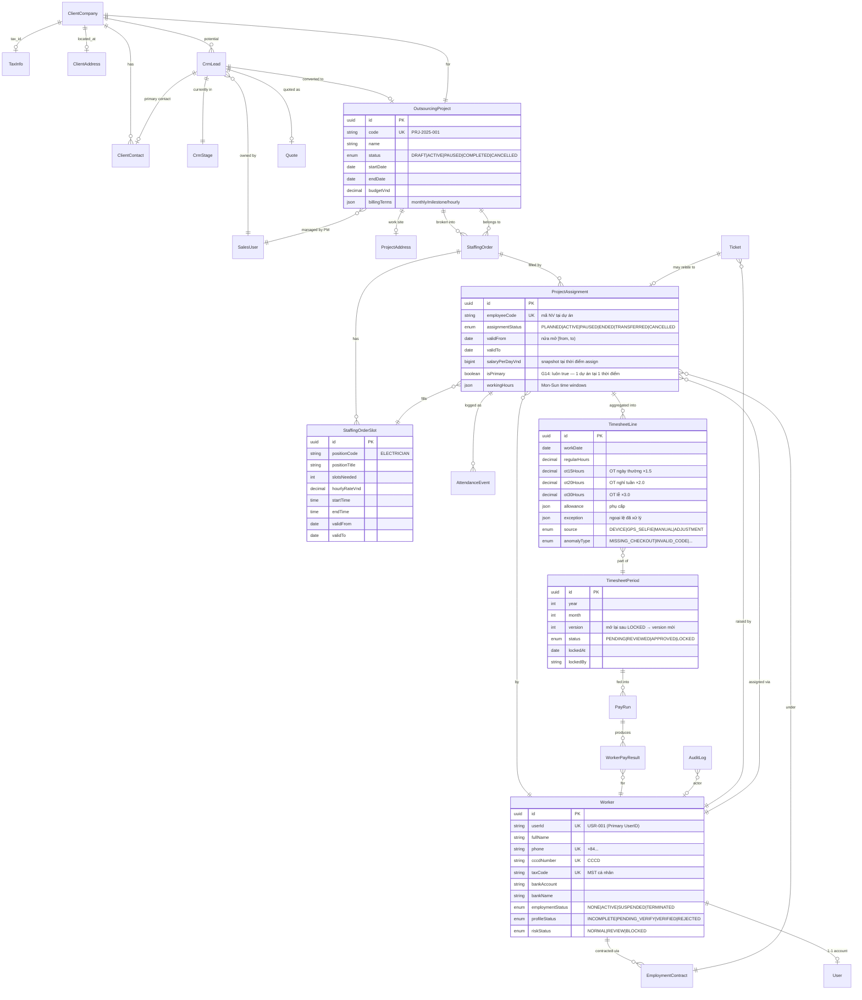

# ERD: CRM → Outsourcing Project → Job Positions → Workers

> Phân tích từ Odoo CE (`odoo/odoo`):
> - `addons/crm/models/crm_lead.py` — `crm.lead` với `stage_id` (CRM stage), `partner_id` (res.partner công ty), `expected_revenue`, `date_deadline`
> - `addons/project/models/project_project.py` — `project.project` với `partner_id` (customer), `user_id` (PM), `account_id` (analytic), `date_start`/`date`, `privacy_visibility`
> - `addons/project/models/project_task.py` — `project.task` với `project_id`, `user_ids` (assignees), `stage_id`, `state` (1_done, etc.)
> - `addons/hr_attendance/models/hr_attendance.py` — `hr.attendance` với `employee_id`, `check_in`/`check_out`, `worked_hours` (computed), `overtime_hours`, `overtime_status` (to_approve/approved/refused)
>
> **Lưu ý:** `hr_contract` (Negotiation → Signed → Active → Terminated) là Enterprise. HRP sẽ tự build dựa trên Ticket state machine pattern.
>
> **V4 sync (14/08/2026):** ERD đã đồng bộ với `UNIFIED_PLAN_v4.md` — chuẩn tên/state theo changelog 0.1.7 (F15–F21).

## ERD Mermaid



## Entity Definitions (PostgreSQL DDL — excerpt)

```sql
-- TẦNG 1: CRM
CREATE TABLE client_companies (
    id UUID PRIMARY KEY DEFAULT gen_random_uuid(),
    code TEXT UNIQUE NOT NULL,                    -- "CC-001"
    name TEXT NOT NULL,
    tax_code TEXT UNIQUE,                         -- MST công ty
    industry TEXT,
    company_size TEXT,                            -- 'SMALL' | 'MEDIUM' | 'LARGE' | 'ENTERPRISE'
    status TEXT DEFAULT 'PROSPECT',               -- 'PROSPECT' | 'ACTIVE' | 'BLACKLISTED'
    created_at TIMESTAMPTZ DEFAULT NOW()
);

CREATE TABLE crm_leads (
    id UUID PRIMARY KEY DEFAULT gen_random_uuid(),
    name TEXT NOT NULL,
    client_company_id UUID REFERENCES client_companies(id),
    contact_name TEXT,
    contact_phone TEXT,
    expected_revenue_vnd BIGINT DEFAULT 0,       -- V4: BigInt VND nguyên (ADR-010)
    expected_close_date DATE,
    stage TEXT DEFAULT 'NEW',                     -- 'NEW' | 'QUALIFIED' | 'PROPOSAL' | 'NEGOTIATION' | 'WON' | 'LOST'
    probability INT DEFAULT 10,                   -- 0-100
    owner_user_id UUID,
    converted_project_id UUID,                    -- FK to outsourcing_projects (set when WON)
    converted_at TIMESTAMPTZ,
    created_at TIMESTAMPTZ DEFAULT NOW()
);

-- TẦNG 2: PROJECT
CREATE TABLE outsourcing_projects (
    id UUID PRIMARY KEY DEFAULT gen_random_uuid(),
    code TEXT UNIQUE NOT NULL,                    -- "PRJ-2025-001"
    client_company_id UUID NOT NULL REFERENCES client_companies(id),
    name TEXT NOT NULL,
    pm_user_id UUID,                              -- Project Manager
    site_address TEXT,
    start_date DATE NOT NULL,
    end_date DATE,
    status TEXT DEFAULT 'DRAFT',                  -- 'DRAFT' | 'ACTIVE' | 'PAUSED' | 'COMPLETED' | 'CANCELLED'
    budget_vnd BIGINT,                           -- V4: BigInt VND nguyên (ADR-010)
    billing_terms JSONB,                          -- { type: 'monthly', dayOfMonth: 5 }
    created_at TIMESTAMPTZ DEFAULT NOW()
);

-- TẦNG 3: STAFFING ORDER
CREATE TABLE staffing_orders (
    id UUID PRIMARY KEY DEFAULT gen_random_uuid(),
    project_id UUID NOT NULL REFERENCES outsourcing_projects(id),
    code TEXT UNIQUE NOT NULL,                    -- "SO-001"
    title TEXT NOT NULL,
    description TEXT,
    deadline_date DATE,
    status TEXT DEFAULT 'OPEN',                   -- 'OPEN' | 'CLOSING_SOON' | 'CLOSED' | 'CANCELLED'
    created_at TIMESTAMPTZ DEFAULT NOW()
);

CREATE TABLE staffing_order_slots (
    id UUID PRIMARY KEY DEFAULT gen_random_uuid(),
    staffing_order_id UUID NOT NULL REFERENCES staffing_orders(id) ON DELETE CASCADE,
    position_code TEXT NOT NULL,                  -- 'ELECTRICIAN'
    position_title TEXT NOT NULL,
    slots_needed INT NOT NULL,
    slots_filled INT DEFAULT 0,                   -- denormalized, trigger updated
    hourly_rate_vnd BIGINT,                      -- V4: BigInt VND nguyên (ADR-010)
    shift_start TIME,
    shift_end TIME,
    valid_from DATE NOT NULL,
    valid_to DATE,
    work_location TEXT
);

-- TẦNG 4: WORKER
CREATE TABLE workers (
    id UUID PRIMARY KEY DEFAULT gen_random_uuid(),
    user_id TEXT UNIQUE NOT NULL,                 -- 'USR-001' (Primary UserID — tạo khi đăng ký, KHÔNG đổi)
    full_name TEXT NOT NULL,
    phone TEXT UNIQUE NOT NULL,                   -- '+84912345678' (E.164)
    cccd_number TEXT UNIQUE,                      -- V4 F17 (thay national_id)
    tax_code TEXT UNIQUE,
    bank_account TEXT,
    bank_name TEXT,
    employment_status TEXT DEFAULT 'NONE',        -- 'NONE' | 'ACTIVE' | 'SUSPENDED' | 'TERMINATED'
    profile_status TEXT DEFAULT 'INCOMPLETE',     -- 'INCOMPLETE' | 'PENDING_VERIFY' | 'VERIFIED' | 'REJECTED'
    risk_status TEXT DEFAULT 'NORMAL',            -- 'NORMAL' | 'REVIEW' | 'BLOCKED'
    -- (submission_status KHÔNG nằm ở worker — thuộc candidate_submissions)
    date_of_birth DATE,
    gender TEXT,
    address JSONB,
    created_at TIMESTAMPTZ DEFAULT NOW()
);

-- TẦNG 5: ASSIGNMENT
CREATE TABLE project_assignments (
    id UUID PRIMARY KEY DEFAULT gen_random_uuid(),
    worker_id UUID NOT NULL REFERENCES workers(id),
    staffing_slot_id UUID NOT NULL REFERENCES staffing_order_slots(id),
    project_id UUID NOT NULL REFERENCES outsourcing_projects(id),
    employment_contract_id UUID,                  -- FK sau khi ký HĐLĐ
    employee_code TEXT NOT NULL,                  -- mã NV tại dự án (do KH/xưởng tạo)
    assignment_status TEXT DEFAULT 'PLANNED',     -- 'PLANNED' | 'ACTIVE' | 'PAUSED' | 'ENDED' | 'TRANSFERRED' | 'CANCELLED'
    valid_from DATE NOT NULL,                     -- nửa mở [valid_from, valid_to)
    valid_to DATE,
    is_primary BOOLEAN DEFAULT TRUE,              -- G14: 1 worker chỉ 1 assignment ACTIVE tại 1 thời điểm
    salary_per_day_vnd BIGINT NOT NULL DEFAULT 0, -- V4 F18 (thay agreed_rate_vnd) — BigInt VND nguyên
    working_hours JSONB,                          -- { mon: ['08:00','17:00'], tue: [...] }
    created_at TIMESTAMPTZ DEFAULT NOW(),
    CHECK (valid_to IS NULL OR valid_to >= valid_from)
);
CREATE INDEX idx_pa_worker_status ON project_assignments(worker_id, assignment_status);
CREATE INDEX idx_pa_project_status ON project_assignments(project_id, assignment_status);

-- TẦNG 6: TIMESHEET
CREATE TABLE timesheet_periods (
    id UUID PRIMARY KEY DEFAULT gen_random_uuid(),
    year INT NOT NULL,
    month INT NOT NULL CHECK (month BETWEEN 1 AND 12),
    project_id UUID REFERENCES outsourcing_projects(id),  -- NULL = all projects
    status TEXT DEFAULT 'PENDING',  -- 'PENDING' | 'REVIEWED' | 'APPROVED' | 'LOCKED' (V4 F2)
    version INT NOT NULL DEFAULT 1,                        -- V4 F21: mở lại sau LOCKED → version mới
    locked_at TIMESTAMPTZ,
    locked_by UUID,
    UNIQUE(year, month, project_id, version)
);

CREATE TABLE timesheet_lines (
    id UUID PRIMARY KEY DEFAULT gen_random_uuid(),
    timesheet_period_id UUID NOT NULL REFERENCES timesheet_periods(id),
    assignment_id UUID NOT NULL REFERENCES project_assignments(id),
    work_date DATE NOT NULL,
    regular_hours NUMERIC(5,2) DEFAULT 0,
    ot15_hours NUMERIC(5,2) DEFAULT 0,            -- OT ngày thường ×1.5
    ot20_hours NUMERIC(5,2) DEFAULT 0,            -- OT nghỉ tuần ×2.0
    ot30_hours NUMERIC(5,2) DEFAULT 0,            -- OT lễ/Tết ×3.0
    allowance JSONB,                              -- phụ cấp
    exception JSONB,                              -- ngoại lệ đã xử lý
    source TEXT DEFAULT 'MANUAL',                 -- 'DEVICE' | 'GPS_SELFIE' | 'MANUAL' | 'ADJUSTMENT'
    anomaly_type TEXT                             -- 'MISSING_CHECKOUT' | 'INVALID_CODE' | 'DUPLICATE_SCAN' | ...
    -- (V4 F19: duyệt công ở cấp PERIOD, không duyệt từng dòng)
);
```

## State Machine: Outsourcing Project Lifecycle

```
DRAFT ──(PM submits)──→ ACTIVE ──(PM pauses)──→ PAUSED
  │                      │                       │
  │                      └────(PM resumes)──────┘
  │                      │
  │                      └────(end_date reached)────→ COMPLETED
  │
  └────(PM cancels)──→ CANCELLED

CRM Lead:   NEW → QUALIFIED → PROPOSAL → NEGOTIATION → WON (→ project) | LOST
Worker:     NONE → ACTIVE → SUSPENDED | TERMINATED  (profile/submission/risk là 3 vòng đời riêng)
Assignment: PLANNED → ACTIVE → PAUSED | ENDED | TRANSFERRED | CANCELLED
Timesheet:  PENDING → REVIEWED → APPROVED → LOCKED  (3-tier theo dự án = config workflow — V4 F2)
```

## Mapping to HRP v3.0 Modules

| Odoo concept | HRP v3 module | Notes |
|--------------|---------------|-------|
| `res.partner` (Customer) | `client_companies` table (M2 §6.2) | Đã có |
| `crm.lead` | `crm_leads` (M2 §6.2.1) | Đã có |
| `project.project` | `outsourcing_projects` (M2 §6.3) | Đã có |
| `project.task` (allocation) | `staffing_orders` + `staffing_order_slots` (M3 §6.3) | **Sẽ bổ sung StaffingOrderSlot table** |
| `hr.employee` | `workers` (M5 §6.5) | Đã có |
| `hr.contract` | `employment_contracts` (M5 §6.5.4) | Đã có, thiếu states (Negotiation → Signed → Active → Terminated) |
| `hr.attendance` | `attendance_events` (M7 §12.1.3) | Đã có — raw events |
| `account.analytic.account` | `project_analytic_accounts` (M8 §12.7) | Đã có |
| `mail.thread` (chatter) | `audit_logs` + `notifications` (ADR-014) | Có — pattern khác |

## Cải tiến cho HRP từ Odoo (10 điểm O1-O10)

| # | Bổ sung cho HRP | Tại sao |
|---|------------------|---------|
| **O1** | `staffing_order_slots` table tách riêng (1 staffing_order → N slots theo vị trí/ca/số lượng) | Odoo gộp `project.task` thành 1 entity. HRP cần tách để vendor/HR query "cần bao nhiêu người cho vị trí X tại site Y trong ca Z" |
| **O2** | **`client_companies` table độc lập** (không gộp vào `companies` của HRP self) | HRP có nhiều client companies (khách hàng) vs 1 company HRP (legal entity). Tách để tránh nhầm lẫn |
| **O3** | `employment_contracts` table với state machine `Negotiation → Signed → Active → Terminated` | Odoo Enterprise có sẵn. HRP cần build cho VN compliance (HĐLĐ thử việc/chính thức/xác định thời hạn) |
| **O4** | `assigned_rate_vnd` + `assigned_multiplier` snapshot trên `project_assignments` | Odoo lưu `hourly_cost` trên employee (master). HRP lưu SNAPSHOT tại thời điểm assign — tránh đổi rate ảnh hưởng history |
| **O5** | `workers.employment_status` vs `profile_status` vs `submission_status` — 3 vòng đời riêng | Odoo chỉ có 1 `active` flag. HRP v3 tách để track "đã verify CCCD" vs "đang làm việc" vs "đã nộp hồ sơ" |
| **O6** | `outsourcing_projects.status` có state machine riêng | Odoo Project có `privacy_visibility` + `active` đơn giản. HRP cần DRAFT/ACTIVE/PAUSED/COMPLETED/CANCELLED |
| **O7** | `timesheet_lines.source` enum: `DEVICE` \| `GPS_SELFIE` \| `MANUAL` \| `ADJUSTMENT` | Odoo chỉ ghi `check_in/check_out`. HRP cần biết nguồn để audit |
| **O8** | `timesheet_lines.anomaly_type` enum | Odoo không có. HRP cần flag MISSING_CHECKOUT/INVALID_CODE/etc để HR xử lý |
| **O9** | `staffing_order_slots.slots_filled` denormalized + trigger update | Odoo dùng `count()` query. HRP denormalize để query nhanh (cho Vendor Portal scan) |
| **O10** | `outsourcing_projects.billing_terms` JSONB | Odoo tách `account.payment.term`. HRP gộp JSON cho MVP (monthly/milestone/hourly) |

## DoD

- [x] ERD vẽ qua 7 tầng (CRM → Project → Staffing → Worker → Assignment → Timesheet → Payroll)
- [x] PostgreSQL DDL cho 7 table chính (excerpt khái niệm — **canonical là `prisma/schema.prisma` (V4 F23)**; ERD chưa vẽ tầng source/submission/statement — G4)
- [x] State machines 5 entity (Lead, Project, Worker, Assignment, Timesheet)
- [x] Mapping 9 concept Odoo → module HRP v3
- [x] 10 cải tiến O1-O10
- [ ] Implement thực tế: chờ Wave 2 (CRM + Project module)